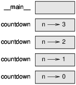
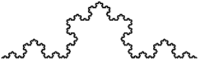

# Chapitre 5<a name="ch5"></a>

## Conditions et récursivité
<br><br>

Le sujet principal de ce chapitre est l'instruction if, qui exécute un code différent en fonction de l'état du programme. Mais je veux d'abord présenter deux nouveaux opérateurs: la division floor et le modulus.

### 5.1 Division et module de plancher

L'opérateur de division floor, ```//```, divise deux nombres et arrondit à un entier. Par exemple, supposons que le temps d'exécution d'un film est de 105 minutes. Vous voudrez peut-être savoir le temps en heures. La division conventionnelle renvoie un float:

```python
>>> minutes = 105
>>> minutes / 60
1.75
```

Mais normalement, nous n'écrivons pas des heures avec des points décimaux. La division classique renvoie le nombre d'heures en entier, en laissant tomber la fraction:

```python
>>> minutes = 105
>>> hours = minutes // 60
>>> hours
1
```

Pour obtenir le reste, vous pouvez soustraire une heure en minutes:

```python
>>> remainder = minutes - hours * 60
>>> remainder
45
```

Une alternative consiste à utiliser l'opérateur de modulus,```%```, qui divise deux nombres et renvoie
le reste.

```python
>>> remainder = minutes % 60
>>> remainder
45
```

L'opérateur modulus est plus utile qu'il n'y paraît. Par exemple, vous pouvez vérifier si
un nombre est divisible par un autre - si ```x % y``` est zéro, alors x est divisible par y.

Vous pouvez également extraire le chiffre ou les chiffres les plus à droite d'un nombre. Par exemple, ```x % 10``` donne le chiffre le plus à droite de x (en base 10). De même, ```x % 100``` fournit les deux derniers chiffres.

Si vous utilisez Python 2, la division fonctionne différemment. L'opérateur de division, /, effectue la division de plancher si les deux opérandes sont des nombres entiers, et la division en float si l'un des opérandes est
un float.

### 5.2 Expressions booléennes

Une expression booléenne est une expression vraie ou fausse. Les exemples suivants utilisent l'opérateur ```==```, qui compare deux opérandes et produit True s'ils sont égaux et False sinon:

```python
>>> 5 == 5
True
>>> 5 == 6
False
```

True et False sont des valeurs spéciales appartenant au type bool; ce ne sont pas des strings:

```
>>> type(True)
<class 'bool'>
>>> type(False)
<class 'bool'>
```
L'opérateur ```==``` est l'un des opérateurs relationnels; les autres sont:

```
    x != y               # x is not equal to y
    x > y                # x is greater than y
    x < y                # x is less than y
    x >= y               # x is greater than or equal to y
    x <= y               # x is less than or equal to y
```

Bien que ces opérations vous soient probablement familières, les symboles Python sont différents des symboles mathématiques. Une erreur courante consiste à utiliser un seul signe égal (```=```) au lieu d'un double signe égal (```==```). Rappelez-vous que ```=``` est un opérateur d'affectation et ```==``` est un opérateur relationnel. Il n'y a pas de chose comme ```=<``` ou ```=>```.

### 5.3 Opérateurs logiques

Il existe trois opérateurs logiques: ```and```, ```or```, et ```not```. La sémantique (signification) de ces
opérateurs sont similaires à leur signification en anglais. Par exemple, ```x>0``` et ```x<10``` est vrai
seulement si x est supérieur à 0 et inférieur à 10.

```n%2 == 0``` ou ```n%3 == 0``` est vraie si l’une ou les deux conditions est vraie, c’est-à-dire si le nombre est divisible par 2 ou 3.

Enfin, l’opérateur not nie une expression booléenne, donc ```not (x > y)``` est vrai si ```x > y``` est False, c'est-à-dire si x est inférieur ou égal à y.

Strictement parlant, les opérandes des opérateurs logiques doivent être des expressions booléennes, mais Python n'est pas très strict. Tout nombre différent de zéro est interprété comme True:

```
>>> 42 and True
True
```

Cette flexibilité peut être utile, mais certaines subtilités peuvent être déroutantes.
Vous voudrez peut-être l'éviter (sauf si vous savez ce que vous faites).

### 5.4 Exécution conditionnelle

Pour écrire des programmes utiles, nous avons presque toujours besoin de pouvoir vérifier les conditions et modifier le comportement du programme en conséquence. Les déclarations conditionnelles nous donnent cette aptitude. La forme la plus simple est l'instruction if:

```python
if x > 0:
    print('x is positive')
```

L'expression booléenne après if s'appelle la condition. Si c'est vrai, la déclaration en retrait s'exécute. Sinon, rien ne se passe.

les instructions if ont la même structure que les définitions de fonctions: un en-tête suivi d'un
corps en retrait. Des déclarations comme celles-ci sont appelées des déclarations composées.

Il n'y a pas de limite au nombre de déclarations pouvant apparaître dans le corps, mais il doit y avoir au moins un. À l’occasion, il est utile d’avoir un corps sans déclaration (généralement placekeeper pour le code que vous n'avez pas encore écrit). Dans ce cas, vous pouvez utiliser la déclaration de passage, qui ne fait rien.

```python
if x < 0:
    pass
```
### 5.5 Exécution alternative

Une deuxième forme de l'instruction if est "exécution alternative", dans laquelle il existe deux possibilités et la condition détermine celle qui s'exécute. La syntaxe ressemble à ceci:

```python
if x % 2 == 0:
    print('x is even')
else:
    print('x is odd')
```

Si le restant lorsque x est divisé par 2 est 0, alors nous savons que x est pair, et le programme affiche un message approprié. Si la condition est fausse, la deuxième série de déclarations s'exécute. Comme la condition doit être vraie ou fausse, l'une des alternatives s'exécutera .

Les alternatives sont appelées branches, car elles sont des branches dans le flux d'exécution.

###5.6 Conditionnels en chaînes

Parfois, il y a plus de deux possibilités et nous avons besoin de plus de deux branches.
Une façon d'exprimer un calcul comme celui-là est un chaîne conditionnel:

```python
if x < y:
    print('x is less than y')
elif x > y:
    print('x is greater than y')
else:
    print('x and y are equal')
```

elif est une abréviation de "else if". Encore une fois, exactement une branche sera exécutée. Il n'y a pas de limite sur
le nombre de déclarations elif. S'il y a une clause else, elle doit être à la fin, mais
cela est facultatif.

```python
if choice == 'a':
    draw_a()
elif choice == 'b':
    draw_b()
elif choice == 'c':
    draw_c()
```
Chaque condition est vérifiée dans l'ordre. Si le premier est faux, le suivant est coché, et ainsi de suite. Si un d'entre eux est vrai, la branche correspondante s'exécute et l'instruction se termine. Même si plus d'une condition est vraie, seule la première branche vraie s'exécute.

### 5.7 Conditionals imbriqués

Un conditionnel peut aussi être imbriqué dans un autre. Nous aurions pu écrire l'exemple dans
la section précédente comme ceci:

```python
if x == y:
    print('x and y are equal')
else:
    if x < y:
        print('x is less than y')
    else:
        print('x is greater than y')
```

Le conditionnel externe contient deux branches. La première branche contient une simple déclaration. La seconde branche contient une autre instruction if, qui comporte deux branches. Ces deux branches sont toutes deux des déclarations simples, bien qu’elles aient pu être conditionnelles.

Bien que l'indentation des déclarations rendent la structure apparente, les conditionnels imbriqués deviennent difficiles à lire très rapidement. C'est une bonne idée de les éviter quand vous
pouvez.

Les opérateurs logiques permettent souvent de simplifier les instructions conditionnelles imbriquées. Par exemple, nous pouvons réécrire le code suivant en utilisant un seul conditionnel:

```python
if 0 < x:
    if x < 10:
        print('x is a positive single-digit number.')
```

L'instruction print ne s'exécute que si nous passons les deux conditions, afin que nous puissions obtenir la même chose
effet avec l'opérateur et:

```python
if 0 < x and x < 10:
    print('x is a positive single-digit number.')
```

Pour ce type de condition, Python fournit une option plus concise:

```python
if 0 < x < 10:
    print('x is a positive single-digit number.')
```

### 5.8 Récursivité

Il est légal qu'une fonction appelle une autre; il est également légal qu'une fonction s'appelle elle-même. Cela pourrait ne pas être évident pourquoi c'est une bonne chose, mais il s'avère être l'un des choses les plus magiques qu'un programme puisse faire. Par exemple, regardez la fonction suivante:

```python
def countdown(n):
    if n <= 0:
        print('Blastoff!')
    else:
        print(n)
        countdown(n-1)
```
Si n est 0 ou négatif, il affiche le mot "Blastoff!" Sinon, il affiche n puis appelle une fonction nommée countdown (soi-même) en passant n-1 en argument.
Que se passe-t-il si nous appelons cette fonction comme ceci?

```
>>> countdown(3))
```

```
The execution of countdown begins with n=3, and since n is greater than 0, it outputs the value 3, and then calls itself...

    The execution of countdown begins with n=2, and since n is greater than 0, it outputs the value 2, and then calls itself...

        The execution of countdown begins with n=1, and since n is greater than 0, it outputs the value 1, and then calls itself...

            The execution of countdown begins with n=0, and since n is not greater than 0, it outputs the word, “Blastoff!” and then returns.

        The countdown that got n=1 returns.

    The countdown that got n=2 returns.

The countdown that got n=3 returns.
```

Et puis vous êtes de retour dans __main__. Ainsi, la sortie totale ressemble à ceci:

```
3
2
1
Blastoff!
```

Une fonction qui s'appelle elle-même est récursive; le processus d'exécution est appelé récursivité.
Comme autre exemple, nous pouvons écrire une fonction qui imprime une chaîne n fois.

```python
def print_n(s, n):
    if n <= 0:
        return
    print(s)
    print_n(s, n-1)
```

Si n <= 0, l'instruction de retour quitte la fonction. Le flux d'exécution retourne immédiatement à l'appelant et les lignes restantes de la fonction ne s'exécutent pas.

Le reste de la fonction est similaire au compte à rebours: il affiche s puis appelle lui-même pour afficher
s ```n - 1``` fois supplémentaires. Donc, le nombre de lignes de sortie est ```1 + (n - 1)```, ce qui totalise
à n.

Pour des exemples simples comme celui-ci, il est probablement plus facile d'utiliser une boucle for. Mais on verra des
exemples plus tard qui sont difficiles à écrire avec une boucle for et facile à écrire avec la récursivité, de sorte qu'il est bon de commencer tôt.

### 5.9 Diagrammes de pile pour les fonctions récursives

Dans la section 3.9, nous avons utilisé un diagramme de pile pour représenter l'état d'un programme au cours d'une fonction
appel. Le même type de diagramme peut aider à interpréter une fonction récursive.

Chaque fois qu’une fonction est appelée, Python crée un cadre pour contenir les variables et paramètres locaux de la fonction. Pour une fonction récursive, il peut y avoir plus d'un frame sur la pile en même temps.

La figure 5.1 montre un diagramme de pile pour le compte à rebours appelé avec ```n = 3```.



Comme d'habitude, le haut de la pile est dans le cadre de __main__. C'est vide parce que nous n'avons pas créer des variables dans __main__ ou lui transmettre des arguments.

Les quatres images du compte à rebours ont des valeurs différentes pour le paramètre n. Le fond de la pile, où n = 0, est appelé le cas de base. Il ne fait pas un appel récursif, donc il n'y a plus de frame.

Comme exercice, dessinez un diagramme de pile pour print_n appelé avec ```s = 'Hello'``` et ```n = 2```. Alors écrivez une fonction appelée do_n qui prend un objet fonction et un nombre, n, comme arguments, et qui appelle la fonction donnée n fois.

### 5.10 Récursion infinie

Si une récursivité n'atteint jamais un cas de base, elle continue à faire des appels récursifs pour toujours et le programme ne se termine jamais. Ceci est connu comme la récursion infinie, et ce n'est généralement pas une
bonne idée. Voici un programme minimal avec une récursion infinie:

```
  File "<stdin>", line 2, in recurse
  File "<stdin>", line 2, in recurse
  File "<stdin>", line 2, in recurse
                  .   
                  .
                  .
  File "<stdin>", line 2, in recurse
RuntimeError: Maximum recursion depth exceeded
```

Ce traceback est un peu plus longue que celui dont nous avions vu dans le chapitre précédente. Quand l'erreur apparait, il y a plus de 1000 frames dans le stack!

Si vous rencontrez une recursion infinie par accident, revisez votre fonction pour comfirmer s'il y a un cas de base qui ne prend pas un appel recursive. S'il y en a, vérifiez si vous êtes assuré d'y accéder.

### 5.11 La saisie au clavier

Les programmes que nous avons écrits jusqu'à présent n'acceptent aucune contribution de l'utilisateur. Ils font juste la même chose à chaque fois.

Python fournit une fonction intégrée appelée entrée qui arrête le programme et attend l'utilisateur de taper quelque chose. Lorsque l'utilisateur appuie sur Entrée ou Retour, le programme reprend et input renvoie ce que l'utilisateur a tapé en tant que chaîne. Dans Python 2, la même fonction est appelée ```raw_input```.

```python
>>> text = input()
'What are you waiting for?'
>>> text
'What are you waiting for?'
```

Avant d’obtenir les commentaires de l’utilisateur, il est conseillé d’imprimer une quelquechose indiquant à l’utilisateur quoi typer. input peut prendre une invite en argument:

```python
>>> name = input('What...is your name?\n')
What...is your name?
Arthur, King of the Britons!
>>> name
'Arthur, King of the Britons!'
```

La séquence ```\n``` à la fin de l'invite représente une nouvelle ligne, qui est un caractère spécial cela provoque un saut de ligne. C'est pourquoi l'entrée de l'utilisateur apparaît sous l'invite.

Si vous vous attendez à ce que l'utilisateur tape un entier, vous pouvez essayer de convertir la valeur de retour en int:

```python
>>> prompt = 'What...is the airspeed velocity of an unladen swallow?\n'
>>> speed = input(prompt)
What...is the airspeed velocity of an unladen swallow?
42
>>> int(speed)
42
```
Mais si l'utilisateur tape autre chose qu'une chaîne de chiffres, vous obtenez une erreur:

```python
>>> speed = input(prompt)
What...is the airspeed velocity of an unladen swallow?
What do you mean, an African or a European swallow?
>>> int(speed)
ValueError: invalid literal for int() with base 10
```

Nous verrons comment gérer ce type d'erreur plus tard.

### 5.12 Le débogage

Lorsqu'une erreur de syntaxe ou d'exécution se produit, le message d'erreur contient beaucoup d'informations, mais cela peut être accablant. Les parties les plus utiles sont généralement les suivantes:

- Quel type d'erreur était-ce et
- où il s'est produit.

Les erreurs de syntaxe sont généralement faciles à trouver, mais il y a quelques pièges. Les erreurs d'espacement peuvent être difficile parce que les espaces et les onglets sont invisibles et nous sommes habitués à les ignorer.

```
>>> x = 5
>>>  y = 6
File "<stdin>", line 1
y = 6
^
IndentationError: unexpected indent
```

Dans cet exemple, le problème est que la deuxième ligne est en retrait d'une espace. Mais l'erreur dans le message indique y, ce qui est trompeur. En général, les messages d’erreur indiquent où le problème a été découvert, mais l'erreur réelle peut être antérieure dans le code, parfois sur une ligne précédente.

La même chose est vraie pour les erreurs d'exécution. Supposons que vous essayiez de calculer un rapport signal / bruit en décibels. La formule est SNRdb = 10 log10 (Psignal / Pnoise) ). En python, vous pourriez écrire quelque chose comme ceci:

```python
import math
signal_power = 9
noise_power = 10
ratio = signal_power // noise_power
decibels = 10 * math.log10(ratio)
print(decibels)
```

Lorsque vous exécutez ce programme, vous obtenez une exception:

```
Traceback (most recent call last):
  File "snr.py", line 5, in ?
    decibels = 10 * math.log10(ratio)
ValueError: math domain error
```

Le message d'erreur indique la ligne 5, mais il n'y a rien de mal avec cette ligne. Pour trouver l'erreur réelle, il pourrait être utile d’imprimer la valeur du ratio, qui se révèle être 0. Le problème est à la ligne 4, qui utilise la division au sol au lieu de la division en float. Vous devriez prendre le temps de lire attentivement les messages d'erreur, mais ne présumez pas que tout ils disent est correct.

### 5.13 Glossaire

- **Division de plancher / floor division:** Un opérateur, noté //, qui divise deux nombres et arrondit à un entier inférieur (vers l'infini négatif).

- **opérateur modulus / modulus operator:** un opérateur, noté avec un signe de pourcentage (%), qui fonctionne sur des nombres entiers
et renvoie le reste lorsqu'un nombre est divisé par un autre.

- **expression booléenne:** expression dont la valeur est True ou False.

- **opérateur relationnel:** Un des opérateurs qui compare ses opérandes: ```==```,```!=```, ```>```, ```<```, ```>=``` et ```<=```.

- **opérateur logique:** un des opérateurs combinant des expressions booléennes: et, ou
ne pas.

- **instruction conditionnelle:** une instruction qui contrôle le flux d'exécution en fonction de certains
conditions.

- **condition:** expression booléenne dans une instruction conditionnelle qui détermine une
branche court.

- **déclaration composée:** déclaration composée d'un en-tête et d'un corps. L'en-tête se termine
avec deux points (:). Le corps est en retrait par rapport à l'en-tête.

- **branch:** une des séquences alternatives d'instructions dans une instruction conditionnelle.

- **conditionnel en chaînes:** une instruction conditionnelle avec une série de branches alternatives.

- **conditionnel imbriqué:** instruction conditionnelle qui apparaît dans l'une des branches d'une autre déclaration conditionnelle.

- **instruction de retour:** instruction qui entraîne la fin immédiate d'une fonction et le retour >a< l'appeleur.

- **récursivité:** processus d'appel de la fonction en cours d'exécution.

- **cas de base:** branche conditionnelle dans une fonction récursive qui ne fait pas un appel récursif.

- **récursion infinie:** récursivité qui n'a pas de cas de base ou ne l'atteint jamais. Finalement, une récursion infinie provoque une erreur d'exécution.

### 5.14 Exercices

**Exercice 1**

_La module time fournit une fonction, également nommée time, qui renvoie le Greenwich Mean Time en tant que "epoch", qui est un temps arbitraire utilisé comme point de référence. Sur les Systèmes UNIX, epoch est le 1er janvier 1970._

```python
>>> import time
>>> time.time()
1437746094.5735958
```

_Écrivez un script qui lit l'heure actuelle et le convertit en heure, en minutes et en minutes.
secondes, plus le nombre de jours écoulés depuis l'époque._

**Exercice 2**

_Le dernier théorème de Fermat dit qu'il n'y a pas d'entiers positifs a, b et c tels que_


a<sup>n</sup> + b<sup>n</sup> = c<sup>n</sup>


_pour toute valeur de n supérieure à 2._

- 1. _Écrivez une fonction nommée check_fermat qui prend quatre paramètres- a, b, c et n -et
vérifie si le théorème de Fermat est valide. Si n est supérieur à 2 et_

a<sup>n</sup> + b<sup>n</sup> = c<sup>n</sup>

_le programme devrait imprimer, "Holy smokes, Fermat was wrong!" Sinon, le programme devrait
imprimer, "No, that doesn’t work."_

- 2. _Écrivez une fonction qui invite l’utilisateur à saisir des valeurs pour a, b, c et n, les convertir en entiers, et utilise check_fermat pour vérifier s'ils ne respectent pas le théorème de Fermat._

**Exercice 3**

_Si on vous donne trois bâtons, vous pouvez ou non être en mesure de les organiser en triangle.
Par exemple, si l'un des bâtons fait 12 pouces de long et que les deux autres ont un pouce de long, vous ne pourrez pas être en mesure de faire en sorte que les bâtons courts se rencontrent au milieu. Pour trois longueurs, il existe un test simple pour voir s'il est possible de former un triangle:_

_Si l'une des trois longueurs est supérieure à la somme des deux autres, vous ne pouvez pas
former un triangle. Sinon, vous pouvez. (Si la somme de deux longueurs est égale à la troisième, elles forme ce qu'on appelle un triangle "dégénéré".)_

- 1. _Écrivez une fonction nommée is_triangle qui prend trois nombres entiers comme arguments et qui imprime soit "Yes" ou "No", selon que vous pouvez ou ne pouvez pas former un triangle à partir de bâtons avec les longueurs données._

- 2. _Écrivez une fonction qui invite l’utilisateur à saisir trois longueurs de bâtons, à les convertir en nombres entiers,
et utilise is_triangle pour vérifier si les bâtons de longueur donnée peuvent former un triangle._

**Exercice 4** 

Quelle est la sortie du programme suivant? Dessine un diagramme de pile qui montre le
état du programme lorsqu'il imprime le résultat.

```
def recurse(n, s):
    if n == 0:
        print(s)
    else:
        recurse(n-1, n+s)

recurse(3, 0)
```

- 1. _Que se passerait-il si vous appeliez cette fonction comme ceci: recurse (-1, 0)?_

- 2. _Ecrivez un docstring qui explique tout ce que quelqu'un devrait savoir pour pouvoir utiliser cet fonction (et rien d'autre)._

Les exercices suivants utilisent le module tortue, décrit au chapitre 4:

**Exercice 5** 

_Lisez la fonction suivante et voyez si vous pouvez comprendre ce qu’elle fait (voir les exemples du chapitre 4). Puis lancez-le et voyez si vous avez bien compris._

```python
def draw(t, length, n):
    if n == 0:
        return
    angle = 50
    t.fd(length*n)
    t.lt(angle)
    draw(t, length, n-1)
    t.rt(2*angle)
    draw(t, length, n-1)
    t.lt(angle)
    t.bk(length*n)
```



La courbe de Koch est une fractale qui ressemble à la figure 5.2. Dessiner un Koch
courbe avec longueur x, tout ce que vous avez à faire est de

- 1. _Tracez une courbe de Koch avec une longueur x / 3._

- 2. _Tourner à gauche de 60 degrés._

- 3. _Tracez une courbe de Koch avec une longueur x / 3._ 

- 4. _Tournez à droite de 120 degrés._ 

- 5. _Tracez une courbe de Koch avec une longueur x / 3._ 

- 6. _Tournez à gauche de 60 degrés._ 

- 7. _Tracez une courbe de Koch avec une longueur x / 3._ 

_L'exception est si x est inférieur à 3: dans ce cas, vous pouvez simplement tracer une ligne de longueur x._

- 1. _Écrivez une fonction appelée koch qui prend une tortue et une longueur comme paramètres, et qui utilise la tortue pour dessiner une courbe de Koch avec la longueur donnée._

- 2. _Écrivez une fonction appelée flocon de neige qui dessine trois courbes de Koch pour dessiner le contour d'un flocon de neige._
Solution: [http://thinkpython2.com/code/koch.py](http://thinkpython2.com/code/koch.py).

- 3. _La courbe de Koch peut être généralisée de plusieurs manières. Voir [http://en.wikipedia.org/wiki/Koch_snowflake](http://en.wikipedia.org/wiki/Koch_snowflake) pour des exemples et implémentez votre favori.