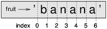
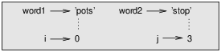

# Chapitre 8<a name="ch8"></a>

## Les chaînes
<br><br>


Les chaînes ne sont pas comme des entiers, des floats et des booléens. Une chaîne est une séquence, ce qui signifie qu'elle est une collection ordonnée d'autres valeurs. Dans ce chapitre, vous verrez comment accéder aux caractères qui constituent une chaîne, et vous apprendrez certaines des méthodes fournies par les chaînes.

## 8.1 Une chaîne est une séquence

Une chaîne est une séquence de caractères. Vous pouvez accéder aux personnages un par un avec le
opérateur de support []:

```
>>> fruit = 'banana'
>>> letter = fruit[1]
```

La deuxième instruction sélectionne le numéro 1 du fruit et l'affecte à la lettre.
L'expression entre parenthèses s'appelle un index. L'index indique quel caractère dans le
séquence vous voulez (d'où le nom).
Mais vous pourriez ne pas avoir ce que vous attendez:

```
>>> letter
'a'
```

Pour la plupart des gens, la première lettre de «banana» est b, pas a. Mais pour les informaticiens, l'index est un décalage par rapport au début de la chaîne et le décalage de la première lettre est zéro.
```
>>> letter = fruit[0]
>>> letter
'b'
```

Donc b est la 0ème lettre ("zero-eth") de "banana", a est la 1ère lettre ("one-eth"), et n est le 2eme
lettre ("two-eth").
En tant qu’index, vous pouvez utiliser une expression contenant des variables et des opérateurs:
```
>>> i = 1
>>> fruit[i]
'a'
>>> fruit[i+1]
'n'
```

Mais la valeur de l'index doit être un entier. Sinon, vous obtenez:

```
>>> letter = fruit[1.5]
TypeError: string indices must be integers
```

## 8.2 len

len est une fonction intégrée qui renvoie le nombre de caractères d'une chaîne:
```
>>> fruit = 'banana'
>>> len(fruit)
6
```

Pour obtenir la dernière lettre d'une chaîne, vous pourriez être tenté d'essayer quelque chose comme ceci:
```
>>> length = len(fruit)
>>> last = fruit[length]
IndexError: string index out of range
```

La raison de l’indexError est qu’il n’ya pas de lettre dans «banana» avec l’index 6.
nous avons commencé à compter à zéro, les six lettres sont numérotées de 0 à 5. Pour obtenir le dernier caractère,
vous devez soustraire 1 de la longueur:
```
>>> last = fruit[length-1]
>>> last
'a'
```
Ou vous pouvez utiliser des index négatifs, qui comptent à partir de la fin de la chaîne. le
expression fruit [-1] donne la dernière lettre, fruit [-2] renvoie la seconde à la dernière, et ainsi de suite.

## 8.3 Traversal avec une boucle for

De nombreux calculs impliquent le traitement d'une chaîne par caractère. Ils commencent souvent
au début, sélectionnez chaque caractèr à son tour, faites-lui quelque chose et continuez jusqu'à la
fin. Ce modèle de traitement s'appelle une traversée. Une façon d'écrire une traversée est d'utiliser un
un boucle:

```python
index = 0
while index < len(fruit):
    letter = fruit[index]
    print(letter)
    index = index + 1
```
Cette boucle traverse la chaîne et affiche chaque lettre sur une ligne. La condition de la boucle
est index < len(fruit), donc quand index est égal à la longueur de la chaîne, la condition est
false et le corps de la boucle ne s'exécute pas. Le dernier personnage accédé est celui avec l'index len (fruit) -1, qui est le dernier caractère de la chaîne.
En tant qu’exercice, écrivez une fonction qui prend une chaîne comme argument et affiche les lettres
en arrière, un par ligne.
Une autre façon d'écrire une traversée consiste à utiliser une boucle for:

```python 
for letter in fruit:
    print(letter)
```

A chaque fois dans la boucle, le caractère suivant de la chaîne est assigné à la variable
letter. La boucle continue jusqu'à ce qu'il ne reste plus aucun caractère.
L'exemple suivant montre comment utiliser la concaténation (ajout de chaîne) et une boucle for
pour générer une série abécédaire (c'est-à-dire par ordre alphabétique). Dans le livre de Robert McCloskey's
Make Way for Ducklings, les noms des canetons sont Jack, Kack, Lack, Mack, Nack,
Ouack, Pack et Quack. Cette boucle génère ces noms dans l'ordre:

```python
prefixes = 'JKLMNOPQ'
suffix = 'ack'

for letter in prefixes:
    print(letter + suffix)
```
The output is:
```
Jack
Kack
Lack
Mack
Nack
Oack
Pack
Qack
```

Bien sûr, ce n'est pas tout à fait correct, car "Ouack" et "Quack" sont mal orthographiés. En tant qu'exercice, 
modifiez le programme pour corriger cette erreur.

## 8.4 Tranches de chaîne

Un segment d'une chaîne est appelé une tranche. La sélection d'une tranche est similaire à la sélection d'un caractère:

```
>>> s = 'Monty Python'
>>> s [0: 5]
'Monty'
>>> s [6:12]
'Python'
```

L'opérateur [n: m] renvoie la partie de la chaîne du caractère "n-eth" au "m-eth"
, y compris le premier mais excluant le dernier. Ce comportement est contre-intuitif, mais
il pourrait être utile d'imaginer les indices pointant entre les caractères, comme dans la figure 8.1.



Si vous omettez le premier index (avant les deux points), la tranche commence au début de la chaîne.
Si vous omettez le deuxième index, la tranche va à la fin de la chaîne:
```
>>> fruit = 'banana'
>>> fruit[:3]
'ban'
>>> fruit[3:]
'ana'
```
Si le premier index est supérieur ou égal au second, le résultat est une chaîne vide, représentée par deux guillemets:
```
>>> fruit = 'banana'
>>> fruit[3:3]
''
```
Une chaîne vide ne contient aucun caractère et a la longueur 0, mais à part ça, c'est la même chose
comme toute autre chaîne.
Poursuivant cet exemple, à votre avis, que veut dire fruit [:]? Essayez-le et voyez.

## 8.5 Les caractères sont immuables

Il est tentant d’utiliser l’opérateur [] à gauche d’une affectation, avec l’intention de
changer un caractère dans une chaîne. Par exemple:
```
>>> greeting = 'Hello, world!'
>>> greeting[0] = 'J'
TypeError: 'str' object does not support item assignment
```
Le "objet" dans ce cas est la chaîne et "l'élément" est le caractère que vous avez essayé d'attribuer.
Pour l'instant, un objet est la même chose qu'une valeur, mais nous affinerons cette définition ultérieurement
(Section 10.10).
La raison de l'erreur est que les chaînes sont immuables, ce qui signifie que vous ne pouvez pas changer un
chaîne existante. Le mieux que vous puissiez faire est de créer une nouvelle chaîne qui est une variante de l'original:
```
>>> greeting = 'Hello, world!'
>>> new_greeting = 'J' + greeting[1:]
>>> new_greeting
'Jello, world!'
```
Cet exemple concatène une nouvelle première lettre sur une tranche de message d'accueil. Cela n'a aucun effet sur le
chaîne originale.

## 8.6 Recherche

Que fait la fonction suivante?

```python
def find(word, letter):
    index = 0
    while index < len(word):
        if word[index] == letter:
            return index
        index = index + 1
    return -1
```

En un sens, find est l'inverse de l'opérateur []. Au lieu de prendre un index et d’extraire
le caractère correspondant, il prend un caractère et trouve l'index où ce caractère
apparaît. Si le caractère n'est pas trouvé, la fonction renvoie -1.
C'est le premier exemple que nous avons vu d'une déclaration de retour dans une boucle. Si mot [index]
== lettre, la fonction sort de la boucle et revient immédiatement.
Si le caractère n'apparaît pas dans la chaîne, le programme quitte la boucle normalement et renvoie -1.
Ce modèle de calcul-traversant une séquence et retournant quand on trouve ce que l'on
recherche-est appelé une recherche.
En tant qu’exercice, modifiez la recherche pour qu’elle ait un troisième paramètre, l’index dans le mot où l'on devrait commencer à regarder.

## 8.7 En boucle et compter

Le programme suivant compte le nombre de fois que la lettre a apparaît dans une chaîne:
```python
word = 'banana'
count = 0
for letter in word:
    if letter == 'a':
        count = count + 1
        print(count)
```

Ce programme montre un autre modèle de calcul appelé compteur. La variable
count est initialisé à 0 puis incrémenté chaque fois qu'un a est trouvé. Lorsque la boucle se termine,
count contient le résultat - le nombre total de a.
En guise d’exercice, encapsulez ce code dans une fonction nommée count et généralisez-le pour qu'il
accepte la chaîne et la lettre comme arguments.
Ensuite, réécrivez la fonction de sorte que, au lieu de parcourir la chaîne, elle utilise la version à trois paramètres de find de la section précédente.

## 8.8 Méthodes de chaîne

Les chaînes fournissent des méthodes permettant d'effectuer diverses opérations utiles. Une méthode est similaire
à une fonction, elle prend des arguments et retourne une valeur, mais la syntaxe est différente. Pour
Par exemple, la méthode upper prend une chaîne et retourne une nouvelle chaîne avec toutes les majuscules
des lettres.
Au lieu de la syntaxe de fonction upper(mot), elle utilise la syntaxe de la méthode word.upper().
```
>>> word = 'banana'
>>> new_word = word.upper()
>>> new_word
'BANANA'
```

Cette forme de notation par points spécifie le nom de la méthode, supérieure et le nom de la
chaîne pour appliquer la méthode à, mot. Les parenthèses vides indiquent que cette méthode
ne prend aucun argument.
Un appel de méthode est appelé une invocation; dans ce cas, nous dirions que nous invoquons
supérieur sur le mot.
Comme il se trouve, il existe une méthode de chaîne nommée find qui est remarquablement similaire à la
fonction nous avons écrit:
```
>>> word = 'banana'
>>> index = word.find('a')
>>> index
1
```
Dans cet exemple, nous invoquons find sur word et transmettons la lettre que nous recherchons en tant que paramètre.
En fait, la méthode de recherche est plus générale que notre fonction; il peut trouver des sous-chaînes, pas seulement
personnages:
```
>>> word.find ('na')
2
```
Par défaut, find commence au début de la chaîne, mais il peut prendre un deuxième argument, l'index où il devrait commencer:
```
>>> word.find ('na', 3)
4
```
Ceci est un exemple d'un argument optionnel; find peut aussi prendre un troisième argument, l'index
où il devrait s'arrêter:
```
>>> name = 'bob'
>>> name.find ('b', 1, 2)
-1
```
Cette recherche échoue car b n'apparaît pas dans la plage d'index de 1 à 2, sans inclure 2.
Recherche jusqu'au, mais non compris, le deuxième index rend la recherche cohérente avec l'opérateur de
tranche.

## 8.9 L'opérateur in

Le mot in est un opérateur booléen qui prend deux chaînes et renvoie True si le premier apparaît comme une sous-chaîne dans le second:

```
>>> 'a' in 'banana'
True
>>> 'seed' in 'banana'
False
```

Par exemple, la fonction suivante imprime toutes les lettres de word1 qui apparaissent également dans
mot2:

```
def in_both(word1, word2):
    for letter in word1:
        if letter in word2:
            print(letter)
```

Avec des noms de variables bien choisis, Python se lit parfois comme l'anglais. Vous pouvez lire
cette boucle, "pour (chaque) lettre dans (le premier) mot, si (la) lettre (apparaît) dans (le second) mot,
imprimer la lettre. "
Voici ce que vous obtenez si vous comparez des pommes et des oranges:

>>> in_both('apples', 'oranges')
a
e
s

## 8.10 Comparaison de chaîne

Les opérateurs relationnels travaillent sur des chaînes. Pour voir si deux chaînes sont égales:
```
if word == 'banana':
    print('All right, bananas.')
```
D'autres opérations relationnelles sont utiles pour mettre les mots en ordre alphabétique:

```python
if word < 'banana':
    print('Your word, ' + word + ', comes before banana.')
elif word > 'banana':
    print('Your word, ' + word + ', comes after banana.')
else:
    print('All right, bananas.')
```

Python ne gère pas les lettres majuscules et minuscules de la même manière que les gens. Tous les
les lettres majuscules viennent avant toutes les lettres minuscules, donc:

Votre mot, ananas, vient avant la banane.
Une méthode courante pour résoudre ce problème consiste à convertir des chaînes en un format standard, tel que
tout en minuscule, avant d'effectuer la comparaison. Gardez cela à l'esprit au cas où vous devriez
Défendez-vous contre un homme armé d'un Ananas.

## 8.11 Le débogage

Lorsque vous utilisez des indices pour parcourir les valeurs dans une séquence, il est difficile de bien cerner le commencement et la fin du parcours. Voici une fonction censée comparer deux mots
et retourner True si l'un des mots est l'inverse de l'autre, mais il contient deux erreurs:

```python
def is_reverse(word1, word2):
    if len(word1) != len(word2):
        return False
    
    i = 0
    j = len(word2)

    while j > 0:
        if word1[i] != word2[j]:
            return False
        i = i+1
        j = j-1

    return True
```

La première instruction if vérifie si les mots ont la même longueur. Sinon, nous pouvons retourner
False immédiatement Sinon, pour le reste de la fonction, on peut supposer que les mots
sont la même longueur Ceci est un exemple du modèle de gardien dans la section 6.8.
i et j sont des indices: i traverse mot1 en avant tandis que j traverse mot2 en arrière. Si nous
trouver deux lettres qui ne correspondent pas, nous pouvons retourner False immédiatement. Si nous passons à travers la
boucle entière et toutes les lettres correspondent, nous retournons True.
Si nous testons cette fonction avec les mots "pots" et "stop", nous attendons la valeur de retour True,
mais nous obtenons un IndexError:
```
>>> is_reverse('pots', 'stop')
...
  File "reverse.py", line 15, in is_reverse
    if word1[i] != word2[j]:
IndexError: string index out of range
```

Pour déboguer ce genre d'erreur, je commence par imprimer les valeurs des indices immédiatement avant la ligne où l'erreur apparaît.
```python
while j > 0:
    print(i, j)        # print here
    
    if word1[i] != word2[j]:
        return False
    i = i+1
    j = j-1
```
Maintenant, lorsque je relance le programme, je reçois plus d'informations:
```
>>> is_reverse('pots', 'stop')
0 4
...
IndexError: string index out of range
```
La première fois dans la boucle, la valeur de j est 4, ce qui est hors de portée pour le
chaîne 'pots'. L'index du dernier caractère est 3, donc la valeur initiale de j devrait être
len (word2) -1.
Si je corrige cette erreur et lance à nouveau le programme, j'obtiens:
```
>>> is_reverse ('pots', 'stop')
0 3
1 2
2 1
True
```
Cette fois, nous obtenons la bonne réponse, mais il semble que la boucle ne soit exécutée que trois fois, ce qui est
méfiant. Pour avoir une meilleure idée de ce qui se passe, il est utile de dessiner un diagramme d'état.
Au cours de la première itération, le cadre de is_reverse est illustré à la figure 8.2.



J'ai pris une licence en organisant les variables dans le cadre et en ajoutant des lignes pointillées pour montrer
que les valeurs de i et j indiquent des caractères dans word1 et word2.
À partir de ce diagramme, lancez le programme sur papier en changeant les valeurs de i et j
lors de chaque itération. Recherchez et corrigez la deuxième erreur dans cette fonction.

## 8.12. Glossaire

- **objet:** quelque chose auquel une variable peut se référer. Pour l'instant, vous pouvez utiliser "objet" et "valeur"
indifféremment.

- **sequence:** Collection ordonnée de valeurs où chaque valeur est identifiée par un entier
indice.

- **item:** Une des valeurs d'une séquence.

- **index:** valeur entière utilisée pour sélectionner un élément dans une séquence, tel qu'un caractère dans une chaîne.
Dans Python, les index commencent à 0.

- **slice:** partie d'une chaîne spécifiée par une plage d'indices.

- **chaîne vide:** Chaîne sans caractères et longueur 0, représentée par deux guillemets
des notes.

- **immutable:** La propriété d'une séquence dont les éléments ne peuvent pas être modifiés.

- **traverse:** pour parcourir les éléments d'une séquence, en effectuant une opération similaire sur
chaque.

- **search:** Un modèle de parcours qui s'arrête lorsqu'il trouve ce qu'il cherche.

- **counter:** variable utilisée pour compter quelque chose, généralement initialisée à zéro puis incrémentée.

- **invocation:** une instruction qui appelle une méthode.

- **argument optionnel:** argument de fonction ou de méthode non requis.

## 8.13 Exercices

**Exercice 8.1**

Lisez la documentation des méthodes de chaîne à l'adresse [http://docs.python.org/3/library/stdtypes.html#string-methods](http://docs.python.org/3/library/stdtypes.html#string-methods). Vous pourriez vouloir expérimenter avec certains d'entre eux
pour vous assurer que vous comprenez comment ils fonctionnent. strip et replace sont particulièrement utiles.
La documentation utilise une syntaxe qui peut être source de confusion.
Par exemple, dans
find (sub [, start [, end]]), les crochets indiquent des arguments facultatifs. Donc sub est requis, mais
start est optionnel, et si vous incluez start, alors end est optionnel.

**Exercice 8.2** 

Il existe une méthode de chaîne appelée count qui est similaire à la fonction de la section 8.7.
Lisez la documentation de cette méthode et écrivez une invocation qui compte le nombre de
'banane'.

**Exercice 8.3** 

Une tranche de chaîne peut prendre un troisième index qui spécifie la "taille de pas"; c'est-à-dire le nombre
des espaces entre les caractères successifs. Un pas de 2 signifie tous les autres caractères; 3 signifie tous les
troisième, etc.

```
>>> fruit = 'banana'
>>> fruit[0:5:2]
'bnn'
```
Une taille de pas de -1 traverse le mot en arrière, de sorte que la tranche [:: - 1] génère une chaîne inversée.
Utilisez cet idiome pour écrire une version d'une ligne de is_palindrome à partir de l'exercice 6.3.
Exercice 8.4. Les fonctions suivantes sont toutes destinées à vérifier si une chaîne contient des
lettres minuscules, mais au moins certaines d'entre elles sont fausses. Pour chaque fonction, décrivez ce que la fonction
fait (en supposant que le paramètre est une chaîne).

```python
def any_lowercase1(s):
    for c in s:
        if c.islower():
            return True
        else:
            return False

def any_lowercase2(s):
    for c in s:
        if 'c'.islower():
            return 'True'
        else:
            return 'False'

def any_lowercase3(s):
    for c in s:
        flag = c.islower()
    return flag

def any_lowercase4(s):
    flag = False
    for c in s:
        flag = flag or c.islower()
    return flag

def any_lowercase5(s):
    for c in s:
        if not c.islower():
            return False
    return True
```
**Exercice 8.5**

Un cryptage César est une forme de cryptage faible qui consiste à "faire tourner" chaque lettre de
un nombre fixe de places. Faire pivoter une lettre signifie la déplacer dans l’alphabet
au début si nécessaire, 'A' pivoté de 3 est 'D' et 'Z' tourné de 1 est 'A'.
Pour faire pivoter un mot, faites pivoter chaque lettre du même montant. Par exemple, "cheer" pivoté de 7 est "jolly"
et "melon" tourné de -10 est "cubed". Dans le film 2001: Odyssée de l'espace, l'ordinateur de bord
est appelée HAL, qui est tournée de -1 par IBM.
Ecrire une fonction appelée rotate_word qui prend une chaîne et un entier comme paramètres et renvoie
une nouvelle chaîne contenant les lettres de la chaîne d'origine pivotée par la quantité donnée.
Vous voudrez peut-être utiliser la fonction intégrée ord, qui convertit un caractère en code numérique, et 
chr, qui convertit les codes numériques en caractères. Les lettres de l'alphabet sont codées par ordre alphabétique
ordre, par exemple:
```
>>> ord ('c') - ord ('a')
2
```
Parce que "c" est la lettre de deux éthiques de l'alphabet. Mais attention: les codes numériques pour les majuscules
les minuscules sont différentes.

Les blagues potentiellement choquantes sur Internet sont parfois encodées dans ROT13, qui est une César
cypher avec rotation 13. Si vous n'êtes pas facilement offensé, trouvez et décodez certains d'entre eux. Solution: [http://thinkpython2.com/code/rotate.py](http://thinkpython2.com/code/rotate.py).