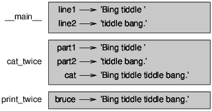
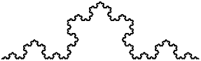

# La Pensée Python, Comment raisonner comme un scientiste de l'informatique

traduction du livre: 

### Think Python, How To Think Like A Computer Scientist 

#### d'Allan Downey

- par Abdur-Rahmaan Janhangeer de l'Ile Maurice 

<hr>

# Indexe

- [Chapitre 1: le chemin de la programmation](#ch1)
- [Chapitre 2: variables, expressions et déclarations](#ch2)
- [Chapitre 3: les fonctions](#ch3)
- [Chapitre 4: conception d'interface](#ch4)
- [Chapitre 5: conditions et récursivité](#ch5)
- [Chapitre 6: fonctions fructueuses](#ch6)
- [Chapitre 7: itération](#ch7)
- [Chapitre 8: strings ](#ch8)
- [Chapitre 9: jeu de mots ](#ch9)

<hr>

# Chapitre 1<a name="ch1"></a>

## Le chemin de la programmation
<br><br>
Le but de ce livre est de vous apprendre à penser comme un informaticien. Cette façon de penser combine certaines des meilleures caractéristiques des maths, de l'ingénierie et des sciences naturelles.
Comme les mathématiciens, les informaticiens utilisent des langages formels pour désigner des idées (en particulier les calculs). Comme les ingénieurs, ils conçoivent des choses, assemblent des composants dans des systèmes et évaluent les compromis entre les alternatives. Comme les scientifiques, ils observent le comportement des systèmes complexes, forment des hypothèses et testent des prédictions.

La compétence la plus importante pour un informaticien est la résolution de problèmes. La résolution des problèmes signifie la capacité de formuler des problèmes, réfléchir de manière créative aux solutions et exprimer une solution claire et précise. Dans l'affirmative, le processus d'apprentissage au programmation est une excellente occasion d’affiner ses compétences en matière de résolution de problèmes. C'est pourquoi ce chapitre s'appelle,
"Le chemin de la programmation".

À un niveau, vous apprendrez à programmer, une compétence utile en soi. Sur un autre niveau, vous utiliserez la programmation comme un moyen d'atteindre une fin. À mesure que nous progressons, cette fin deviendra plus claire.

### 1.1 Qu'est-ce qu'un programme?

Un programme est une séquence d'instructions qui spécifie comment effectuer un calcul. Le calcul peut être quelque chose de mathématique, comme la résolution d'un système d'équations ou trouver les racines d'un polynôme, mais il peut également s'agir d'un calcul symbolique, comme la recherche, remplacer du texte dans un document ou quelque chose de graphique, comme le traitement d'une image ou jouer une vidéo.

Les détails sont différents dépendant des langues, mais quelques instructions de base apparaissent dans la plupart des langues:

- Entrée: Obtenez des données du clavier, d'un fichier, du réseau ou d'un autre appareil.

- Sortie: afficher les données sur l'écran, l'enregistrer dans un fichier, envoie sur réseau, etc.

- Maths: effectuez des opérations mathématiques de base comme addition et multiplication.

- Exécution conditionnelle: vérifier certaines conditions et exécuter le code approprié.

- Répétition: Effectuez une action répétée, habituellement avec une certaine variation.

Croyez-le ou non, c'est à peu près tout ce qu'il y a à faire. Chaque programme que vous avez déjà utilisé, quelle que soit la complexité, se compose d'instructions qui ressemblent à peu près à celles-ci. Ainsi, vous pouvez penser à la programmation en tant que processus de rupture d'une tâche complexe en de sous-tâches plus petites et plus petites jusqu'à ce que les sous-tâches soient assez simples pour être exécutées avec une de ces instructions de base.

### 1.2 Exécuter Python

L'un des défis de commencer avec Python est que vous devrez peut-être installer Python et logiciels relatifs sur votre ordinateur. Si vous connaissez votre système d’exploitation, et surtout si vous êtes à l'aise avec l'interface de ligne de commande, vous n'aurez aucun problème pour installer Python. Mais pour les débutants, il peut être douloureux d'apprendre l'administration du système et la programmation en même temps.

Pour éviter ce problème, je vous recommande de commencer à exécuter Python dans un navigateur. Plus tard, lorsque vous êtes à l'aise avec Python, je ferai des suggestions pour installer Python sur votre ordinateur.

Il existe un certain nombre de pages Web que vous pouvez utiliser pour exécuter Python. Si vous avez déjà un favori, allez-y et utilisez-le. Sinon, je recommande PythonAnywhere. Voyez les instructions sur 
[http://tinyurl.com/thinkpython2e](http://tinyurl.com/thinkpython2e)

Il existe deux versions de Python, appelées Python 2 et Python 3. Elles sont très similaires, donc si vous en apprendrez un, il est facile de passer à l'autre. En fait, il n'y a que quelques différences que vous rencontrerez en tant que débutant. Ce livre est écrit pour Python 3, mais j'ai inclu des notes sur Python 2.

**L'interpréteur** Python est un programme qui lit et exécute le code Python. En fonction de votre environnement, vous pouvez lancer l'interprète en cliquant sur une icône ou en tapant python sur une ligne de commande. Quand cela commence, vous devriez voir:

```python
Python 3.4.0 (default, Jun 19 2015, 14:20:21)
[GCC 4.8.2] on linux
Type "help", "copyright", "credits" or "license" for more information.
>>>
```

Les trois premières lignes contiennent des informations sur l'interprète et le système d'exploitation actuel, donc il pourrait être différent pour vous. Mais vous devez vérifier que le numéro de version, qui est 3.4.0 dans cet exemple, commence par 3, ce qui indique que vous utilisez Python 3. Si cela commence avec 2, vous exécutez (vous l'avez deviné) Python 2.

La dernière ligne indique que l'interprète est prêt à recevoir le code. Si vous tapez une ligne de code et appuyez sur Entrée (sur le clavier), l'interprète affiche le résultat:

```python
>>> 1 + 1
2
```

Maintenant, vous êtes prêt à commencer. À partir de là, je suppose que vous savez comment commencer l’interprète de Python et exécuter des lignes de code.

### 1.3 Le premier programme

Traditionnellement, le premier programme que vous écrivez dans une nouvelle langue s'appelle "Hello, World!" Parce que tout ce qu'il fait, c'est d'afficher les mots "Hello, World!". Dans Python, cela ressemble à ceci:

```python
>>> print('Hello, World!')
```

Il s'agit d'un exemple d'une déclaration d'impression, bien qu'il n'imprime en réalité rien sur papier. Il affiche un résultat sur l'écran. Dans ce cas, le résultat est les mots

```
Hello, World!
```

Les guillemets dans le programme marquent le début et la fin du texte à afficher ; ils n'apparaissent pas dans le résultat.

Les parenthèses indiquent que l'impression est une fonction. Nous aborderons les fonctions du [chapitre 3](#ch3).

Dans Python 2, l'instruction d'impression est légèrement différente; ce n'est pas une fonction, donc les parenthèses, ça ne sert à rien.

```python
>>> print 'Hello, World!'
```

Cette distinction aura plus de sens bientôt, mais c'est assez pour commencer.

### 1.4 Opérateurs arithmétiques

Après ```" Hello, World!"```, la prochaine étape est l'arithmétique. Python fournit aux opérateurs, qui sont des symboles spéciaux qui représentent des calculs comme addition et multiplication.

Les opérateurs +, -, et * effectuent l'addition, la soustraction et la multiplication, comme suit
exemples:

```python

>>> 40 + 2
42
>>> 43 - 1
42
>>> 6 * 7
42

#L'opérateur / exécute la division:
>>> 84/2
42,0
```

Vous pourriez vous demander pourquoi le résultat est 42.0 au lieu de 42. Je vais vous expliquer dans la prochaine section.

Enfin, l'opérateur ** effectue une exponentiation; c'est-à-dire qu'il soulève un nombre à une puissance:

```python
>>> 6 ** 2 + 6
42
```

Dans certaines autres langues, ^ est utilisé pour l'exponentiation, mais en Python, c'est un opérateur bit appelé XOR. Si vous n'êtes pas familiarisé avec les opérateurs bit, le résultat vous surprendra:

```python
>>> 6 ^ 2
4
```

Je ne couvrirai pas les opérateurs bit à bit dans ce livre, mais vous pouvez les lire sur 
[http://wiki.python.org/moin/BitwiseOperators](http://wiki.python.org/moin/BitwiseOperators).

### 1.5 Valeurs et types

Une valeur est l'une des choses de base avec laquelle un programme fonctionne, comme une lettre ou un numéro. Certains des valeurs que nous avons vues jusqu'ici sont ```2```, ```42.0```, et ```'Hello, World!'```.

Ces valeurs appartiennent à différents types: ```2``` est un nombre entier, ```42.0``` est un float alias nombre décimal et ```'Hello, World!'``` est une chaîne de charactères (string en anglais), soi-disant parce que les lettres qu'il contient sont enfilées ensemble.

Si vous ne savez pas de quel type est une valeur, l'interprète peut vous dire:

```python
>>> type (2)
<classe 'int'>
>>> type (42.0)
<classe 'float'>
>>> type (' Hello, World!')
<classe 'str'>
```

Dans ces résultats, le mot ```«class»``` est utilisé au sens d'une catégorie; un type est une catégorie de valeurs.

Il n'est pas surprenant que les entiers appartiennent au type ```int```, les chaînes appartiennent à ```str``` et les nombres à virgule flottante à ```float```.

Qu'en est-il des valeurs comme ```'2'``` et ```'42 .0 '```? Ils ressemblent à des chiffres, mais ils sont en citations comme les strings.

```python
>>> type ('2')
<classe 'str'>
>>> type ('42 .0 ')
<classe 'str'>
Ils sont des strings.
```

Lorsque vous tapez un grand nombre entier, vous pourriez être tenté d'utiliser des virgules entre les groupes de chiffres, soit 1 000 000. Ce n'est pas un entier juridiquement parlant en Python, mais c'est légal :

```python
>>> 1,000,000
(1, 0, 0)
```
Ce n'est pas ce à quoi nous nous attendions du tout! Python interprète 1,000,000 comme une séquence d'entiers séparé par des virgules. Nous en apprendrons d’avantage sur ce genre de séquence plus tard.

### 1.6 Langues formelles et naturelles

Les langues sont les langues que les gens parlent, comme l'anglais, l'espagnol et le français. Ils n'étaient pas conçus par les gens (bien que les gens essayent d'imposer un ordre sur eux); ils évoluent naturellement.

Les langues formelles sont des langages conçus par des personnes pour des applications spécifiques. Par exemple, la notation utilisée par les mathématiciens est un langage formel qui est en particulier bien apte à dénoter les relations entre les nombres et les symboles. Les chimistes utilisent une langue formelle pour représenter la structure moléculaire des atomes. Et, surtout:

> **Les langages de programmation sont des langages formels conçus pour exprimer les calculs.**

Les langues formelles ont tendance à avoir des règles de syntaxe strictes qui régissent la structure des déclarations. Par exemple, en mathématiques, la déclaration ```3 + 3 = 6``` a une syntaxe correcte, mais ```3+ = 3 $ 6``` ne l’est pas. En chimie H<sub>2</sub>O est une formule syntaxiquement correcte, mais <sub>2</sub>Zz ne l'est pas.

Les règles de syntaxe comportent deux saveurs, relatives aux tokens et à la structure. Les tokens sont les éléments basiques de la langue, tels que les mots, les chiffres et les éléments chimiques. Un des problèmes avec ``3+ = 3 $ 6`` est que ```$``` n'est pas un token juridique en mathématiques (du moins à ce que je sais). De même, <sub>2</sub>Zz n'est pas légal car il n'y a aucun élément avec l'abréviation Zz.

Le second type de règle de syntaxe concerne la façon dont les tokens sont combinés. L'équation ```3 += 3 est illégal``` car même si + et = sont des tokens légaux, vous ne pouvez pas avoir un après l'autre. De même, dans une formule chimique, l'indice vient après le nom de l'élément, pas avant.

Ceci une phr@se bien $tructurée avec t * kens invalide. Cette phrase valable tokens a, mais structure invalide avec.

Lorsque vous lisez une phrase ou une déclaration dans une langue officielle, vous devez identifier la structure (bien que dans une langue naturelle, vous faites cela de façon inconsciente). Ce processus s'appelle parsing (analyse).

Bien que les langages formels et naturels possèdent de nombreuses caractéristiques communs : les token, la structure, et la syntaxe - il y a des différences:

- **ambiguïté:** les langues naturelles sont pleines d'ambiguïté, auxquelles les gens s'occupent en utilisant des indices contextuels et d'autres informations. Les langues officielles sont conçues pour être presque ou totalement sans ambiguïté, ce qui signifie que toute déclaration a exactement un sens, quel que soit le contexte.

- **redondance:** afin de compenser l'ambiguïté et de réduire les malentendus, les langues naturelles utilisent beaucoup de redondance. En conséquence, ils sont souvent détaillés. Les langues formelles sont moins redondantes et plus concises.

- **littéralité:** les langues naturelles sont pleines d'idiome et de métaphore. Si je dis en anglais: "The penny dropped" (litt. le penny est tombé), il n'y a probablement pas de penny et rien n’est tombé (cette idiome signifie que quelqu'un a compris quelque chose après une période de confusion). Les langues formelles signifient exactement ce qu'ils disent. Parce que nous grandissons tous en parlant des langues naturelles, il est parfois difficile de s'adapter à la forme langues. La différence entre langage formel et naturel est comme la différence entre la poésie et la prose, mais plus encore:

- **Poésie:** les mots sont utilisés pour leurs sons aussi bien que pour leur signification, et le poème entier ensemble crée un effet ou une réponse émotionnelle. L'ambiguïté n'est pas seulement souvent mais aussi délibéré.

- **Prose:** le sens littéral des mots est plus important, et la structure contribue davantage au sens. La prose est plus susceptible d'analyse que le poésie, mais toujours ambiguë.

- **Programmes:** la signification d'un programme informatique est sans ambiguïté et littérale, et peut être entièrement compris par l'analyse des tokens et de la structure.


Les langues formelles sont plus denses que les langues naturelles, il faut donc plus de temps pour les lire. En outre, la structure est importante, donc il n'est pas toujours préférable de lire de haut en bas, de gauche à droite. Au lieu de cela, apprenez à analyser le programme dans votre tête, identifiant les tokens et l'interprétation de la structure. Enfin, les détails sont importants. De petites erreurs dans l'orthographe et la ponctuation, dont vous pouvez vous en sortir dans des langues naturelles, peut faire une grande différence dans une langue formelle.

### 1.7 Débogage

Les programmeurs font des erreurs. Pour des raisons capricieuses, les erreurs de programmation sont appelées bugs et le processus de suivi est appelé débogage.
La programmation, et en particulier le débogage, soulève parfois de fortes émotions. Si vous êtes en face d’un bug difficile, vous pouvez vous sentir en colère, découragé ou embarrassé.

Il existe des preuves que les gens répondent naturellement aux ordinateurs comme s'ils étaient des gens. Quand ils fonctionnent bien, on les considère comme des coéquipiers, et quand ils sont obstinés ou grossiers, nous répondons à eux de la même manière que nous répondons à des personnes grossières et obstinées (Reeves and Nass, _The Media Equation: How People Treat Computers, Television, and New Media Like Real People
and Places_) .

Se préparer à ces réactions pourrait vous aider à les traiter. Une approche consiste à penser à l'ordinateur en tant qu'employé avec certaines forces, comme la vitesse et la précision, et en particulier les faiblesses, comme le manque d'empathie et l'incapacité de saisir l’image en gros.

Votre travail consiste à être un bon gestionnaire: trouver des moyens de tirer parti des atouts et atténuer les faiblesses. Et trouver des façons d'utiliser vos émotions pour s'engager dans le problème, sans laisser vos réactions interférer avec votre capacité à travailler efficacement.

Apprendre à déboguer peut être frustrant, mais c'est une compétence précieuse qui est utile pour de nombreuses activités au-delà de la programmation. À la fin de chaque chapitre, il y a une section, comme celle-ci, avec mes suggestions de débogage. J'espère qu'ils vous seront utiles!

### 1.8 Glossaire

- **résolution de problèmes / problem-solving:** le processus de formulation d'un problème, la recherche d'une solution et l'exprimer.

- **langage haut niveau / high-level language:** un langage de programmation comme Python conçu pour être facile pour les humains à lire et à écrire.

- **langage de bas niveau / low-level language:** un langage de programmation conçu pour être facile pour un ordinateur de parcourir; également appelé "language machine" ou "langage assembly".

- **portabilité:** une propriété d'un programme qui peut fonctionner sur plus d'un type d'ordinateur.

- **interprète:** un programme qui lit un autre programme et l'exécute

- **prompt:** caractères affichés par l'interprète pour indiquer qu'il est prêt à prendre une entrée de l'utilisateur.

- **programme:** un ensemble d'instructions qui spécifient un calcul.

- **print statement:** une instruction qui amène l'interpréteur Python à afficher une valeur sur l'écran.

- **opérateur:** un symbole spécial qui représente un calcul simple comme : addition, multiplication ou la concaténation de chaîne de caractères .

- **valeur:** une des unités de base de données, comme un nombre ou une chaîne, qu'un programme manipule.

- **type:** une catégorie de valeurs. Les types que nous avons vus jusqu'ici sont des entiers (type int), les nombres flottant (type float) et les chaînes (type str).

- **int:** un type qui représente des nombres entiers.

- **float:** un type qui représente des nombres décimaux.

- **string:** un type qui représente des séquences de caractères.
Langue naturelle: l'une des langues que les gens parlent et qui évolue naturellement.

- **langage formel:** l'une des langues que les gens ont conçues à des fins spécifiques, tels que la représentation d'idées mathématiques ou de programmes informatiques; toute les langues de programmation sont des langues officielles.

- **token:** l'un des éléments de base de la structure syntaxique d'un programme, analogue à un mot dans une langue naturelle.

- **syntax:** les règles qui régissent la structure d'un programme.

- **parsing / analyse:** examiner un programme et analyser la structure syntaxique.

- **bug / bogue:** une erreur dans un programme.

- **débogage:** processus de recherche et de correction de bogues.

### 1.9 Exercices

**Exercice 1**

_C'est une bonne idée de lire ce livre devant un ordinateur afin que vous puissiez essayer les exemples que vous allez lire._

_Chaque fois que vous expérimentez avec une nouvelle fonctionnalité, vous devriez essayer de faire des erreurs. Par exemple, dans le programme «Hello World!», qu'arrive-t-il si vous laissez une des guillemets? Et qu'est-ce qui se passerait si vous quittez les deux? Que se passe-t-il si vous écrivez une mauvaise impression? Ce genre d'expérience vous aide à vous souvenir de ce que vous lisez. Cela vous aide également lorsque vous programmez, parce que vous comprenez ce que signifient les messages d'erreur. Il est préférable de faire des fautes maintenant et que plus tard et accidentellement._

1. Dans un print statement , que se passe-t-il si vous excluez l'une des parenthèses, ou les deux?

2. Si vous essayez d'imprimer une chaîne, que se passe-t-il si vous laissez une des guillemets, ou les deux?

3. Vous pouvez utiliser un signe moins pour créer un nombre négatif comme -2. Que se passe-t-il si vous mettez un + avant un nombre? Qu'en est-il de 2 ++ 2?

4. En notation mathématique, les zéros avancés sont corrects, comme en 02. Que se passe-t-il si vous essayez cela dans Python?

5. Que se passe-t-il si vous avez deux valeurs sans opérateur entre elles?

**Exercice 2**

_Démarrez l'interpréteur Python et utilisez-le comme calculatrice._

1. Combien de secondes existe-t-il en 42 minutes 42 secondes?

2. Combien y a-t-il de miles en 10 kilomètres? Astuce: il y a 1.61 kilomètre dans un mile.

3. Si vous exécutez une course de 10 kilomètres en 42 minutes 42 secondes, quel est votre rythme moyen (temps par mile en minutes et secondes)? Quelle est votre vitesse moyenne en miles par heure?

# Chapitre 2 <a name="ch2"></a>

## Variables, expressions et déclarations
<br><br>
### 2.1 L'affectation

Une **affectation** crée une nouvelle variable et lui donne une valeur

```python
>>> message = 'And now for something completely different'
>>> n = 17
>>> pi = 3.141592653589793
```

Cet exemple fait trois affectations. Le premier attribue une chaîne à une nouvelle variable appelée message; la seconde donne l'entier 17 à n; le troisième attribue la valeur (approximative) de π à pi.

Une manière courante de représenter des variables sur du papier consiste à écrire le nom avec une flèche pointant vers sa valeur. Ce type de figure est appelé diagramme d’état car il indique l’état de chacune des variables (considérez-le comme l’état d’esprit de la variable). La figure 2.1 montre le résultat de l'exemple précédent.


### 2.2 Nom de variables

Les programmeurs choisissent généralement des noms significatifs pour leurs variables - ils documentent l'utilisation de la variable.

Les noms de variables peuvent être aussi longs que vous le souhaitez. Ils peuvent contenir des lettres et des chiffres, mais ils ne peuvent pas commencer par un chiffre. Il est légal d'utiliser des lettres majuscules, mais il est conventionnel de n'utiliser que des minuscules pour les noms de variables.

Le caractère de soulignement _ peut apparaître dans un nom. Il est souvent utilisé dans les noms comportant plusieurs mots, tels que ```your_name``` ou ```airspeed_of_unladen_swallow``` .

Si vous attribuez un nom illégal à une variable, vous obtenez une erreur de syntaxe:

```python
>>> 76trombones = 'grand défilé'
SyntaxError: invalid syntax
>>> more@ = 1000000
SyntaxError: invalid syntax
>>> class = 'Zymurgie théorique avancée'
SyntaxError: invalid syntax
```
```76trombones``` est illégal car il commence par un nombre. ```more@``` est illégal car il contient un caractère illégal, @. Mais quel est le problème avec ```class```?

Il s’avère que ```class``` est l’un des mots clés de Python. L'interprète utilise des mots-clés pour reconnaître la structure du programme et ne peut pas être utilisé comme nom de variable.

Python 3 a ces mots-clés:

```python
False      class      finally    is         return
None       continue   for        lambda     try
True       def        from       nonlocal   while
and        del        global     not        with
as         elif       if         or         yield
assert     else       import     pass
break      except     in         raise
```
Vous n'êtes pas obligé de mémoriser cette liste. Dans la plupart des environnements de développement, les mots-clés sont affichés dans une couleur différente. si vous essayez d’en utiliser un comme nom de variable, vous le saurez.

#### 2.3 Expression et déclarations

Une expression est une combinaison de valeurs, de variables et d'opérateurs. Une valeur en elle-même est considérée comme une expression, de même qu'une variable. Par conséquent ceux-là sont des expressions juridiques:
```python
>>> 42
42
>>> n
17
>>> n + 25
42
```
Lorsque vous tapez une expression au prompt, l'interpréteur l'évalue, ce qui signifie qu'il trouve la valeur de l'expression. Dans cet exemple, ```n``` a la valeur 17 et ```n + 25``` a la valeur 42.

Une instruction est une unité de code qui a un effet, comme créer une variable ou afficher une valeur.

```python
>>> n = 17
>>> imprimer (n)
```
La première ligne est une instruction d’affectation qui donne une valeur à ```n```. La deuxième ligne est une instruction print qui affiche la valeur de ```n```.

Lorsque vous tapez une instruction, l'interprète l'exécute, ce qui signifie qu'il fait tout ce que dit l'instruction. En général, les déclarations n’ont pas de valeurs.

### 2.4 Mode script

Jusqu'à présent, nous avons exécuté Python en mode interactif, ce qui signifie que vous interagissez directement avec l'interpréteur. Le mode interactif est un bon moyen de commencer, mais si vous travaillez avec plus de quelques lignes de code, il peut être maladroit.

L'alternative consiste à enregistrer le code dans un fichier appelé script, puis à exécuter l'interpréteur en mode script pour exécuter le script. Par convention, les scripts Python ont des noms qui se terminent par .py.

Si vous savez créer et exécuter un script sur votre ordinateur, vous êtes prêt. Sinon, je recommande d'utiliser PythonAnywhere à nouveau. J'ai posté des instructions pour l'exécution en mode script à l'adresse [http://tinyurl.com/thinkpython2e](http://tinyurl.com/thinkpython2e).

Comme Python fournit les deux modes, vous pouvez tester des bouts de code en mode interactif avant de les insérer dans un script. Mais il existe des différences entre le mode interactif et le mode script qui peuvent prêter à confusion.

Par exemple, si vous utilisez Python comme calculatrice, vous pouvez taper
```python
>>> miles = 26,2
>>> milles * 1,61
42.182
```
La première ligne attribue une valeur aux miles, mais elle n’a aucun effet visible. La deuxième ligne est une expression, donc l'interprète l'évalue et affiche le résultat. Il s'avère qu'un marathon est d'environ 42 kilomètres.

Mais si vous tapez le même code dans un script et que vous l'exécutez, vous n'obtenez aucune sortie. En mode script, une expression, par elle-même, n'a aucun effet visible. Python évalue réellement l'expression, mais il n'affiche pas la valeur sauf si vous lui indiquez:
```python
miles = 26,2
print(miles * 1,61)
```
Ce comportement peut être déroutant au début.

Un script contient généralement une séquence d'instructions. S'il existe plusieurs instructions, les résultats s'affichent les uns après les autres au fur et à mesure de leur exécution.

Par exemple, le script

```python
print(1)
x = 2
print(x)
```
produit la sortie
```
1
2
```
L'instruction d'affectation ne produit aucune sortie.

Pour vérifier votre compréhension, tapez les instructions suivantes dans l'interpréteur Python et voyez ce qu'elles font:
```python
5
x = 5
x + 1
```
Maintenant, mettez les mêmes instructions dans un script et exécutez-le. Quelle est la sortie? Modifiez le script en transformant chaque expression en une instruction d'impression, puis réexécutez-la.

### 2.5 Ordre des opérations

Lorsqu'une expression contient plusieurs opérateurs, l'ordre d'évaluation dépend de l'ordre des opérations. Pour les opérateurs mathématiques, Python respecte les conventions mathématiques. L'acronyme **PEMDAS** est un moyen utile de mémoriser les règles:

- Les **P**arenthèses ont la priorité la plus élevée et peuvent être utilisées pour forcer l’évaluation d’une expression dans l’ordre que vous souhaitez. Comme les expressions entre parenthèses sont évaluées en premier, ```2 * (3-1)``` est égal à 4 et ```(1 + 1) ** (5-2)``` est égal à 8. Vous pouvez également utiliser des parenthèses pour faciliter la lecture d’une expression, comme dans ```( minute * 100) / 60```, même si cela ne change pas le résultat.

- L'**E**xponentiation a la priorité suivante, donc ```1 + 2 ** 3``` est égal à 9 et non 27 et ```2 * 3 ** 2``` à 18 et non 36.

- La **M**ultiplication et la **D**ivision ont une priorité plus élevée que l'addition et la soustraction. Donc, ```2 * 3-1``` correspond à 5, pas 4, et ```6 + 4/2``` à 8, pas 5.

- Les opérateurs avec la même priorité sont évalués de gauche à droite (sauf l'exponentiation). Ainsi, dans l'expression ```degrees / 2 * pi```, la division se produit en premier et le résultat est multiplié par pi. Pour diviser par 2 π, vous pouvez utiliser des parenthèses ou écrire ```degrees / 2 / pi```.

Je ne travaille pas très dur pour me souvenir de la préséance des opérateurs. Si je ne peux pas dire en regardant l'expression, j'utilise des parenthèses pour la rendre évidente.

### 2.6 Opérations sur les chaînes

En général, vous ne pouvez pas effectuer d’opérations mathématiques sur des chaînes, même si elles ressemblent à des nombres, les opérations suivantes sont donc illégales:

```
'2' - '1' 
'oeufs' / 'facile' 
'troisième' * 'un charme'
```

Mais il y a deux exceptions, + et * .

L'opérateur + effectue la concaténation de chaînes, ce qui signifie qu'il joint les chaînes en les liant de bout en bout. Par exemple:
```python
>>> first = 'throat'
>>> second = 'warbler'
>>> first + second
throatwarbler
```

L'opérateur * travaille également sur les chaînes; il effectue la répétition. Par exemple, ```"Spam" * 3``` est ```"SpamSpamSpam"```. Si l'une des valeurs est une chaîne, l'autre doit être un entier.

Cette utilisation de + et * est logique par analogie avec l'addition et la multiplication. Tout comme ```4 * 3``` équivaut à ```4 + 4 + 4```, nous nous attendons à ce que ```'Spam' * 3``` soit identique à ```'Spam' + 'Spam' + 'Spam'```, et c'est le cas. D'autre part, il existe une différence significative entre la concaténation et la répétition de chaînes et l'addition et la multiplication d'entiers. Pouvez-vous penser à une propriété dont l'addition a que lq concaténation n'ait pas?

### 2.7 Commentaires

À mesure que les programmes deviennent plus grands et plus compliqués, ils deviennent plus difficiles à lire. Les langages formels sont denses et il est souvent difficile de regarder un morceau de code et de comprendre ce qu'il fait ou pourquoi.

Pour cette raison, il est judicieux d’ajouter des notes à vos programmes pour expliquer en langage naturel ce qu’il fait. Ces notes s'appellent des commentaires et commencent par le symbole ```#```:

```python
# calcule le pourcentage de l'heure écoulée
pourcentage = (minute * 100) / 60
```

Dans ce cas, le commentaire apparaît sur une ligne à part. Vous pouvez également mettre des commentaires à la fin d'une ligne:

```python
pourcentage = (minute * 100) / 60 # pourcentage d'une heure
```
Tout ce qui va du ```#``` à la fin de la ligne est ignoré - cela n’a aucun effet sur l’exécution du programme.

Les commentaires sont plus utiles lorsqu'ils documentent des caractéristiques non évidentes du code. Il est raisonnable de supposer que le lecteur peut comprendre ce que fait le code; il est plus utile d'expliquer pourquoi.

Ce commentaire est redondant avec le code et inutile:

```python
v = 5 # assigner 5 à v
```

Ce commentaire contient des informations utiles qui ne figurent pas dans le code:

```python
v = 5 # vitesse en mètres / seconde.
```
De bons noms de variables peuvent réduire le besoin de commentaires, mais des noms longs peuvent rendre les expressions complexes difficiles à lire, ce qui crée un compromis.

### 2.8 Débogage

Trois types d’erreur peuvent se produire dans un programme: les erreurs de syntaxe, les erreurs d’exécution et les erreurs sémantiques. Il est utile de les distinguer afin de les localiser plus rapidement.

- **Erreur de syntaxe:** La «syntaxe» fait référence à la structure d'un programme et aux règles relatives à cette structure. Par exemple, les parenthèses doivent être appariées, donc ```(1 + 2)``` est légal, mais ```8)``` est une erreur de syntaxe.
S'il y a une erreur de syntaxe dans votre programme, Python affiche un message d'erreur et se ferme. Vous ne pourrez pas exécuter le programme. Pendant les premières semaines de votre carrière en programmation, vous passerez peut-être beaucoup de temps à rechercher les erreurs de syntaxe. Au fur et à mesure que vous gagnerez de l'expérience, vous ferez moins d'erreurs et les trouverez plus rapidement.

- **Erreur d'exécution:** Le deuxième type d'erreur est une erreur d'exécution, ainsi appelée car l'erreur n'apparaît pas avant que le programme n'ait commencé à s'exécuter. Ces erreurs sont également appelées exceptions car elles indiquent généralement qu'un événement exceptionnel (et un incident grave) s'est produit.
Les erreurs d'exécution sont rares dans les programmes simples que vous verrez dans les premiers chapitres, il faudra donc peut-être un peu de temps avant d'en rencontrer un.

- **Erreur sémantique:** Le troisième type d'erreur est «sémantique», ce qui signifie lié au sens. S'il y a une erreur sémantique dans votre programme, celui-ci s'exécutera sans générer de message d'erreur, mais cela ne fonctionnera pas correctement. Cela fera autre chose. Plus précisément, il fera ce que vous lui avez dit de faire.
Identifier les erreurs sémantiques peut être délicat, car cela nécessite de travailler en arrière en examinant les résultats du programme et en essayant de comprendre ce qu'il fait.

### 2.9 Glossaire

- **variable:** Un nom qui fait référence à une valeur.

- **affectation:** Une déclaration qui assigne une valeur à une variable.

- **diagramme d'état:** Représentation graphique d'un ensemble de variables et des valeurs auxquelles elles se rapportent.

- **mot-clé:** Mot réservé utilisé pour analyser un programme. vous ne pouvez pas utiliser de mots-clés tels que if, def et while comme noms de variable.

- **opérande:** Une des valeurs sur lesquelles opère un opérateur.

- **expression:** Combinaison de variables, d'opérateurs et de valeurs représentant un seul résultat.

- **évaluer:** Simplifier une expression en effectuant les opérations afin de générer une valeur unique.

- **déclaration:** Une section de code qui représente une commande ou une action. Jusqu'à présent, les déclarations que nous avons vues sont des assignations et des déclarations imprimées.

- **exécuter:** Pour exécuter une déclaration et faire ce qu'elle dit.

- **mode interactif:** Une façon d'utiliser l'interpréteur Python en tapant du code à l'invite.

- **mode script:** Une façon d'utiliser l'interpréteur Python pour lire le code d'un script et l'exécuter.

- **scénario:** Un programme stocké dans un fichier.

- **ordre des opérations:** Règles régissant l'ordre dans lequel les expressions impliquant plusieurs opérateurs et opérandes sont évaluées.

- **enchaîner:** Pour joindre deux opérandes de bout en bout.

- **commentaire:** Informations contenues dans un programme destiné à d'autres programmeurs (ou à toute personne lisant le code source) et n'ayant aucun effet sur l'exécution du programme.

- **erreur de syntaxe:** Une erreur dans un programme qui rend impossible l'analyse (et donc impossible à interpréter).

- **exception:** Une erreur détectée pendant l'exécution du programme.

- **sémantique:** Le sens d'un programme.

- **erreur sémantique:** Une erreur dans un programme qui lui fait faire autre chose que ce que le programmeur avait prévu.

### 2.10 Exercices

** Exercice 1 **

_Répétant les conseils du chapitre précédent, chaque fois que vous apprenez une nouvelle fonctionnalité, vous devriez l'essayer en mode interactif et faire des erreurs exprès pour voir ce qui ne va pas._

- _Nous avons vu que ```n = 42``` est légal. Qu'en est-il de ```42 = n``` ?_

- _Comment à propos de ```x = y = 1```?_

- _Dans certaines langues, chaque instruction se termine par un point-virgule,;. Que se passe-t-il si vous mettez un point-virgule à la fin d'une instruction Python?_

- _Que se passe-t-il si vous mettez un point à la fin d'une déclaration?_

- _En notation mathématique, vous pouvez multiplier x et y comme ceci: ```x y```. Que se passe-t-il si vous essayez cela en Python?_

** Exercice 2 **

_Pratique utilisant l'interpréteur Python comme calculatrice:_

1. _Le volume d'une sphère de rayon r est 4/3 π r<sup>3</sup>. Quel est le volume d'une sphère de rayon 5?_

2. _Supposez que le prix de vente d'un livre est de $24,95 , mais les librairies bénéficient d'une réduction de 40%. La livraison coûte $3 pour le premier exemplaire et 75 cents pour chaque exemplaire supplémentaire. Quel est le prix en gros total pour 60 exemplaires?_

3. _Si je quitte ma maison à 6h52 du matin et que je cours 1 mile à un rythme lent (8:15 par mile), puis 3 miles au tempo (7:12 par mile) et à un mile à nouveau, quelle heure puis-je rentrer à la maison pour le petit déjeuner?_ 

<hr>

# Chapitre 3<a name="ch3"></a>

## Les fonctions
<br><br>

Dans le contexte de la programmation, une fonction est une séquence d'instructions nommée qui effectue un calcul. Lorsque vous définissez une fonction, vous spécifiez le nom et la séquence d'instructions. Plus tard, vous pourrez “appeler” la fonction par son nom.

### 3.1 Appels de fonction

Nous avons déjà vu un exemple d'appel de fonction:

```python
>>> type (42)
<classe 'int'>
```

Le nom de la fonction est type. L'expression entre parenthèses est appelée l'argument de la fonction. Le résultat, pour cette fonction, est le type de l'argument.

Il est courant de dire qu'une fonction "prend" un argument et "renvoie" un résultat. Le résultat s'appelle également la valeur de retour.

Python fournit des fonctions qui convertissent les valeurs d'un type à un autre. La fonction int prend n'importe quelle valeur et la convertit en un entier, si elle le peut, ou se plaint sinon:

```python
>>> int('32')
32
>>> int('Hello')
ValueError: invalid literal for int(): Hello
```
int peut convertir les valeurs en virgule flottante en nombres entiers, mais cela n’arrondit pas; il coupe la partie fraction:

```python
>>> int(3.99999)
3
>>> int(-2.3)
-2
```

float convertit les entiers et les chaînes en nombres à virgule flottante:

```python
>>> float(32)
32.0
>>> float('3.14159')
3.14159
```

Enfin, str convertit son argument en chaîne:

```python
>>> str(32)
'32'
>>> str(3.14159)
'3.14159'
```

### 3.2 Fonctions mathématiques

Python a un module mathématique qui fournit la plupart des fonctions mathématiques habituelles. Un module est un fichier contenant une collection de fonctions connexes.

Avant de pouvoir utiliser les fonctions d'un module, nous devons l'importer avec une instruction import:

```python
>>> import math
```
Cette instruction crée un objet module nommé math. Si vous affichez l'objet module, vous obtenez des informations à ce sujet:

```python
>>> math
<module 'math' (built-in)>
```
L'objet module contient les fonctions et les variables définies dans le module. Pour accéder à l'une des fonctions, vous devez spécifier le nom du module et le nom de la fonction, séparés par un point (également appelé période). Ce format s'appelle la notation par point.

```python
>>> ratio = signal_power / noise_power
>>> decibels = 10 * math.log10(ratio)

>>> radians = 0.7
>>> height = math.sin(radians)
```
Le premier exemple utilise math.log10 pour calculer un rapport signal sur bruit en décibels (en supposant que signal_power et noise_power soient définis). Le module mathématique fournit également un journal, qui calcule les logarithmes de base e.

Le deuxième exemple trouve le sinus de radians. Le nom de la variable est un indice que péché et les autres fonctions trigonométriques (cos, tan, etc.) prennent des arguments en radians. Pour convertir des degrés en radians, divisez par 180 et multipliez par π:

```python
>>> degrees = 45
>>> radians = degrees / 180.0 * math.pi
>>> math.sin(radians)
0.707106781187
```

L'expression math.pi obtient la variable pi du module mathématique. Sa valeur est une approximation à virgule flottante de π, précise à environ 15 chiffres.

Si vous connaissez la trigonométrie, vous pouvez vérifier le résultat précédent en le comparant à la racine carrée de deux divisée par deux:

```python
>>> math.sqrt(2) / 2.0
0.707106781187
```

### 3.3 Composition

Jusqu'à présent, nous avons examiné les éléments d'un programme - variables, expressions et déclarations - de manière isolée, sans parler de la façon de les combiner.

Une des caractéristiques les plus utiles des langages de programmation est leur capacité à prendre et à composer de petits blocs de construction. Par exemple, l'argument d'une fonction peut être n'importe quel type d'expression, y compris les opérateurs arithmétiques:

```python
x = math.sin (degrés / 360.0 * 2 * math.pi)
```

Et même des appels de fonction:

```python
x = math.exp(math.log(x+1))
```

Presque n'importe où vous pouvez mettre une valeur, vous pouvez mettre une expression arbitraire, à une exception près: le côté gauche d'une instruction d'affectation doit être un nom de variable. Toute autre expression à gauche est une erreur de syntaxe (nous verrons des exceptions à cette règle plus tard).

```python
>>> minutes = hours * 60                 # right
>>> hours * 60 = minutes                 # wrong!
SyntaxError: can't assign to operator
```

### 3.4 Ajouter de nouvelles fonctions

Jusqu'à présent, nous utilisions uniquement les fonctions fournies avec Python, mais il est également possible d'ajouter de nouvelles fonctions. Une définition de fonction spécifie le nom d'une nouvelle fonction et la séquence d'instructions qui s'exécutent lorsque la fonction est appelée.

Voici un exemple:

```python
def print_lyrics():
    print("I'm a lumberjack, and I'm okay.")
    print("I sleep all night and I work all day.")
```

def est un mot clé qui indique qu'il s'agit d'une définition de fonction. Le nom de la fonction est print_lyrics. Les règles pour les noms de fonction sont les mêmes que pour les noms de variables: les lettres, les chiffres et les traits de soulignement sont légaux, mais le premier caractère ne peut pas être un nombre. Vous ne pouvez pas utiliser un mot-clé comme nom d'une fonction et vous devez éviter d'avoir une variable et une fonction du même nom.

Les parenthèses vides après le nom indiquent que cette fonction ne prend aucun argument.

La première ligne de la définition de fonction s'appelle l'en-tête. le reste s'appelle le corps. L'en-tête doit se terminer par un deux-points et le corps doit être mis en retrait. Par convention, l'indentation est toujours de quatre espaces. Le corps peut contenir n'importe quel nombre d'énoncés.

Les chaînes dans les instructions d'impression sont placées entre guillemets. Les guillemets simples et les guillemets doubles font la même chose; la plupart des gens utilisent des guillemets simples, sauf dans les cas comme celui-ci où un guillemet simple (qui est aussi une apostrophe) apparaît dans la chaîne.

Tous les guillemets (simples et doubles) doivent être des «guillemets droits», généralement situés à côté de la touche Entrée du clavier. Les «guillemets bouclés», comme ceux de cette phrase, ne sont pas légaux en Python.

Si vous tapez une définition de fonction en mode interactif, l’interprète imprime des points (...) pour vous informer que la définition n’est pas complète:

```python
>>> def print_lyrics():
...     print("I'm a lumberjack, and I'm okay.")
...     print("I sleep all night and I work all day.")
...
```

Pour terminer la fonction, vous devez entrer une ligne vide.

La définition d'une fonction crée un objet de fonction, qui a le type fonction:

```python
>>> print(print_lyrics)
<function print_lyrics at 0xb7e99e9c>
>>> type(print_lyrics)
<class 'function'>
```

La syntaxe pour appeler la nouvelle fonction est la même que pour les fonctions intégrées:

```python
>>> print_lyrics()
I'm a lumberjack, and I'm okay.
I sleep all night and I work all day.
```

Une fois que vous avez défini une fonction, vous pouvez l’utiliser dans une autre fonction. Par exemple, pour répéter le refrain précédent, nous pourrions écrire une fonction appelée repeat_lyrics:

```python
def repeat_lyrics ():
    print_lyrics ()
    print_lyrics ()
```

Et ensuite, appelez repeat_lyrics:

```python
>>> repeat_lyrics()
I'm a lumberjack, and I'm okay.
I sleep all night and I work all day.
I'm a lumberjack, and I'm okay.
I sleep all night and I work all day.
```

Mais ce n’est pas vraiment comme ça que la chanson se passe.

### 3.5 Définitions et utilisations

En rassemblant les fragments de code de la section précédente, l'ensemble du programme se présente comme suit:

```python
def print_lyrics():
    print("I'm a lumberjack, and I'm okay.")
    print("I sleep all night and I work all day.")

def repeat_lyrics():
    print_lyrics()
    print_lyrics()

repeat_lyrics()
```

Ce programme contient deux définitions de fonction: print_lyrics et repeat_lyrics. Les définitions de fonctions sont exécutées exactement comme les autres instructions, mais l’effet consiste à créer des objets de fonction. Les instructions à l'intérieur de la fonction ne sont exécutées que lorsque la fonction est appelée et que la définition de la fonction ne génère aucune sortie.

Comme vous vous en doutez, vous devez créer une fonction avant de pouvoir l'exécuter. En d'autres termes, la définition de la fonction doit être exécutée avant que la fonction ne soit appelée.

En tant qu'exercice, déplacez la dernière ligne de ce programme vers le haut pour que l'appel de fonction apparaisse avant les définitions. Exécutez le programme et voyez quel message d'erreur vous obtenez.

Déplacez maintenant l'appel de fonction vers le bas et déplacez la définition de print_lyrics après la définition de repeat_lyrics. Que se passe-t-il lorsque vous exécutez ce programme?

### 3.6 Flux d'exécution

Pour vous assurer qu'une fonction est définie avant sa première utilisation, vous devez connaître le déroulement des instructions, appelé flux d'exécution.

L'exécution commence toujours à la première déclaration du programme. Les instructions sont exécutées une par une, de haut en bas.

Les définitions de fonction ne modifient pas le flux d’exécution du programme, mais rappelez-vous que les instructions contenues dans la fonction ne sont exécutées que lorsque la fonction est appelée.

Un appel de fonction est comme un détour dans le flux d'exécution. Au lieu de passer à l'instruction suivante, le flux saute dans le corps de la fonction, y exécute les instructions, puis revient à la position où elle s'est arrêtée.

Cela semble assez simple, jusqu'à ce que vous vous souveniez qu'une fonction peut en appeler une autre. Au milieu d'une fonction, le programme peut devoir exécuter les instructions dans une autre fonction. Ensuite, lors de l’exécution de cette nouvelle fonction, le programme devra peut-être exécuter une autre fonction encore!

Heureusement, Python sait bien où il se trouve. Ainsi, chaque fois qu'une fonction est terminée, le programme reprend là où il l'avait laissé dans la fonction qui l'a appelée. Quand il arrive à la fin du programme, il se termine.

En résumé, lorsque vous lisez un programme, vous ne voulez pas toujours lire de haut en bas. Parfois, il est plus logique de suivre le déroulement de l’exécution.

### 3.7 Paramètres et arguments

Certaines des fonctions que nous avons vues nécessitent des arguments. Par exemple, lorsque vous appelez math.sin, vous passez un nombre en argument. Certaines fonctions prennent plus d'un argument: math.pow en prend deux, la base et l'exposant.

Dans la fonction, les arguments sont affectés à des variables appelées paramètres. Voici une définition pour une fonction qui prend un argument:

```python
def print_twice(bruce):
    print(bruce)
    print(bruce)
```

Cette fonction assigne l'argument à un paramètre nommé bruce. Lorsque la fonction est appelée, elle affiche deux fois la valeur du paramètre (quel qu’il soit).

Cette fonction fonctionne avec toutes les valeurs pouvant être imprimées.

```python
>>> print_twice('Spam')
Spam
Spam
>>> print_twice(42)
42
42
>>> print_twice(math.pi)
3.14159265359
3.14159265359
```
Les mêmes règles de composition qui s'appliquent aux fonctions intégrées s'appliquent également aux fonctions définies par le programmeur. Nous pouvons donc utiliser n'importe quel type d'expression comme argument pour print_twice:

```python
>>> print_twice('Spam '*4)
Spam Spam Spam Spam
Spam Spam Spam Spam
>>> print_twice(math.cos(math.pi))
-1.0
-1.0
```
L'argument est évalué avant l'appel de la fonction. Ainsi, dans les exemples, les expressions 'Spam' * 4 et math.cos (math.pi) ne sont évaluées qu'une seule fois.

Vous pouvez également utiliser une variable comme argument:

```python
>>> michael = 'Eric, the half a bee.'
>>> print_twice(michael)
Eric, the half a bee.
Eric, the half a bee.
```
Le nom de la variable que nous passons en tant qu'argument (michael) n'a rien à voir avec le nom du paramètre (bruce). Peu importe que la valeur ait été appelée à la maison (dans l'appelant); ici à print_twice, nous appelons tout le monde bruce.

### 3.8 Les variables et les paramètres sont locaux

Lorsque vous créez une variable dans une fonction, elle est locale, ce qui signifie qu'elle n'existe que dans la fonction. Par exemple:

```python
def cat_twice(part1, part2):
    cat = part1 + part2
    print_twice(cat)
```

Cette fonction prend deux arguments, les concatène et affiche le résultat deux fois. Voici un exemple qui l'utilise:

```python
>>> line1 = 'Bing tiddle '
>>> line2 = 'tiddle bang.'
>>> cat_twice(line1, line2)
Bing tiddle tiddle bang.
Bing tiddle tiddle bang.
```

Lorsque cat_twice se termine, la variable cat est détruite. Si nous essayons de l'imprimer, nous obtenons une exception:

```python
>>> print(cat)
NameError: name 'cat' is not defined
```

Les paramètres sont également locaux. Par exemple, en dehors de print_twice, il n’existe pas de bruce.

### 3.9 Diagrammes de pile

Pour savoir quelles variables peuvent être utilisées où, il est parfois utile de dessiner un diagramme de pile. Comme les diagrammes d'état, les diagrammes de pile indiquent la valeur de chaque variable, mais ils indiquent également la fonction à laquelle appartient cette variable.

Chaque fonction est représentée par un cadre. Un cadre est une boîte avec le nom d'une fonction à côté, ainsi que les paramètres et les variables de la fonction qu'il contient. Le diagramme de pile de l'exemple précédent est présenté à la figure 3.1.



Figure 3.1: diagramme de pile.

Les cadres sont disposés dans une pile qui indique quelle fonction est appelée, et ainsi de suite. Dans cet exemple, print_twice a été appelé par cat_twice et cat_twice par __main__, qui est un nom spécial pour la plus haute image. Lorsque vous créez une variable en dehors de toute fonction, elle appartient à __main__.


Chaque paramètre fait référence à la même valeur que son argument correspondant. Ainsi, part1 a la même valeur que line1, part2 a la même valeur que line2 et bruce a la même valeur que cat.

Si une erreur se produit pendant un appel de fonction, Python affiche le nom de la fonction, le nom de la fonction qui l’a appelée et le nom de la fonction qui l’a appelée, jusqu’à __main__.

Par exemple, si vous essayez d'accéder à cat depuis print_twice, vous obtenez une erreur NameError:

```python
Traceback (innermost last):
  File "test.py", line 13, in __main__
    cat_twice(line1, line2)
  File "test.py", line 5, in cat_twice
    print_twice(cat)
  File "test.py", line 9, in print_twice
    print(cat)
NameError: name 'cat' is not defined
```

Cette liste de fonctions s'appelle un traceback. Il vous indique dans quel fichier de programme l'erreur s'est produite, dans quelle ligne et quelles fonctions étaient exécutées à ce moment-là. Il montre également la ligne de code qui a provoqué l'erreur.

L'ordre des fonctions dans le suivi est le même que celui des images dans le diagramme de pile. La fonction en cours d'exécution est en bas.

### 3.10 Fonctions fructueuses et fonctions vides

Certaines des fonctions que nous avons utilisées, telles que les fonctions mathématiques, renvoient des résultats; faute de meilleur nom, je les appelle des fonctions fructueuses. D'autres fonctions, comme print_twice, effectuent une action mais ne renvoient pas de valeur. Ils s'appellent des fonctions vides.

Lorsque vous appelez une fonction fructueuse, vous voulez presque toujours faire quelque chose avec le résultat; Par exemple, vous pouvez l'assigner à une variable ou l'utiliser dans le cadre d'une expression:

```python
x = math.cos(radians)
golden = (math.sqrt(5) + 1) / 2
```

Lorsque vous appelez une fonction en mode interactif, Python affiche le résultat:

```python
>>> math.sqrt(5)
2.2360679774997898
```

Mais dans un script, si vous appelez une fonction fructueuse toute seule, la valeur de retour est perdue à jamais!

```python
math.sqrt(5)
```

Ce script calcule la racine carrée de 5, mais comme il ne stocke ni n’affiche le résultat, il n’est pas très utile.

Les fonctions d'annulation peuvent afficher quelque chose à l'écran ou avoir un autre effet, mais elles n'ont pas de valeur de retour. Si vous affectez le résultat à une variable, vous obtenez une valeur spéciale appelée Aucune.

```python
>>> result = print_twice('Bing')
Bing
Bing
>>> print(result)
None
```

La valeur None est différente de la chaîne "None". C'est une valeur spéciale qui a son propre type:

```python
>>> type(None)
<class 'NoneType'>
```

Les fonctions que nous avons écrites jusqu'à présent sont toutes nulles. Nous allons commencer à écrire des fonctions fructueuses dans quelques chapitres.

### 3.11 Pourquoi les fonctions?

On ne comprend peut-être pas pourquoi il vaut la peine de diviser un programme en fonctions. Il existe plusieurs raisons:

- La création d'une nouvelle fonction vous permet de nommer un groupe d'instructions, ce qui facilite la lecture et le débogage de votre programme.

- Les fonctions peuvent rendre un programme plus petit en éliminant le code répétitif. Plus tard, si vous effectuez un changement, vous ne devez le faire qu’à un seul endroit.

- Diviser un programme long en fonctions vous permet de déboguer les pièces une par une, puis de les assembler en un ensemble fonctionnel.

- Des fonctions bien conçues sont souvent utiles pour de nombreux programmes. Une fois que vous avez écrit et débogué, vous pouvez le réutiliser.

### 3.12 Débogage

Une des compétences les plus importantes que vous allez acquérir est le débogage. Bien que cela puisse être frustrant, le débogage est l’une des parties de la programmation les plus riches, les plus stimulantes et les plus intéressantes sur le plan intellectuel.

À certains égards, le débogage est comme un travail de détective. Vous êtes confronté à des indices et vous devez en déduire les processus et les événements qui ont conduit aux résultats que vous voyez.

Le débogage est aussi une science expérimentale. Une fois que vous avez une idée de ce qui ne va pas, modifiez votre programme et essayez à nouveau. Si votre hypothèse était correcte, vous pouvez prédire le résultat de la modification et vous rapprocher d'un programme opérationnel. Si votre hypothèse était fausse, vous devez en inventer une nouvelle. Comme Sherlock Holmes l'a souligné, "lorsque vous avez éliminé l'impossible, tout ce qui reste, aussi invraisemblable soit-il, doit être la vérité." (A. Conan Doyle, _The Sign of Four_)

Pour certaines personnes, la programmation et le débogage sont la même chose. C'est-à-dire que la programmation est le processus de débogage progressif d'un programme jusqu'à ce qu'il fasse ce que vous voulez. L'idée est que vous devriez commencer avec un programme fonctionnel et apporter de petites modifications, en les corrigeant au fur et à mesure.

Par exemple, Linux est un système d’exploitation qui contient des millions de lignes de code, mais c’était à l’origine un simple programme utilisé par Linus Torvalds pour explorer la puce Intel 80386. Selon Larry Greenfield, «L’un des projets précédents de Linus était un programme qui basculerait entre l’impression AAAA et BBBB. Ceci a ensuite évolué vers Linux. ”(_The Linux Users’ Guide_ Beta Version 1).

### 3.13 Glossaire

- **une fonction:** Une séquence d'instructions nommée qui effectue une opération utile. Les fonctions peuvent ou non prendre des arguments et peuvent ou non produire un résultat.

- **définition de la fonction:** Une instruction qui crée une nouvelle fonction, spécifiant son nom, ses paramètres et les instructions qu’elle contient.

- **objet de fonction:** Une valeur créée par une définition de fonction. Le nom de la fonction est une variable qui fait référence à un objet fonction.

- **entête:** La première ligne d'une définition de fonction.

- **corps:** La séquence d'instructions à l'intérieur d'une définition de fonction.

- **paramètre:** Un nom utilisé dans une fonction pour faire référence à la valeur transmise en tant qu'argument.

- **appel de fonction:** Une déclaration qui exécute une fonction. Il se compose du nom de la fonction suivi d'une liste d'arguments entre parenthèses.

- **argument:** Une valeur fournie à une fonction lorsque cette fonction est appelée. Cette valeur est affectée au paramètre correspondant dans la fonction.

- **variable locale:** Une variable définie dans une fonction. Une variable locale ne peut être utilisée que dans sa fonction.

- **valeur de retour:** Le résultat d'une fonction. Si un appel de fonction est utilisé comme expression, la valeur renvoyée est la valeur de l'expression.

- **fonction fructueuse:** Une fonction qui retourne une valeur.

- **fonction vide:** Une fonction qui renvoie toujours None.

- **Aucun:** Une valeur spéciale renvoyée par les fonctions void.

- **module:** Un fichier qui contient une collection de fonctions connexes et d'autres définitions.

- **déclaration d'importation:** Une instruction qui lit un fichier de module et crée un objet de module.

- **objet module:** Une valeur créée par une instruction d'importation qui donne accès aux valeurs définies dans un module.

- **notation par points:** La syntaxe pour appeler une fonction dans un autre module en spécifiant le nom du module suivi d'un point (point) et du nom de la fonction.

- **composition:** Utilisation d'une expression dans le cadre d'une expression plus grande ou d'une instruction dans le cadre d'une instruction plus grande

- **flux d'exécution:** Les instructions de commande sont exécutées.

- **diagramme de pile:** Représentation graphique d'une pile de fonctions, de leurs variables et des valeurs auxquelles elles se rapportent.

- **cadre:** Un cadre dans un diagramme de pile qui représente un appel de fonction. Il contient les variables locales et les paramètres de la fonction.

- **traceback:** Une liste des fonctions en cours d’exécution imprimées lorsqu’une exception se produit.

### 3.14 exercices

** Exercice 1 **

_Ecrivez une fonction nommée right_justify qui prend une chaîne nommée s en tant que paramètre et imprime la chaîne avec suffisamment d'espaces de début pour que la dernière lettre de la chaîne soit dans la colonne 70 de l'affichage._

```python
>>> right_justify('monty')
                                                                 monty
```

_Astuce: Utilisez la concaténation et la répétition de chaînes. En outre, Python fournit une fonction intégrée appelée len qui renvoie la longueur d'une chaîne. La valeur de len ('monty') est donc 5._

** Exercice 2 **

_Un objet fonction est une valeur que vous pouvez affecter à une variable ou transmettre sous forme d'argument. Par exemple, do_twice est une fonction qui prend un objet fonction en argument et l'appelle deux fois:_

```python
def do_twice(f):
    f()
    f()
```

Voici un exemple qui utilise do_twice pour appeler une fonction nommée print_spam deux fois.

```python
def print_spam():
    print('spam')

do_twice(print_spam)
```

1. _Tapez cet exemple dans un script et testez-le._

2. _Modifiez do_twice pour qu'il prenne deux arguments, un objet fonction et une valeur, et appelle la fonction deux fois, en transmettant la valeur sous forme d'argument._

3. _Copiez la définition de print_twice de ce chapitre dans votre script._ 

4. _Utilisez la version modifiée de do_twice pour appeler print_twice deux fois, en transmettant "spam" en tant qu'argument._

5. _Définissez une nouvelle fonction appelée do_four qui prend un objet fonction et une valeur et appelle la fonction quatre fois, en transmettant la valeur en tant que paramètre. Il ne devrait y avoir que deux déclarations dans le corps de cette fonction, pas quatre.
Solution: [http://thinkpython2.com/code/do_four.py](http://thinkpython2.com/code/do_four.py)._

** Exercice 3 **

_Remarque: Cet exercice doit être effectué à l'aide des déclarations et autres fonctionnalités que nous avons apprises jusqu'à présent._

_Ecrivez une fonction qui dessine une grille comme suit:_
```
+ - - - - + - - - - +
|         |         |
|         |         |
|         |         |
|         |         |
+ - - - - + - - - - +
|         |         |
|         |         |
|         |         |
|         |         |
+ - - - - + - - - - +
```
_Astuce: pour imprimer plusieurs valeurs sur une ligne, vous pouvez imprimer une séquence de valeurs séparées par des virgules:_

```python
print ('+', '-')
```

Par défaut, print avance à la ligne suivante, mais vous pouvez remplacer ce comportement et mettre un espace à la fin, comme ceci:

```python
print('+', end=' ')
print('-')
```
_La sortie de ces instructions est "+ -" sur la même ligne. La sortie de la prochaine instruction print commencerait à la ligne suivante._

_Ecrivez une fonction qui dessine une grille similaire avec quatre lignes et quatre colonnes.
Solution: [http://thinkpython2.com/code/grid.py](http://thinkpython2.com/code/grid.py). Crédit: Cet exercice est basé sur un exercice de Oualline, Practical C Programming, Third Edition, O’Reilly Media, 1997._

# Chapitre 4<a name="ch3"></a>

## Cas d'étude: conception d'interface
<br><br>

Ce chapitre présente une cas d'étude qui illustre un processus de conception de fonctions qui travaillent ensemble.

Il présente la module tortue, qui vous permet de créer des images à l'aide de graphiques tortue.
La module tortue est inclus dans la plupart des installations Python, mais si vous utilisez Python
en utilisant PythonAnywhere, vous ne pourrez pas exécuter les exemples de tortue (au moins vous ne pouviez pas quand j'ai écrit ceci).
Si vous avez déjà installé Python sur votre ordinateur, vous devriez pouvoir exécuter les
exemples. Sinon, c'est le bon moment pour l'installer. J'ai posté des instructions sur [http://tinyurl.com/thinkpython2e](http://tinyurl.com/thinkpython2e).
Des exemples de code de ce chapitre sont disponibles sur [http://thinkpython2.com/code/polygon.py](http://thinkpython2.com/code/polygon.py).

### 4.1 La module tortue

Pour vérifier si vous avez la module tortue, ouvrez l'interpréteur Python et tapez

```python
>>> import turtle
>>> bob = turtle.Turtle()
```
Lorsque vous exécutez ce code, il doit créer une nouvelle fenêtre avec une petite flèche qui représente
la tortue. Fermez la fenêtre.
Créez un fichier nommé mypolygon.py et tapez le code suivant:

```python
import turtle

bob = turtle.Turtle()
print(bob)
turtle.mainloop()
```

La module turtle (avec un 't' minuscule) fournit une fonction appelée Turtle (avec un 'T' majuscule) qui crée un objet Turtle, que nous assignons à une variable nommée bob. print
bob affiche quelque chose comme:

```
<turtle.Turtle object at 0xb7bfbf4c>
```

Cela signifie que bob fait référence à un objet de type Turtle tel que défini dans la tortue de module.

```mainloop``` indique à la fenêtre d'attendre que l'utilisateur fasse quelque chose, bien que dans ce cas il n'y a pas grand chose à faire pour l'utilisateur, sauf fermer la fenêtre.
Une fois que vous créez une tortue, vous pouvez appeler une méthode pour la déplacer dans la fenêtre. Une méthode est similaire à une fonction, mais utilise une syntaxe légèrement différente. Par exemple, pour déplacer la tortue
vers l'avant:

```python
bob.fd(100)
```

La méthode fd est associée à l'objet tortue que nous appelons bob. L'appel d'une méthode est
comme faire une demande: vous demandez à Bob d'avancer.
L'argument de fd étant une distance en pixels, la taille réelle dépend de votre affichage.
Les autres méthodes que vous pouvez appeler sur une tortue sont bk pour reculer, lt pour tourner à gauche et rt virage à droite. L'argument pour lt et rt est un angle en degrés.
En outre, chaque tortue tient un stylo, qui est soit en bas soit en haut; si le stylo touche la page, la tortue laisse une trace quand il bouge. Les méthodes ```pu``` et ```pd``` représentent "pen up" et "pen down".
Pour dessiner un angle droit, ajoutez ces lignes au programme (après avoir créé bob et avant d'appeler la
boucle principale):

```python
bob.fd(100)
bob.lt(90)
bob.fd(100)
```

Lorsque vous exécutez ce programme, vous devriez voir Bob se déplacer vers l’est puis vers le nord, laissant deux
segments de ligne derrière.
Modifiez maintenant le programme pour dessiner un carré. Ne continuez pas tant que vous ne l'avez pas fait fonctionner!

### 4.2 Répétition simple

Les chances sont que vous avez écrit quelque chose comme ceci:

```python
bob.fd(100)
bob.lt(90)

bob.fd(100)
bob.lt(90)

bob.fd(100)
bob.lt(90)

bob.fd(100)
```

Nous pouvons faire la même chose de manière plus concise avec une déclaration. Ajouter cet exemple à
mypolygon.py et lancez-le à nouveau:

```python
for i in range(4):
    print('Hello!')
```

Vous devriez voir quelque chose comme ceci:

```
Hello!
Hello!
Hello!
Hello!
```

C'est l'utilisation la plus simple de la déclaration for; nous verrons plus tard. Mais cela devrait être
de quoi vous permettre de réécrire votre programme de dessin en carré. Ne continuez pas jusqu'à ce que vous fassiez.
Voici une déclaration qui dessine un carré:

```python
for i in range(4):
    bob.fd(100)
    bob.lt(90)
```

La syntaxe d'une instruction for est similaire à une définition de fonction. Il a un en-tête qui se termine avec un colon et un corps en retrait. Le corps peut contenir n'importe quel nombre d'instructions.

Un déclaration for est également appelé une boucle parce que le flux d'exécution traverse le corps
puis retourne au sommet. Dans ce cas, il court le corps quatre fois.
Cette version est en fait un peu différente du précédent code de dessin car
fait un autre tour après avoir dessiné le dernier côté de la place. Le tour supplémentaire prend plus
temps, mais cela simplifie le code si nous faisons la même chose à chaque fois dans la boucle. Ce
version la a également pour effet de laisser la tortue dans la position de départ, face à la
direction de départ.

### 4.3 Exercices

Ce qui suit est une série d'exercices utilisant TurtleWorld. Ils sont censés êtres amusants, mais ils
ont un point aussi. Pendant que vous y travaillez, réfléchissez à la question.
Les sections suivantes proposent des solutions aux exercices, ne regardez donc pas avant d'avoir terminé
(ou au moins essayé).

1. Ecrivez une fonction appelée carré qui prend un paramètre nommé t, qui est une tortue. Il
doit utiliser la tortue pour dessiner un carré.
Écrivez un appel de fonction qui passe Bob en argument à square, puis exécutez le
programme à nouveau.

2. Ajoutez un autre paramètre, nommé length, au carré. Modifier le corps si long de la
les côtés est la longueur, puis modifiez l'appel de la fonction pour fournir un second argument. Executer
le programme à nouveau. Testez votre programme avec une plage de valeurs de longueur.

3. Faites une copie du carré et changez le nom en polygone. Ajouter un autre paramètre
nommée n et modifie le corps pour dessiner un polygone régulier à n côtés. Indice: le
les angles extérieurs d'un polygone régulier à n côtés sont de ```360 ​​/ n``` degrés.

4. Écrivez une fonction appelée cercle qui prend comme paramètres une tortue, t et rayon, et
qui trace un cercle approximatif en appelant le polygone avec une longueur appropriée et
nombre de côtés. Testez votre fonction avec une plage de valeurs de r.
Astuce: déterminez la circonférence du cercle et assurez-vous que cette ```longueur * n =
circonference```.

5. Faire une version plus générale du cercle appelé arc qui prend un paramètre supplémentaire
angle, qui détermine quelle fraction de cercle dessiner. l'angle est en unités de degrés,
Ainsi, lorsque angle = 360, l'arc doit dessiner un cercle complet.

### 4.4 Encapsulation

Le premier exercice vous demande de mettre votre code de dessin carré dans une définition de fonction et
puis appelez la fonction, en passant la tortue en paramètre. Voici une solution:

```python
def square(t):
    for i in range(4):
        t.fd(100)
        t.lt(90)

square(bob)
```
Les instructions les plus internes, fd et lt, sont en retrait deux fois pour montrer qu'elles sont à l'intérieur du
for loop, qui se trouve dans la définition de la fonction. La ligne suivante, square(bob), est alignée avec la marge de gauche, qui indique la fin de la boucle for et la définition de la fonction.
À l’intérieur de la fonction, t fait référence au même bob tortue, donc ```t.lt(90)``` a le même effet que
```bob.lt(90)```. Dans ce cas, pourquoi ne pas appeler le paramètre bob? L'idée est que t peut être n'importe quel
tortue, pas seulement bob, vous pouvez donc créer une deuxième tortue et la passer en argument

```python
alice = turtle.Turtle()
square(alice)
```

L'encapsulation d'un morceau de code dans une fonction est appelée encapsulation. Un des avantages de
l'encapsulation consiste à attacher un nom au code, qui sert de type de documentation. Un autre avantage est que si vous réutilisez le code, il est plus concis d'appeler une fonction
deux fois que de copier et coller le corps!

### 4.5 Généralisation

L'étape suivante consiste à ajouter un paramètre de longueur à square. Voici une solution:

```python
def square(t, length):
    for i in range(4):
        t.fd(length)
        t.lt(90)

square(bob, 100)
```
L'ajout d'un paramètre à une fonction s'appelle la généralisation car elle fait la fonction
plus général: dans la version précédente, le carré a toujours la même taille; dans cette version c'est
peut être n'importe quelle taille.
L'étape suivante est également une généralisation. Au lieu de dessiner des carrés, le polygone dessine des
polygones régulière avec un nombre quelconque de côtés. Voici une solution:

```python
def polygon(t, n, length):
    angle = 360 / n
    for i in range(n):
        t.fd(length)
        t.lt(angle)

polygon(bob, 7, 70)
```

Cet exemple dessine un polygone à sept côtés avec une longueur de côté 70.
Si vous utilisez Python 2, la valeur de l'angle peut être désactivée en raison de la division entière. Une
solution simple est de calculer ```angle = 360.0 / n```. Le numérateur étant un nombre à virgule flottante, le résultat est un nombre à virgule flottante.
Lorsqu'une fonction a plus que quelques arguments numériques, il est facile d'oublier ce qu'ils sont,
ou dans quel ordre ils devraient être. Dans ce cas, il est souvent utile d'inclure les noms de
les paramètres de la liste d'arguments:

```polygon(bob, n=7, length=70)```

Ceux-ci sont appelés des arguments de mots-clés car ils incluent les noms de paramètres en tant que "mots-clés" (à ne pas confondre avec les mots-clés Python comme while et def).
Cette syntaxe rend le programme plus lisible. C'est aussi un rappel sur la façon dont les arguments
et paramètres fonctionnent: lorsque vous appelez une fonction, les arguments sont affectés aux paramètres.

### 4.6 Design d'interface

L'étape suivante consiste à écrire le cercle, qui prend un rayon, r, en tant que paramètre. Voici un simple
solution qui utilise un polygone pour dessiner un polygone à 50 côtés:

```python
import math

def circle(t, r):
    circumference = 2 * math.pi * r
    n = 50
    length = circumference / n
    polygon(t, n, length)
```
La première ligne calcule la circonférence d'un cercle de rayon r en utilisant la formule 2πr.
Puisque nous utilisons math.pi, nous devons importer des mathématiques. Par convention, les instructions d'importation sont
généralement au début du script.

n est le nombre de segments de droite dans notre approximation d'un cercle, donc la longueur est la longueur
de chaque segment. Ainsi, le polygone dessine un polygone à 50 côtés qui se rapproche d’un cercle avec
rayon r.
Une des limites de cette solution est que n est une constante, ce qui signifie que pour de très grands cercles,
les segments de ligne sont trop longs et pour les petits cercles, nous perdons du temps à dessiner très petit
segments. Une solution consisterait à généraliser la fonction en prenant n comme paramètre.
Cela donnerait à l'utilisateur (celui qui appelle le cercle) plus de contrôle, mais l'interface serait
moins propre.
L'interface d'une fonction est un résumé de son utilisation: quels sont les paramètres? Quelle
la fonction fait-elle? Et quelle est la valeur de retour? Une interface est "propre" si elle permet au
appelant à faire ce qu'il veut sans traiter les détails inutiles.
Dans cet exemple, r appartient à l'interface car il spécifie le cercle à dessiner. n est
moins approprié car cela concerne les détails de la façon dont le cercle doit être rendu.
Plutôt que d'encombrer l'interface, il est préférable de choisir une valeur appropriée de n en fonction de la circonférence:

```python
def circle(t, r):
    circumference = 2 * math.pi * r
    n = int(circumference / 3) + 3
    length = circumference / n
    polygon(t, n, length)
```

Maintenant, le nombre de segments est un entier proche de la circumference/3, donc la longueur de chaque
le segment est d'environ 3, ce qui est assez petit pour que les cercles semblent bons, mais gros
suffisamment pour être efficace et acceptable pour tout cercle de taille.
L'ajout de 3 à n garantit que le polygone a au moins 3 côtés.

### 4.7 Refactoring

Lorsque j'ai écrit le cercle, j'ai pu réutiliser un polygone car un polygone à plusieurs côtés est un bon
approximation d'un cercle. Mais l'arc n'est pas aussi coopératif; nous ne pouvons pas utiliser polygone ou cercle pour
dessine un arc.
Une alternative consiste à commencer par une copie du polygone et à le transformer en arc. Le résultat
pourrait ressembler à ceci:

```python
def arc(t, r, angle):
    arc_length = 2 * math.pi * r * angle / 360
    n = int(arc_length / 3) + 1
    step_length = arc_length / n
    step_angle = angle / n
    
    for i in range(n):
        t.fd(step_length)
        t.lt(step_angle)
```

La seconde moitié de cette fonction ressemble à un polygone, mais nous ne pouvons pas réutiliser un polygone sans
changer l'interface. On pourrait généraliser le polygone pour prendre un angle comme troisième argument,
mais alors le polygone ne serait plus un nom approprié! Au lieu de cela, appelons le plus
fonction générale polyligne:

```python
def polyline(t, n, length, angle):
    for i in range(n):
        t.fd(length)
        t.lt(angle)
```

Maintenant, nous pouvons réécrire le polygone et l'arc pour utiliser la polyligne:

```python
def polygon(t, n, length):
    angle = 360.0 / n
    polyline(t, n, length, angle)

def arc(t, r, angle):
    arc_length = 2 * math.pi * r * angle / 360
    n = int(arc_length / 3) + 1
    step_length = arc_length / n
    step_angle = float(angle) / n
    polyline(t, n, step_length, step_angle)
```

Enfin, nous pouvons réécrire le cercle pour utiliser l'arc:

```python
def circle(t, r):
    arc(t, r, 360)
```

Ce processus de réorganisation d'un programme pour améliorer les interfaces et faciliter la réutilisation du code est
appelé refactoring. Dans ce cas, nous avons remarqué qu'il y avait un code similaire en arc et en polygone,
donc nous avons "factorisé" en polyligne.
Si nous avions prévu à l’avance, nous aurions peut-être écrit la polyligne d’abord et évité la refactorisation,
mais souvent vous ne savez pas assez au début d'un projet pour concevoir toutes les interfaces.
Une fois que vous commencez à coder, vous comprenez mieux le problème. Parfois, le refactoring est un signe
que vous avez appris quelque chose.

### 4.8 Un plan de développement

Un plan de développement est un processus d’écriture de programmes. Le processus utilisé dans ce cas
l'étude d' "encapsulation et généralisation". Les étapes de ce processus sont les suivantes:

1. Commencez par écrire un petit programme sans définition de fonction.

2. Une fois que le programme fonctionne, identifiez-en un élément cohérent, encapsulez le
pièce dans une fonction et lui donner un nom.

3. Généraliser la fonction en ajoutant les paramètres appropriés.

4. Répétez les étapes 1 à 3 jusqu'à ce que vous ayez un ensemble de fonctions de travail. Copiez et collez le
code pour éviter de retaper (et re-déboguer).

5. Recherchez les possibilités d’améliorer le programme en procédant à un remaniement. Par exemple, si vous
avez un code similaire à plusieurs endroits, envisagez de le prendre en compte avec une
fonction générale.

Ce processus a quelques inconvénients - nous verrons des alternatives plus tard - mais cela peut être utile si
vous ne savez pas à l'avance comment diviser le programme en fonctions. Cette approche
vous permet de concevoir au fur et à mesure.

### 4.9 docstring

Un docstring est une chaîne au début d'une fonction qui explique l'interface ("doc" est
abréviation de "documentation"). Voici un exemple:

```python
def polyline(t, n, length, angle):
    """Draws n line segments with the given length and
    angle (in degrees) between them.  t is a turtle.
    """    
    for i in range(n):
        t.fd(length)
        t.lt(angle)
```

Par convention, toutes les chaînes de caractères sont des chaînes entre guillemets, également appelées chaînes multilignes.
car les triples guillemets permettent à la chaîne de s'étendre sur plusieurs lignes.

C'est concis, mais il contient l'information essentielle dont quelqu'un aurait besoin pour utiliser cette fonction. Il explique de manière concise ce que la fonction fait (sans entrer dans les détails de la façon dont
il le fait). Il explique quel effet chaque paramètre a sur le comportement de la fonction et
quel type chaque paramètre devrait être (si ce n'est pas évident).
L'écriture de ce type de documentation est une partie importante de la conception de l'interface. Une interface bien conçue devrait être simple à expliquer; si vous avez du mal à en expliquer un
de vos fonctions, peut-être l'interface pourrait être améliorée.

### 4.10 Le débogage

Une interface est comme un contrat entre une fonction et un appelant. L'appelant accepte de fournir
certains paramètres et la fonction accepte de faire certains travaux.
Par exemple, polyligne nécessite quatre arguments: t doit être une tortue; n doit être un entier;
la longueur doit être un nombre positif; et l'angle doit être un nombre, ce qui est compris
être en degrés.
Ces exigences sont appelées conditions préalables car elles sont supposées être vraies avant
la fonction commence à s'exécuter. Inversement, les conditions à la fin de la fonction sont des conditions postconduites. Les post-conditions incluent l’effet prévu de la fonction (comme dessiner une ligne
segments) et tout effet secondaire (comme déplacer la tortue ou apporter d’autres modifications).
Les conditions préalables sont la responsabilité de l'appelant. Si l'appelant viole une condition préalable (correctement documentée!) Et que la fonction ne fonctionne pas correctement, le bogue se trouve dans l'appelant, pas
la fonction.
Si les conditions préalables sont satisfaites et que les conditions de postconditions ne le sont pas, le bogue est dans la fonction.
Si vos conditions préalables et postérieures sont claires, elles peuvent aider au débogage.

### 4.11 Glossaire

- **method:** Fonction associée à un objet et appelée à l'aide de la notation par points.

- **loop:** Partie d'un programme pouvant être exécutée à plusieurs reprises.

- **encapsulation:** processus de transformation d'une séquence d'instructions en une définition de fonction.

- **généralisation:** processus de remplacement de quelque chose d'inutile (comme un nombre)
avec quelque chose de façon générale (comme une variable ou un paramètre).

- **keyword argument:** argument qui inclut le nom du paramètre en tant que "mot-clé".

- **interface:** description de l'utilisation d'une fonction, y compris le nom et les descriptions de
les arguments et la valeur de retour.

- **refactoring:** Processus de modification d'un programme de travail pour améliorer les interfaces de fonction
et d'autres qualités du code.

- **plan de développement:** Un processus pour écrire des programmes.

- **docstring:** Chaîne qui apparaît en haut d'une définition de fonction pour documenter l'interface de la fonction.

- **condition préalable:** exigence qui doit être satisfaite par l'appelant avant le démarrage d'une fonction.

- **postcondition:** Une exigence qui devrait être satisfaite par la fonction avant sa fin.

### 4.12 Exercices

**Exercice 1** 

_Téléchargez le code dans ce chapitre à partir de [http://thinkpython2.com/code/polygon.py](http://thinkpython2.com/code/polygon.py)._

1. _Dessinez un diagramme de pile qui montre l’état du programme pendant l’exécution du cercle (bob,
rayon). Vous pouvez faire l'arithmétique à la main ou ajouter des instructions d'impression au code._

2. _La version de l'arc de la section 4.7 n'est pas très précise car l'approximation linéaire de
cercle est toujours en dehors du vrai cercle. En conséquence, la tortue se retrouve à quelques pixels de
la bonne destination. Ma solution montre un moyen de réduire l'effet de cette erreur. Lis le
code et voir si cela a du sens pour vous. Si vous dessinez un diagramme, vous pourriez voir comment cela fonctionne._ 


**Exercice 2** 

Écrivez un ensemble de fonctions qui peut dessiner des fleurs comme dans la figure 4.1.
Solution: [http://thinkpython2.com/code/flower.py](http://thinkpython2.com/code/flower.py),
nécessite également [http://thinkpython2.com/code/polygon.py](http://thinkpython2.com/code/polygon.py).


**Exercice 3.**

Ecrivez un ensemble de fonctions qui peut dessiner des formes comme dans la Figure 4.2.
Solution: [http://thinkpython2.com/code/pie.py](http://thinkpython2.com/code/pie.py).

**Exercice 4.**

Les lettres de l'alphabet peuvent être construites à partir d'un nombre modéré d'éléments de base, tels que des lignes verticales et horizontales et quelques courbes. Concevoir un alphabet qui peut être dessiné
avec un nombre minimal d'éléments de base, puis écrivez les fonctions qui dessinent les lettres.
Vous devriez écrire une fonction pour chaque lettre, avec les noms draw_a, draw_b, etc., et mettre votre
fonctions dans un fichier nommé letters.py. Vous pouvez télécharger une "machine à écrire tortue" sur [http://thinkpython2.com/code/typewriter.py](http://thinkpython2.com/code/typewriter.py) pour vous aider à tester votre code.

Vous pouvez obtenir une solution à partir de [ http://thinkpython2.com/code/letters.py]( http://thinkpython2.com/code/letters.py); il faut aussi avoir
[http://thinkpython2.com/code/polygon.py](http://thinkpython2.com/code/polygon.py).

**Exercice 5.**

 Lisez à propos des spirales sur [http://en.wikipedia.org/wiki/Spiral](http://en.wikipedia.org/wiki/Spiral); puis écrivez
un programme qui dessine une spirale archimédienne (ou l'une des autres sortes). Solution: [http://thinkpython2.com/code/spiral.py](http://thinkpython2.com/code/spiral.py).

# Chapitre 5<a name="ch5"></a>

## Conditions et récursivité
<br><br>

Le sujet principal de ce chapitre est l'instruction if, qui exécute un code différent en fonction de l'état du programme. Mais je veux d'abord présenter deux nouveaux opérateurs: la division floor et le modulus.

### 5.1 Division et module de plancher

L'opérateur de division floor, ```//```, divise deux nombres et arrondit à un entier. Par exemple, supposons que le temps d'exécution d'un film est de 105 minutes. Vous voudrez peut-être savoir le temps en heures. La division conventionnelle renvoie un float:

```python
>>> minutes = 105
>>> minutes / 60
1.75
```

Mais normalement, nous n'écrivons pas des heures avec des points décimaux. La division classique renvoie le nombre d'heures en entier, en laissant tomber la fraction:

```python
>>> minutes = 105
>>> hours = minutes // 60
>>> hours
1
```

Pour obtenir le reste, vous pouvez soustraire une heure en minutes:

```python
>>> remainder = minutes - hours * 60
>>> remainder
45
```

Une alternative consiste à utiliser l'opérateur de modulus,```%```, qui divise deux nombres et renvoie
le reste.

```python
>>> remainder = minutes % 60
>>> remainder
45
```

L'opérateur modulus est plus utile qu'il n'y paraît. Par exemple, vous pouvez vérifier si
un nombre est divisible par un autre - si ```x % y``` est zéro, alors x est divisible par y.

Vous pouvez également extraire le chiffre ou les chiffres les plus à droite d'un nombre. Par exemple, ```x % 10``` donne le chiffre le plus à droite de x (en base 10). De même, ```x % 100``` fournit les deux derniers chiffres.

Si vous utilisez Python 2, la division fonctionne différemment. L'opérateur de division, /, effectue la division de plancher si les deux opérandes sont des nombres entiers, et la division en float si l'un des opérandes est
un float.

### 5.2 Expressions booléennes

Une expression booléenne est une expression vraie ou fausse. Les exemples suivants utilisent l'opérateur ```==```, qui compare deux opérandes et produit True s'ils sont égaux et False sinon:

```python
>>> 5 == 5
True
>>> 5 == 6
False
```

True et False sont des valeurs spéciales appartenant au type bool; ce ne sont pas des strings:

```
>>> type(True)
<class 'bool'>
>>> type(False)
<class 'bool'>
```
L'opérateur ```==``` est l'un des opérateurs relationnels; les autres sont:

```
    x != y               # x is not equal to y
    x > y                # x is greater than y
    x < y                # x is less than y
    x >= y               # x is greater than or equal to y
    x <= y               # x is less than or equal to y
```

Bien que ces opérations vous soient probablement familières, les symboles Python sont différents des symboles mathématiques. Une erreur courante consiste à utiliser un seul signe égal (```=```) au lieu d'un double signe égal (```==```). Rappelez-vous que ```=``` est un opérateur d'affectation et ```==``` est un opérateur relationnel. Il n'y a pas de chose comme ```=<``` ou ```=>```.

### 5.3 Opérateurs logiques

Il existe trois opérateurs logiques: ```and```, ```or```, et ```not```. La sémantique (signification) de ces
opérateurs sont similaires à leur signification en anglais. Par exemple, ```x>0``` et ```x<10``` est vrai
seulement si x est supérieur à 0 et inférieur à 10.

```n%2 == 0``` ou ```n%3 == 0``` est vraie si l’une ou les deux conditions est vraie, c’est-à-dire si le nombre est divisible par 2 ou 3.

Enfin, l’opérateur not nie une expression booléenne, donc ```not (x > y)``` est vrai si ```x > y``` est False, c'est-à-dire si x est inférieur ou égal à y.

Strictement parlant, les opérandes des opérateurs logiques doivent être des expressions booléennes, mais Python n'est pas très strict. Tout nombre différent de zéro est interprété comme True:

```
>>> 42 and True
True
```

Cette flexibilité peut être utile, mais certaines subtilités peuvent être déroutantes.
Vous voudrez peut-être l'éviter (sauf si vous savez ce que vous faites).

### 5.4 Exécution conditionnelle

Pour écrire des programmes utiles, nous avons presque toujours besoin de pouvoir vérifier les conditions et modifier le comportement du programme en conséquence. Les déclarations conditionnelles nous donnent cette aptitude. La forme la plus simple est l'instruction if:

```python
if x > 0:
    print('x is positive')
```

L'expression booléenne après if s'appelle la condition. Si c'est vrai, la déclaration en retrait s'exécute. Sinon, rien ne se passe.

les instructions if ont la même structure que les définitions de fonctions: un en-tête suivi d'un
corps en retrait. Des déclarations comme celles-ci sont appelées des déclarations composées.

Il n'y a pas de limite au nombre de déclarations pouvant apparaître dans le corps, mais il doit y avoir au moins un. À l’occasion, il est utile d’avoir un corps sans déclaration (généralement placekeeper pour le code que vous n'avez pas encore écrit). Dans ce cas, vous pouvez utiliser la déclaration de passage, qui ne fait rien.

```python
if x < 0:
    pass
```
### 5.5 Exécution alternative

Une deuxième forme de l'instruction if est "exécution alternative", dans laquelle il existe deux possibilités et la condition détermine celle qui s'exécute. La syntaxe ressemble à ceci:

```python
if x % 2 == 0:
    print('x is even')
else:
    print('x is odd')
```

Si le restant lorsque x est divisé par 2 est 0, alors nous savons que x est pair, et le programme affiche un message approprié. Si la condition est fausse, la deuxième série de déclarations s'exécute. Comme la condition doit être vraie ou fausse, l'une des alternatives s'exécutera .

Les alternatives sont appelées branches, car elles sont des branches dans le flux d'exécution.

###5.6 Conditionnels en chaînes

Parfois, il y a plus de deux possibilités et nous avons besoin de plus de deux branches.
Une façon d'exprimer un calcul comme celui-là est un chaîne conditionnel:

```python
if x < y:
    print('x is less than y')
elif x > y:
    print('x is greater than y')
else:
    print('x and y are equal')
```

elif est une abréviation de "else if". Encore une fois, exactement une branche sera exécutée. Il n'y a pas de limite sur
le nombre de déclarations elif. S'il y a une clause else, elle doit être à la fin, mais
cela est facultatif.

```python
if choice == 'a':
    draw_a()
elif choice == 'b':
    draw_b()
elif choice == 'c':
    draw_c()
```
Chaque condition est vérifiée dans l'ordre. Si le premier est faux, le suivant est coché, et ainsi de suite. Si un d'entre eux est vrai, la branche correspondante s'exécute et l'instruction se termine. Même si plus d'une condition est vraie, seule la première branche vraie s'exécute.

### 5.7 Conditionals imbriqués

Un conditionnel peut aussi être imbriqué dans un autre. Nous aurions pu écrire l'exemple dans
la section précédente comme ceci:

```python
if x == y:
    print('x and y are equal')
else:
    if x < y:
        print('x is less than y')
    else:
        print('x is greater than y')
```

Le conditionnel externe contient deux branches. La première branche contient une simple déclaration. La seconde branche contient une autre instruction if, qui comporte deux branches. Ces deux branches sont toutes deux des déclarations simples, bien qu’elles aient pu être conditionnelles.

Bien que l'indentation des déclarations rendent la structure apparente, les conditionnels imbriqués deviennent difficiles à lire très rapidement. C'est une bonne idée de les éviter quand vous
pouvez.

Les opérateurs logiques permettent souvent de simplifier les instructions conditionnelles imbriquées. Par exemple, nous pouvons réécrire le code suivant en utilisant un seul conditionnel:

```python
if 0 < x:
    if x < 10:
        print('x is a positive single-digit number.')
```

L'instruction print ne s'exécute que si nous passons les deux conditions, afin que nous puissions obtenir la même chose
effet avec l'opérateur et:

```python
if 0 < x and x < 10:
    print('x is a positive single-digit number.')
```

Pour ce type de condition, Python fournit une option plus concise:

```python
if 0 < x < 10:
    print('x is a positive single-digit number.')
```

### 5.8 Récursivité

Il est légal qu'une fonction appelle une autre; il est également légal qu'une fonction s'appelle elle-même. Cela pourrait ne pas être évident pourquoi c'est une bonne chose, mais il s'avère être l'un des choses les plus magiques qu'un programme puisse faire. Par exemple, regardez la fonction suivante:

```python
def countdown(n):
    if n <= 0:
        print('Blastoff!')
    else:
        print(n)
        countdown(n-1)
```
Si n est 0 ou négatif, il affiche le mot "Blastoff!" Sinon, il affiche n puis appelle une fonction nommée countdown (soi-même) en passant n-1 en argument.
Que se passe-t-il si nous appelons cette fonction comme ceci?

```
>>> countdown(3))
```

```
The execution of countdown begins with n=3, and since n is greater than 0, it outputs the value 3, and then calls itself...

    The execution of countdown begins with n=2, and since n is greater than 0, it outputs the value 2, and then calls itself...

        The execution of countdown begins with n=1, and since n is greater than 0, it outputs the value 1, and then calls itself...

            The execution of countdown begins with n=0, and since n is not greater than 0, it outputs the word, “Blastoff!” and then returns.

        The countdown that got n=1 returns.

    The countdown that got n=2 returns.

The countdown that got n=3 returns.
```

Et puis vous êtes de retour dans __main__. Ainsi, la sortie totale ressemble à ceci:

```
3
2
1
Blastoff!
```

Une fonction qui s'appelle elle-même est récursive; le processus d'exécution est appelé récursivité.
Comme autre exemple, nous pouvons écrire une fonction qui imprime une chaîne n fois.

```python
def print_n(s, n):
    if n <= 0:
        return
    print(s)
    print_n(s, n-1)
```

Si n <= 0, l'instruction de retour quitte la fonction. Le flux d'exécution retourne immédiatement à l'appelant et les lignes restantes de la fonction ne s'exécutent pas.

Le reste de la fonction est similaire au compte à rebours: il affiche s puis appelle lui-même pour afficher
s ```n - 1``` fois supplémentaires. Donc, le nombre de lignes de sortie est ```1 + (n - 1)```, ce qui totalise
à n.

Pour des exemples simples comme celui-ci, il est probablement plus facile d'utiliser une boucle for. Mais on verra des
exemples plus tard qui sont difficiles à écrire avec une boucle for et facile à écrire avec la récursivité, de sorte qu'il est bon de commencer tôt.

### 5.9 Diagrammes de pile pour les fonctions récursives

Dans la section 3.9, nous avons utilisé un diagramme de pile pour représenter l'état d'un programme au cours d'une fonction
appel. Le même type de diagramme peut aider à interpréter une fonction récursive.

Chaque fois qu’une fonction est appelée, Python crée un cadre pour contenir les variables et paramètres locaux de la fonction. Pour une fonction récursive, il peut y avoir plus d'un frame sur la pile en même temps.

La figure 5.1 montre un diagramme de pile pour le compte à rebours appelé avec ```n = 3```.


Comme d'habitude, le haut de la pile est dans le cadre de __main__. C'est vide parce que nous n'avons pas créer des variables dans __main__ ou lui transmettre des arguments.

Les quatres images du compte à rebours ont des valeurs différentes pour le paramètre n. Le fond de la pile, où n = 0, est appelé le cas de base. Il ne fait pas un appel récursif, donc il n'y a plus de frame.

Comme exercice, dessinez un diagramme de pile pour print_n appelé avec ```s = 'Hello'``` et ```n = 2```. Alors écrivez une fonction appelée do_n qui prend un objet fonction et un nombre, n, comme arguments, et qui appelle la fonction donnée n fois.

### 5.10 Récursion infinie

Si une récursivité n'atteint jamais un cas de base, elle continue à faire des appels récursifs pour toujours et le programme ne se termine jamais. Ceci est connu comme la récursion infinie, et ce n'est généralement pas une
bonne idée. Voici un programme minimal avec une récursion infinie:

```
  File "<stdin>", line 2, in recurse
  File "<stdin>", line 2, in recurse
  File "<stdin>", line 2, in recurse
                  .   
                  .
                  .
  File "<stdin>", line 2, in recurse
RuntimeError: Maximum recursion depth exceeded
```

Ce traceback est un peu plus longue que celui dont nous avions vu dans le chapitre précédente. Quand l'erreur apparait, il y a plus de 1000 frames dans le stack!

Si vous rencontrez une recursion infinie par accident, revisez votre fonction pour comfirmer s'il y a un cas de base qui ne prend pas un appel recursive. S'il y en a, vérifiez si vous êtes assuré d'y accéder.

### 5.11 La saisie au clavier

Les programmes que nous avons écrits jusqu'à présent n'acceptent aucune contribution de l'utilisateur. Ils font juste la même chose à chaque fois.

Python fournit une fonction intégrée appelée entrée qui arrête le programme et attend l'utilisateur de taper quelque chose. Lorsque l'utilisateur appuie sur Entrée ou Retour, le programme reprend et input renvoie ce que l'utilisateur a tapé en tant que chaîne. Dans Python 2, la même fonction est appelée ```raw_input```.

```python
>>> text = input()
'What are you waiting for?'
>>> text
'What are you waiting for?'
```

Avant d’obtenir les commentaires de l’utilisateur, il est conseillé d’imprimer une quelquechose indiquant à l’utilisateur quoi typer. input peut prendre une invite en argument:

```python
>>> name = input('What...is your name?\n')
What...is your name?
Arthur, King of the Britons!
>>> name
'Arthur, King of the Britons!'
```

La séquence ```\n``` à la fin de l'invite représente une nouvelle ligne, qui est un caractère spécial cela provoque un saut de ligne. C'est pourquoi l'entrée de l'utilisateur apparaît sous l'invite.

Si vous vous attendez à ce que l'utilisateur tape un entier, vous pouvez essayer de convertir la valeur de retour en int:

```python
>>> prompt = 'What...is the airspeed velocity of an unladen swallow?\n'
>>> speed = input(prompt)
What...is the airspeed velocity of an unladen swallow?
42
>>> int(speed)
42
```
Mais si l'utilisateur tape autre chose qu'une chaîne de chiffres, vous obtenez une erreur:

```python
>>> speed = input(prompt)
What...is the airspeed velocity of an unladen swallow?
What do you mean, an African or a European swallow?
>>> int(speed)
ValueError: invalid literal for int() with base 10
```

Nous verrons comment gérer ce type d'erreur plus tard.

### 5.12 Le débogage

Lorsqu'une erreur de syntaxe ou d'exécution se produit, le message d'erreur contient beaucoup d'informations, mais cela peut être accablant. Les parties les plus utiles sont généralement les suivantes:

- Quel type d'erreur était-ce et
- où il s'est produit.

Les erreurs de syntaxe sont généralement faciles à trouver, mais il y a quelques pièges. Les erreurs d'espacement peuvent être difficile parce que les espaces et les onglets sont invisibles et nous sommes habitués à les ignorer.

```
>>> x = 5
>>>  y = 6
File "<stdin>", line 1
y = 6
^
IndentationError: unexpected indent
```

Dans cet exemple, le problème est que la deuxième ligne est en retrait d'une espace. Mais l'erreur dans le message indique y, ce qui est trompeur. En général, les messages d’erreur indiquent où le problème a été découvert, mais l'erreur réelle peut être antérieure dans le code, parfois sur une ligne précédente.

La même chose est vraie pour les erreurs d'exécution. Supposons que vous essayiez de calculer un rapport signal / bruit en décibels. La formule est SNRdb = 10 log10 (Psignal / Pnoise) ). En python, vous pourriez écrire quelque chose comme ceci:

```python
import math
signal_power = 9
noise_power = 10
ratio = signal_power // noise_power
decibels = 10 * math.log10(ratio)
print(decibels)
```

Lorsque vous exécutez ce programme, vous obtenez une exception:

```
Traceback (most recent call last):
  File "snr.py", line 5, in ?
    decibels = 10 * math.log10(ratio)
ValueError: math domain error
```

Le message d'erreur indique la ligne 5, mais il n'y a rien de mal avec cette ligne. Pour trouver l'erreur réelle, il pourrait être utile d’imprimer la valeur du ratio, qui se révèle être 0. Le problème est à la ligne 4, qui utilise la division au sol au lieu de la division en float. Vous devriez prendre le temps de lire attentivement les messages d'erreur, mais ne présumez pas que tout ils disent est correct.

### 5.13 Glossaire

- **Division de plancher / floor division:** Un opérateur, noté //, qui divise deux nombres et arrondit à un entier inférieur (vers l'infini négatif).

- **opérateur modulus / modulus operator:** un opérateur, noté avec un signe de pourcentage (%), qui fonctionne sur des nombres entiers
et renvoie le reste lorsqu'un nombre est divisé par un autre.

- **expression booléenne:** expression dont la valeur est True ou False.

- **opérateur relationnel:** Un des opérateurs qui compare ses opérandes: ```==```,```!=```, ```>```, ```<```, ```>=``` et ```<=```.

- **opérateur logique:** un des opérateurs combinant des expressions booléennes: et, ou
ne pas.

- **instruction conditionnelle:** une instruction qui contrôle le flux d'exécution en fonction de certains
conditions.

- **condition:** expression booléenne dans une instruction conditionnelle qui détermine une
branche court.

- **déclaration composée:** déclaration composée d'un en-tête et d'un corps. L'en-tête se termine
avec deux points (:). Le corps est en retrait par rapport à l'en-tête.

- **branch:** une des séquences alternatives d'instructions dans une instruction conditionnelle.

- **conditionnel en chaînes:** une instruction conditionnelle avec une série de branches alternatives.

- **conditionnel imbriqué:** instruction conditionnelle qui apparaît dans l'une des branches d'une autre déclaration conditionnelle.

- **instruction de retour:** instruction qui entraîne la fin immédiate d'une fonction et le retour >a< l'appeleur.

- **récursivité:** processus d'appel de la fonction en cours d'exécution.

- **cas de base:** branche conditionnelle dans une fonction récursive qui ne fait pas un appel récursif.

- **récursion infinie:** récursivité qui n'a pas de cas de base ou ne l'atteint jamais. Finalement, une récursion infinie provoque une erreur d'exécution.

### 5.14 Exercices

**Exercice 1**

_La module time fournit une fonction, également nommée time, qui renvoie le Greenwich Mean Time en tant que "epoch", qui est un temps arbitraire utilisé comme point de référence. Sur les Systèmes UNIX, epoch est le 1er janvier 1970._

```python
>>> import time
>>> time.time()
1437746094.5735958
```

_Écrivez un script qui lit l'heure actuelle et le convertit en heure, en minutes et en minutes.
secondes, plus le nombre de jours écoulés depuis l'époque._

**Exercice 2**

_Le dernier théorème de Fermat dit qu'il n'y a pas d'entiers positifs a, b et c tels que_


a<sup>n</sup> + b<sup>n</sup> = c<sup>n</sup>


_pour toute valeur de n supérieure à 2._

- 1. _Écrivez une fonction nommée check_fermat qui prend quatre paramètres- a, b, c et n -et
vérifie si le théorème de Fermat est valide. Si n est supérieur à 2 et_

a<sup>n</sup> + b<sup>n</sup> = c<sup>n</sup>

_le programme devrait imprimer, "Holy smokes, Fermat was wrong!" Sinon, le programme devrait
imprimer, "No, that doesn’t work."_

- 2. _Écrivez une fonction qui invite l’utilisateur à saisir des valeurs pour a, b, c et n, les convertir en entiers, et utilise check_fermat pour vérifier s'ils ne respectent pas le théorème de Fermat._

**Exercice 3**

_Si on vous donne trois bâtons, vous pouvez ou non être en mesure de les organiser en triangle.
Par exemple, si l'un des bâtons fait 12 pouces de long et que les deux autres ont un pouce de long, vous ne pourrez pas être en mesure de faire en sorte que les bâtons courts se rencontrent au milieu. Pour trois longueurs, il existe un test simple pour voir s'il est possible de former un triangle:_

_Si l'une des trois longueurs est supérieure à la somme des deux autres, vous ne pouvez pas
former un triangle. Sinon, vous pouvez. (Si la somme de deux longueurs est égale à la troisième, elles forme ce qu'on appelle un triangle "dégénéré".)_

- 1. _Écrivez une fonction nommée is_triangle qui prend trois nombres entiers comme arguments et qui imprime soit "Yes" ou "No", selon que vous pouvez ou ne pouvez pas former un triangle à partir de bâtons avec les longueurs données._

- 2. _Écrivez une fonction qui invite l’utilisateur à saisir trois longueurs de bâtons, à les convertir en nombres entiers,
et utilise is_triangle pour vérifier si les bâtons de longueur donnée peuvent former un triangle._

**Exercice 4** 

Quelle est la sortie du programme suivant? Dessine un diagramme de pile qui montre le
état du programme lorsqu'il imprime le résultat.

```
def recurse(n, s):
    if n == 0:
        print(s)
    else:
        recurse(n-1, n+s)

recurse(3, 0)
```

- 1. _Que se passerait-il si vous appeliez cette fonction comme ceci: recurse (-1, 0)?_

- 2. _Ecrivez un docstring qui explique tout ce que quelqu'un devrait savoir pour pouvoir utiliser cet fonction (et rien d'autre)._

Les exercices suivants utilisent le module tortue, décrit au chapitre 4:

**Exercice 5** 

_Lisez la fonction suivante et voyez si vous pouvez comprendre ce qu’elle fait (voir les exemples du chapitre 4). Puis lancez-le et voyez si vous avez bien compris._

```python
def draw(t, length, n):
    if n == 0:
        return
    angle = 50
    t.fd(length*n)
    t.lt(angle)
    draw(t, length, n-1)
    t.rt(2*angle)
    draw(t, length, n-1)
    t.lt(angle)
    t.bk(length*n)
```



La courbe de Koch est une fractale qui ressemble à la figure 5.2. Dessiner un Koch
courbe avec longueur x, tout ce que vous avez à faire est de

- 1. _Tracez une courbe de Koch avec une longueur x / 3._

- 2. _Tourner à gauche de 60 degrés._

- 3. _Tracez une courbe de Koch avec une longueur x / 3._ 

- 4. _Tournez à droite de 120 degrés._ 

- 5. _Tracez une courbe de Koch avec une longueur x / 3._ 

- 6. _Tournez à gauche de 60 degrés._ 

- 7. _Tracez une courbe de Koch avec une longueur x / 3._ 

_L'exception est si x est inférieur à 3: dans ce cas, vous pouvez simplement tracer une ligne de longueur x._

- 1. _Écrivez une fonction appelée koch qui prend une tortue et une longueur comme paramètres, et qui utilise la tortue pour dessiner une courbe de Koch avec la longueur donnée._

- 2. _Écrivez une fonction appelée flocon de neige qui dessine trois courbes de Koch pour dessiner le contour d'un flocon de neige._
Solution: [http://thinkpython2.com/code/koch.py](http://thinkpython2.com/code/koch.py).

- 3. _La courbe de Koch peut être généralisée de plusieurs manières. Voir [http://en.wikipedia.org/wiki/Koch_snowflake](http://en.wikipedia.org/wiki/Koch_snowflake) pour des exemples et implémentez votre favori._

# Chapitre 6<a name="ch6"></a>

## Fonctions fructueuses
<br><br>

Beaucoup de fonctions Python que nous avons utilisées, telles que les fonctions mathématiques, produisent des valeurs de
retour. Mais les fonctions que nous avons écrites sont toutes vides: elles ont un effet, comme imprimer un
valeur ou le déplacement d'une tortue, mais ils n'ont pas de valeur de retour. Dans ce chapitre, vous apprendrez à
écrire des fonctions fructueuses.

### 6.1 Valeurs de retour

L'appel de la fonction génère une valeur de retour, que nous l'affectons généralement à une variable ou à une utilisation.
dans le cadre d'une expression.

```
e = math.exp (1.0)
height = radius * math.sin (radians)
```

Les fonctions que nous avons écrites jusqu'à présent sont nulles. Parlant avec désinvolture, ils n'ont aucun valeur de
retour; plus précisément, leur valeur de retour est None.
Dans ce chapitre, nous allons (enfin) écrire des fonctions fructueuses. Le premier exemple est la zone,
qui renvoie l'aire d'un cercle du rayon donné:

```
def area(radius):
    a = math.pi * radius**2
    return a
```
Nous avons vu la déclaration de retour avant, mais dans une fonction fructueuse la déclaration de retour
comprend une expression. Cette déclaration signifie: "Retourner immédiatement de cette fonction
et utilisez l'expression suivante comme valeur de retour. "L'expression peut être arbitrairement
compliqué, nous aurions pu écrire cette fonction de manière plus concise:

```
def area(radius):
    return math.pi * radius**2
```

En revanche, des variables temporaires telles que a peuvent faciliter le débogage.
Parfois, il est utile d'avoir plusieurs instructions de retour, une dans chaque branche d'un conditionnel:

```
def absolute_value(x):
    if x < 0:
        return -x
    else:
        return x
```

Comme ces instructions de retour sont dans une autre condition, une seule est exécutée.
Dès qu'une instruction de retour s'exécute, la fonction se termine sans exécuter les instructions suivantes. Partie de code qui apparaît après une déclaration de retour, ou tout autre endroit que le flux
de l'exécution ne peut jamais atteindre, s'appelle le code mort.
Dans une fonction fructueuse, il est conseillé de s’assurer que chaque chemin possible du programme rencontre une déclaration de retour. Par exemple:

```
def absolute_value(x):
    if x < 0:
        return -x
    if x > 0:
        return x
```

Cette fonction est incorrecte car si x se trouve être 0, ni la condition est vraie, et le
fonction se termine sans frapper une déclaration de retour. Si le flux d'exécution arrive à la fin
d'une fonction, la valeur de retour est None, ce qui n'est pas la valeur absolue de 0.
```
>>> print(absolute_value(0))
None
```
Par ailleurs, Python fournit une fonction intégrée appelée abs qui calcule des valeurs absolues.
Comme exercice, écrire une fonction de comparaison prend deux valeurs, x et y, et renvoie 1 si x > y,
0 si x == y et -1 si x < y.

### 6.2 Développement incrémental

Au fur et à mesure que vous écrivez des fonctions plus grandes, vous risquez de devoir passer plus de temps à déboguer.
Pour gérer des programmes de plus en plus complexes, vous pouvez essayer un processus appelé développement incrémentiel. Le développement incrémentiel a pour but d'éviter le débogage de long
sessions en ajoutant et en testant seulement une petite quantité de code à la fois.
Par exemple, supposons que vous souhaitiez trouver la distance entre deux points, donnée par les
coordonnées (x1, y1) et (x2, y2). Par le théorème de Pythagore, la distance est:

distance = √(x2 − x1)<sup>2</sup> + (y2 − y1)<sup>2</sup>


La première étape consiste à examiner à quoi devrait ressembler une fonction de distance en Python. En d'autre
mots, quelles sont les entrées (paramètres) et quelle est la sortie (valeur de retour)?
Dans ce cas, les entrées sont deux points que vous pouvez représenter en utilisant quatre chiffres. La
valeur de retour est la distance représentée par une valeur à virgule flottante.
Immédiatement, vous pouvez écrire un aperçu de la fonction:

```
def distance(x1, y1, x2, y2):
    return 0.0
```

Evidemment, cette version ne calcule pas les distances; il retourne toujours zéro. Mais il est syntaxiquement correct et fonctionne, ce qui signifie que vous pouvez le tester avant de le rendre plus
compliqué.
Pour tester la nouvelle fonction, appelez-la avec des exemples d'arguments:

```
>>> distance(1, 2, 4, 6)
0.0
```

J'ai choisi ces valeurs pour que la distance horizontale soit de 3 et la distance verticale de 4; 
ainsi, le résultat est 5, l'hypoténuse d'un triangle 3-4-5. Lors du test d'une fonction, il est utile de
connaître la bonne réponse.
A ce stade, nous avons confirmé que la fonction est syntaxiquement correcte, et nous pouvons commencer
ajouter du code au corps. Une prochaine étape raisonnable consiste à trouver les différences x2 - x1 et
y2 - y1. La prochaine version stocke ces valeurs dans des variables temporaires et les imprime.
def distance(x1, y1, x2, y2):

```
def distance(x1, y1, x2, y2):
    dx = x2 - x1
    dy = y2 - y1
    print('dx is', dx)
    print('dy is', dy)
    return 0.0
```

Si la fonction fonctionne, elle devrait afficher dx  3 et dy  4. Si oui, nous savons que le
la fonction consiste à obtenir les bons arguments et à effectuer le premier calcul correctement. Si
non, il n'y a que quelques lignes à vérifier.
Ensuite, nous calculons la somme des carrés de dx et dy:
def distance(x1, y1, x2, y2):

```
def distance(x1, y1, x2, y2):
    dx = x2 - x1
    dy = y2 - y1
    dsquared = dx**2 + dy**2
    print('dsquared is: ', dsquared)
    return 0.0
```

Encore une fois, vous devez exécuter le programme à ce stade et vérifier le résultat (qui doit être
25). Enfin, vous pouvez utiliser math.sqrt pour calculer et renvoyer le résultat:

```
def distance(x1, y1, x2, y2):
    dx = x2 - x1
    dy = y2 - y1
    dsquared = dx**2 + dy**2
    result = math.sqrt(dsquared)
    return result
```

Si cela fonctionne correctement, vous avez terminé. Sinon, vous pouvez imprimer la valeur du
résultat avant la déclaration de retour.
La version finale de la fonction n'affiche rien quand elle s'exécute; il ne fait que retourner
une valeur. Les instructions d'impression que nous avons écrites sont utiles pour le débogage, mais une fois que vous obtenez le
fonction de travail, vous devez les supprimer. Les codes comme cela s'appellent échafaudage car ils
sont utiles pour construire le programme mais ne fait pas partie du produit final.
Lorsque vous commencez, vous ne devez ajouter qu'une ligne ou deux de code à la fois. Comme vous gagnez plus
d'expérience, vous pourriez vous retrouver à écrire et à déboguer de plus gros morceaux. D'une manière ou d'une autre,
le développement incrémentiel peut vous faire économiser beaucoup de temps de débogage.
Les aspects clés du processus sont les suivants:


1. Commencez par un programme de travail et apportez de petites modifications incrémentielles. A tout moment, si
il y a une erreur, vous devriez avoir une bonne idée de la situation.

2. Utilisez des variables pour contenir des valeurs intermédiaires afin de pouvoir les afficher et les vérifier.

3. Une fois que le programme fonctionne, vous pouvez supprimer une partie de l’échafaudage ou
consolider plusieurs instructions dans des expressions composées, mais seulement si elles ne le font pas
rendre le programme difficile à lire.

Comme exercice, utilisez le développement incrémental pour écrire une fonction appelée hypoténuse qui
renvoie la longueur de l'hypoténuse d'un triangle rectangle étant donné la longueur des deux autres
jambes comme arguments. Enregistrez chaque étape du processus de développement au fur et à mesure.

### 6.3 Composition

Comme vous vous en doutez, vous pouvez appeler une fonction depuis une autre. Par exemple, nous allons écrire une fonction qui prend deux points, le centre du cercle et un point sur le
périmètre, et calcule l'aire du cercle.
Supposons que le point central est stocké dans les variables xc et yc et que le point de périmètre est
dans xp et yp. La première étape consiste à trouver le rayon du cercle, qui est la distance entre
les deux points. Nous venons écrire une fonction, distance, qui fait cela:

```
radius = distance(xc, yc, xp, yp)
```

L'étape suivante consiste à trouver l'aire d'un cercle avec ce rayon; nous venons d'écrire cela aussi:

```
result = area(radius)
```

En encapsulant ces étapes dans une fonction, nous obtenons:

```
def circle_area(xc, yc, xp, yp):
    radius = distance(xc, yc, xp, yp)
    result = area(radius)
    return result
```

Les variables temporaires radius et result sont utiles pour le développement et le débogage,
mais une fois que le programme fonctionne, nous pouvons le rendre plus concis en composant les fonctions d'appels:

```
def circle_area(xc, yc, xp, yp):
    return area(distance(xc, yc, xp, yp))
```

### 6.4 Fonctions booléennes

Les fonctions peuvent renvoyer des valeurs booléennes, ce qui est souvent pratique pour cacher des tests compliqués à l'intérieur de fonctions. Par exemple:

```
def is_divisible(x, y):
    if x % y == 0:
        return True
    else:
        return False
```


Il est courant de donner des noms de fonctions booléens qui sonnent comme des questions oui / non;
is_divisible renvoie True ou False pour indiquer si x est divisible par y.
Voici un exemple:

```
>>> is_divisible(6, 4)
False
>>> is_divisible(6, 3)
True
```

Le résultat de l'opérateur == est un booléen, de sorte que nous pouvons écrire la fonction de manière plus concise en
le retournant directement:

```
def is_divisible(x, y):
    return x % y == 0
```

Les fonctions booléennes sont souvent utilisées dans les instructions conditionnelles:

```
if is_divisible(x, y):
    print('x is divisible by y')
```

Il pourrait être tentant d'écrire quelque chose comme:

```
if is_divisible(x, y) == True:
    print('x is divisible by y')
```

Mais la comparaison supplémentaire est inutile.
En tant qu'exercice, écrivez une fonction ```is_between (x, y, z)``` qui renvoie ```True``` si ```x ≤ y ≤ z``` ou
```False``` sinon.

### 6.5 Plus de récursivité

Nous avons seulement couvert un petit sous-ensemble de Python, mais vous pourriez être intéressé de savoir que
ce sous-ensemble est un langage de programmation complet, ce qui signifie que tout ce qui peut être
calculé peut être exprimé dans cette langue. Tout programme jamais écrit pourrait être réécrit
en utilisant uniquement les fonctionnalités de langue que vous avez apprises jusqu'à présent (en fait, vous auriez besoin de quelques
commandes pour contrôler les périphériques comme la souris, les disques, etc., mais c'est tout).
Prouver que cette affirmation n'est pas banale, voici un exercice accompli d’abord par Alan Turing, un des
premiers informaticiens (certains diront qu’il était mathématicien, mais beaucoup
d'informaticiens ont commencé comme mathématiciens). En conséquence, il est connu sous le nom du Thèse Turing. 
Pour une discussion plus complète (et précise) de la thèse de Turing, je vous recommande
le livre de Michael Sipser Introduction to the Theory of Computation.
Pour vous donner une idée de ce que vous pouvez faire avec les outils que vous avez appris jusqu'à présent, nous évaluerons quelques fonctions mathématiques définies récursivement. Une définition récursive est similaire à
une définition circulaire, en ce sens que la définition contient une référence à la chose
défini. Une définition vraiment circulaire n'est pas très utile:

vorpal: un adjectif utilisé pour décrire quelque chose qui est vorpal.

Si vous avez vu cette définition dans le dictionnaire, vous pourriez être ennuyé. D'autre part,
si vous avez regardé la définition de la fonction factorielle, notée avec le symbole!, vous
pourrait obtenir quelque chose comme ça:

```
0! = 1
n! = n (n - 1)!
```

Cette définition dit que la factorielle de 0 est 1 et que la factorielle de toute autre valeur, n, est n
multiplié par la factorielle de n - 1.
Donc 3! est 3 fois 2!, ce qui correspond à 2 fois 1!, soit 1 fois 0 !. Tout rassembler, 3! est égal à 3
fois 2 fois 1 fois 1, soit 6.
Si vous pouvez écrire une définition récursive de quelque chose, vous pouvez écrire un programme Python sur
l'évaluez La première étape consiste à décider quels devraient être les paramètres. Dans ce cas, il devrait
être clair que factorial prend un entier:

```
def factorial(n):
```
Si l'argument arrive à 0, il suffit de retourner 1:

```
def factorial(n):
    if n == 0:
        return 1
```

Sinon, et ceci est la partie intéressante, nous devons faire un appel récursif pour trouver le
factorielle de n - 1 puis multiplie-la par n:

```
def factorial(n):
    if n == 0:
        return 1
    else:
        recurse = factorial(n-1)
        result = n * recurse
        return result
```

Le flux d'exécution de ce programme est similaire au flux de compte à rebours de la section 5.8. Si
nous appelons factorial avec la valeur 3:
Puisque 3 n'est pas 0, nous prenons la deuxième branche et calculons la factorielle de n-1 ...
Puisque 2 n'est pas 0, nous prenons la deuxième branche et calculons la factorielle de n-1 ...
Puisque 1 n'est pas 0, nous prenons la deuxième branche et calculons la factorielle
de n-1 ...
Puisque 0 est égal à 0, nous prenons la première branche et retournons 1 sans
faire plus d'appels récursifs.
La valeur de retour, 1, est multipliée par n, qui est 1, et le résultat est
revenu.
La valeur de retour, 1, est multipliée par n, qui est 2, et le résultat est renvoyé.
La valeur de retour (2) est multipliée par n, qui est 3, et le résultat 6 devient le retour
valeur de l'appel de fonction qui a démarré tout le processus.
La figure 6.1 montre à quoi ressemble le diagramme de la pile pour cette séquence d'appels de fonction.
Les valeurs de retour sont affichées lors de la remontée de la pile. Dans chaque cadre, le retour
valeur est la valeur du résultat, qui est le produit de n et recurse.
Dans la dernière exemple, les variables locales recurse et result n'existent pas, car la branche
qui les a crée ne fonctionne pas.


### 6.6 Acte de foi

Suivre le flux d’exécution est une façon de lire les programmes, mais elle peut rapidement devenir
accablant. Une alternative est ce que j'appelle le "leap of faith". Quand vous arrivez à un
fonction appel, au lieu de suivre le flux d'exécution, vous supposez que la fonction fonctionne
correctement et renvoie le bon résultat.
En fait, vous pratiquez déjà cet acte de foi lorsque vous utilisez des fonctions intégrées. Quand
vous appelez math.cos ou math.exp, vous n'examinez pas les corps de ces fonctions. Nous
supposons qu'ils fonctionnent parce que les personnes qui ont écrit les fonctions intégrées étaient de bons
programmeurs.
La même chose est vraie lorsque vous appelez l'une de vos propres fonctions. Par exemple, dans la section 6.4, nous
avons écrit une fonction appelée is_divisible qui détermine si un nombre est divisible par
un autre. Une fois que nous nous sommes convaincus que cette fonction est correcte, en examinant le
code et test - nous pouvons utiliser la fonction sans regarder à nouveau le corps.
La même chose est vraie pour les programmes récursifs. Lorsque vous arrivez à l'appel récursif, au lieu de
suivre le flux d'exécution, vous devez supposer que l'appel récursif fonctionne (retourne
le résultat correct) et puis demandez-vous, "En supposant que je peux trouver la factorielle de n - 1,
puis-je calculer la factorielle de n? "Il est clair que vous pouvez, en multipliant par n.
Bien sûr, c'est un peu étrange de supposer que la fonction fonctionne correctement lorsque vous n'avez pas
fini de l'écrire, mais c'est pourquoi on appelle cela un acte de foi!

### 6.7 Un autre exemple

Après factorielle, l'exemple le plus commun d'une fonction mathématique définie récursivement est fibonacci, qui a la définition suivante (voir [http://en.wikipedia.org/wiki/Fibonacci_number](http://en.wikipedia.org/wiki/Fibonacci_number)):

```

 	 fibonacci(0) = 0 
 	 fibonacci(1) = 1 
 	 fibonacci(n) = fibonacci(n−1) + fibonacci(n−2)

```

Traduit en Python, il ressemble à ceci:

```
def fibonacci(n):
    if n == 0:
        return 0
    elif  n == 1:
        return 1
    else:
        return fibonacci(n-1) + fibonacci(n-2)
```

Si vous essayez de suivre le flux d'exécution ici, même pour des valeurs assez petites de n, votre tête
explose. Mais selon le saut de foi, si vous supposez que les deux appels récursifs fonctionnent
correctement, il est clair que vous obtenez le bon résultat en les ajoutant ensemble.

### 6.8 Vérification des types

Que se passe-t-il si nous appelons factorial et lui donnons 1,5 comme argument?

```
>>> factorial(1.5)
RuntimeError: Maximum recursion depth exceeded
```

Cela ressemble à une récursion infinie. Comment ça peut survenir? La fonction a un cas de base lorsque n
== 0. Mais si n n'est pas un nombre entier, nous pouvons rater le cas de base et récurer pour toujours.
Dans le premier appel récursif, la valeur de n est 0,5. Dans le prochain, c'est -0.5. De là, ça devient
plus petit (plus négatif), mais il ne sera jamais 0.
Nous avons deux choix. Nous pouvons essayer de généraliser la fonction factorielle pour travailler avec
les nombres à virgule flottante, ou nous pouvons faire factoriel vérifier le type de son argument. le
La première option est appelée fonction gamma et dépasse un peu la portée de ce livre. Alors
nous irons pour le second.
Nous pouvons utiliser la fonction intégrée isinstance pour vérifier le type de l'argument. Tandis que
nous y sommes, nous pouvons également nous assurer que l'argument est positif:

```
def factorial(n):
    if not isinstance(n, int):
        print('Factorial is only defined for integers.')
        return None
    elif n < 0:
        print('Factorial is not defined for negative integers.')
        return None
    elif n == 0:
        return 1
    else:
        return n * factorial(n-1)
```

Le premier cas de base gère les non-entiers; le second traite les entiers négatifs. À la fois
Dans certains cas, le programme imprime un message d'erreur et renvoie None pour indiquer que quelque chose
s'est mal passé:

```
>>> print(factorial('fred'))
Factorial is only defined for integers.
None
>>> print(factorial(-2))
Factorial is not defined for negative integers.
None
```
Si nous passons les deux vérifications, nous savons que n est positif ou nul, nous pouvons donc prouver que le
la récursivité se termine.
Ce programme montre un modèle parfois appelé un tuteur. Les deux premières conditions agissent comme des gardiens, protégeant le code qui découle des valeurs susceptibles de provoquer
Erreur. Les gardiens permettent de prouver l'exactitude du code.
Dans la section 11.4, nous verrons une alternative plus flexible à l’impression d’un message d’erreur:
une exception.

### 6.9 Le débogage

Briser un grand programme en fonctions plus petites crée des points de contrôle naturels pour le débogage.
Si une fonction ne fonctionne pas, vous avez trois possibilités:

- Il y a quelque chose qui ne va pas dans les arguments obtenus par la fonction. une condition préalable
est violé.

- Il y a quelque chose qui ne va pas dans la fonction; une post-condition est violée.

- Il y a un problème avec la valeur de retour ou la manière dont elle est utilisée.

Pour exclure la première possibilité, vous pouvez ajouter un relevé d'impression au début du
fonction et afficher les valeurs des paramètres (et peut-être leurs types). Ou vous pouvez
écrire le code qui vérifie explicitement les conditions préalables.
Si les paramètres sont corrects, ajoutez une instruction print avant chaque instruction de retour et
afficher la valeur de retour. Si possible, vérifiez le résultat à la main. Envisagez d'appeler la fonction
avec des valeurs facilitant la vérification du résultat (comme dans la section 6.2).
Si la fonction semble fonctionner, regardez l'appel de fonction pour vous assurer que la valeur de retour
est utilisé correctement (ou utilisé du tout!).
L'ajout d'instructions d'impression au début et à la fin d'une fonction peut aider à
exécution plus visible. Par exemple, voici une version de factorial avec des instructions d'impression:

```
def factorial(n):
    space = ' ' * (4 * n)
    print(space, 'factorial', n)
    if n == 0:
        print(space, 'returning 1')
        return 1
    else:
        recurse = factorial(n-1)
        result = n * recurse
        print(space, 'returning', result)
        return result
```

L'espace est une chaîne de caractères d'espace qui contrôle l'indentation de la sortie. Voici la
résultat de la factorielle (4):

```
                 factorial 4
             factorial 3
         factorial 2
     factorial 1
 factorial 0
 returning 1
     returning 1
         returning 2
             returning 6
                 returning 24
```

Si vous ne comprenez pas le déroulement de l'exécution, ce type de résultat peut être utile. Ça prend
un peu de temps pour développer des échafaudages efficaces, mais un petit échafaudage peut économiser beaucoup de
débogage.

### 6.10 Glossaire

- **variable temporaire:** variable utilisée pour stocker une valeur intermédiaire dans un calcul complexe.

- **code mort:** partie d'un programme qui ne peut jamais s'exécuter, souvent parce qu'il apparaît après un déclaration de
retour.

- **développement incrémental:** Un plan de développement de programme destiné à éviter le débogage par
ajouter et tester seulement une petite quantité de code à la fois.

- **échafaudage:** code utilisé lors du développement du programme mais ne faisant pas partie de la finale
version.

- **guardian:** Un modèle de programmation qui utilise une instruction conditionnelle pour rechercher et gérer des circonstances pouvant provoquer une erreur.

### 6.11 Exercices

**Exercice 1**

_Dessinez un diagramme de pile pour le programme suivant. Qu'est-ce que le programme imprime?_

```
def b(z):
    prod = a(z, z)
    print(z, prod)
    return prod

def a(x, y):
    x = x + 1
    return x * y

def c(x, y, z):
    total = x + y + z
    square = b(total)**2
    return square

x = 1
y = x + 1
print(c(x, y+3, x+y))
```

**Exercise 2** 

La fonction Ackermann, A(m, n) est définie comme suit:


```
A(m, n) =

⎧
⎪			n+1	if  m = 0 
⎨		A(m−1, 1)	if  m > 0  and  n = 0 
⎪	A(m−1, A(m, n−1))	if  m > 0  and  n > 0.
⎩
```


_Voir [http://en.wikipedia.org/wiki/Ackermann_function](http://en.wikipedia.org/wiki/Ackermann_function). Ecrivez une fonction nommée ack
qui évalue la fonction Ackermann. Utilisez votre fonction pour évaluer ```ack(3, 4)```, qui devrait être 125. Que se passe-t-il pour les plus grandes valeurs de m et n? Solution: [http://thinkpython2.com/code/ackermann.py](http://thinkpython2.com/code/ackermann.py)._

**Exercice 3** 

_Un palindrome est un mot qui est orthographié de la même façon de gauche à droite et de droite à gauche, comme "noon" et "redivider". Récursivement, un mot est un palindrome si les première et dernière lettres sont identiques et
le milieu est un palindrome.
Les fonctions suivantes prennent un argument de type string et renvoient les lettres du premier, du dernier et du milieu:_

```
def first(word):
    return word[0]

def last(word):
    return word[-1]

def middle(word):
    return word[1:-1]
```

_Nous verrons comment ils fonctionnent dans le chapitre 8._

1. _Saisissez ces fonctions dans un fichier nommé palindrome.py et testez-les. Ce qui se passe si
vous appelez le milieu avec une chaîne avec deux lettres? Une lettre? Qu'en est-il de la chaîne vide,
qui est écrit '' et ne contient pas de lettres?_

2. _Écrivez une fonction appelée is_palindrome qui prend un argument de chaîne et renvoie True si elle
est un palindrome et faux autrement. Rappelez-vous que vous pouvez utiliser la fonction intégrée len
pour vérifier la longueur d'une chaîne.
Solution: [http://thinkpython2.com/code/palindrome_soln.py](http://thinkpython2.com/code/palindrome_soln.py)._

**Exercice 4** 

_Un nombre, a, est une puissance de b s'il est divisible par b et a / b est une puissance de b. Écrire un
fonction appelée is_power qui prend les paramètres a et b et renvoie True si a est une puissance de b. Remarque:
vous devrez penser au cas de base._

**Exercice 6.5**

_Le plus grand diviseur commun (GDC) de a et b est le plus grand nombre qui divise
les deux sans reste.Une façon de trouver le GDC de deux nombres est basée sur l’observation que si r est le reste
a est divisé par b, alors gcd(a, b) = gcd (b, r). En tant que cas de base, nous pouvons utiliser gcd (a, 0) = a.
Ecrivez une fonction appelée gdc qui prend les paramètres a et b et retourne leur plus grand commun diviseur._

_Crédit: Cet exercice est basé sur un exemple tiré de **Structure and Interpretation of Computer Programs** d’Abelson et Sussman._

# Chapitre 7<a name="ch7"></a>

## Itération
<br><br>
Ce chapitre concerne l'itération, qui permet d'exécuter un bloc d'instructions à plusieurs reprises.
Nous avons vu une sorte d'itération, en utilisant la récursivité, dans la section 5.8. Nous avons aussi vu un autre type, en utilisant un
boucle for, dans la section 4.2. Dans ce chapitre, nous verrons un autre type, en utilisant une instruction while.
Mais je veux d'abord en dire un peu plus sur l'affectation de variables.

## 7.1 Réaffectation

Comme vous avez pu le constater, il est légal de confier plusieurs affectations à la même
variable. Une nouvelle affectation fait qu'une variable existante se réfère à une nouvelle valeur (et arrête
de faire référence à l'ancienne valeur).

```python
>>> x = 5
>>> x
5
>>> x = 7
>>> x
7
```

La première fois que nous affichons x, sa valeur est 5; la deuxième fois, sa valeur est 7.

Le dessin 7.1 montre à quoi ressemble la réaffectation dans un diagramme d'état.

À ce stade, je veux aborder une source commune de confusion. Parce que Python utilise le
signe égal (=) pour l'affectation, il est tentant d'interpréter un énoncé comme a = b comme une proposition mathématique d'égalité; c'est-à-dire que a et b sont égaux. Mais cette interprétation est fausse.
Tout d'abord, l'égalité est une relation symétrique et l'affectation ne l'est pas. Par exemple, en mathématiques, si a = 7 alors 7 = a. Mais en Python, l'instruction a = 7 est légale de 7 = a
est faux.
De plus, en mathématiques, une proposition d’égalité est vraie ou faux pour tous les temps. Si a =
b maintenant, alors b sera toujours égal à a. En Python, une instruction d'affectation peut faire deux
variables égales, mais ils ne doivent pas rester comme ça:


```python
>>> a = 5
>>> b = a    # a and b are now equal
>>> a = 3    # a and b are no longer equal
>>> b
5
```


La troisième ligne change la valeur de a mais ne change pas la valeur de b, donc elles ne sont pas
plus égal
La réaffectation des variables est souvent utile, mais vous devez l'utiliser avec prudence. Si les valeurs des
variables changent fréquemment, cela peut rendre le code difficile à lire et à déboguer.


Figure 7.1: Diagramme d'état.

## 7.2 Mise à jour des variables

Un type courant de réaffectation est une mise à jour, où la nouvelle valeur de la variable dépend
sur l'ancien

```python
>>> x = x + 1
```

Cela signifie "obtenir la valeur actuelle de x, ajouter un, puis mettre à jour x avec la nouvelle valeur."
Si vous essayez de mettre à jour une variable qui n’existe pas, vous obtenez une erreur, car Python évalue
le côté droit avant d'assigner une valeur à x:

```python
>>> x = x + 1
NameError: name 'x' is not defined
```

Avant de pouvoir mettre à jour une variable, vous devez l'initialiser, généralement avec une affectation simple:

```python
>>> x = 0
>>> x = x + 1
```

La mise à jour d'une variable en ajoutant 1 est appelée un incrément; soustraire 1 est appelé décrément.

## 7.3 La boucle while

Les ordinateurs sont souvent utilisés pour automatiser des tâches répétitives. Répéter des tâches identiques ou similaires
sans faire d'erreurs est quelque chose que les ordinateurs font bien et que les gens font mal. Dans un
programme informatique, la répétition est aussi appelée itération.
Nous avons déjà vu deux fonctions, countdown et print_n, qui itèrent en utilisant la récursivité.
Comme l'itération est si courante, Python fournit des fonctionnalités de langage pour le rendre plus facile. Un
est la déclaration for que nous avons vue à la section 4.2. Nous y reviendrons plus tard.
Une autre est la boucle while. Voici une version du compte à rebours qui utilise une instruction while:

```python
def countdown(n):
    while n > 0:
        print(n)
        n = n - 1
    print('Blastoff!')
```

Vous pouvez presque lire la déclaration while comme si c'était l'anglais. Cela signifie que "Alors que n est plus grand
que 0, affiche la valeur de n puis décrémente n. Lorsque vous arrivez à 0, affichez le mot
blastoff"

Plus formellement, voici le déroulement de l’exécution:
1. Déterminez si la condition est vraie ou fausse.
2. Si la valeur est false, quittez l'instruction while et continuez l'exécution à l'instruction suivante.
3. Si la condition est vraie, lancez le corps et retournez à l'étape 1.

Ce type de flux est appelé une boucle car la troisième étape est bouclée vers le haut.
Le corps de la boucle devrait changer la valeur d'une ou plusieurs variables pour que la condition
devient finalement faux et la boucle se termine. Sinon, la boucle se répètera pour toujours,
qui s'appelle une boucle infinie. Une source d'amusement sans fin pour les informaticiens
est l'observation que les instructions sur le shampooing, "Lather, rinse, repeat", est une boucle
infinie.
Dans le cas du compte à rebours, on peut prouver que la boucle se termine: si n est zéro ou négatif, le
boucle ne fonctionne jamais. Sinon, n diminue chaque fois à travers la boucle, donc finalement nous
doivent arriver à 0.
Pour d'autres boucles, ce n'est pas si facile à dire. Par exemple:

```python
def sequence(n):
    while n != 1:
        print(n)
        if n % 2 == 0:        # n is even
            n = n / 2
        else:                 # n is odd
            n = n * 3 + 1
```

La condition pour cette boucle est n! = 1, donc la boucle continuera jusqu'à ce que n soit 1, ce qui rend
la condition fausse.
À chaque fois dans la boucle, le programme affiche la valeur de n et vérifie ensuite si
c'est pair ou impair. Si c'est pair, n est divisé par 2. S'il est impair, la valeur de n est remplacée par
n * 3 + 1. Par exemple, si l'argument passé à la séquence est 3, les valeurs résultantes de n
sont 3, 10, 5, 16, 8, 4, 2, 1.
Comme n augmente et diminue parfois, il n’ya pas de preuve évidente que n
atteindra 1, ou que le programme se termine. Pour certaines valeurs particulières de n, nous pouvons prouver
la términaison. Par exemple, si la valeur de départ est une puissance de deux, n sera pair à
chaque fois dans la boucle jusqu'à ce qu'il atteigne 1. L'exemple précédent se termine par une telle séquence,
à partir de 16.
La question difficile est de savoir si nous pouvons prouver que ce programme se termine pour toutes les valeurs positives de n. Jusqu'à présent, personne n'a été capable de le prouver ou de le réfuter! Voyez [collatz conjecture](http://en.wikipedia.org/wiki/Collatz_conjecture.))

En guise d’exercice, réécrivez la fonction print_n de la section 5.8 en utilisant l’itération au lieu de
récursivité.

## 7.4 Break

Parfois, vous ne savez pas qu'il est temps de terminer une boucle jusqu'à ce que vous atteigniez la moitié du corps.
Dans ce cas, vous pouvez utiliser l'instruction break pour sortir de la boucle.
Par exemple, supposons que vous souhaitiez saisir les informations de l'utilisateur jusqu'à ce qu'elles soient saisies. Vous pourriez
écrire:

```python
while True:
    line = input('> ')
    if line == 'done':
        break
    print(line)

print('Done!')
```

La condition de la boucle est True, ce qui est toujours vrai, donc la boucle s'exécute jusqu'à ce qu'elle atteigne la déclaration de
rupture.
À chaque fois, l'utilisateur est invité à choisir une option. Si l'utilisateur type 'done' (terminé), l'
instruction break quitte la boucle. Sinon, le programme reimprime ce que l'utilisateur type et
retourne au sommet de la boucle. Voici un exemple:
```
> not done
not done
> done
Done!
```
Cette façon d'écrire des boucles est commune car vous pouvez vérifier la condition n'importe où
dans la boucle (pas seulement en haut) et vous pouvez exprimer la condition d'arrêt de manière affirmative ("arretez
quand cela se produit ") plutôt que négativement (" continuez jusqu'à ce que cela arrive ").

## 7.5 Racines carrées

Les boucles sont souvent utilisées dans les programmes qui calculent des résultats numériques en commençant par une réponse approximative et en l'améliorant de manière itérative.
Par exemple, une méthode de calcul des racines carrées est la méthode de Newton. Supposons que vous
voulez savoir la racine carrée de a. Si vous commencez avec presque n'importe quelle estimation, x, vous pouvez calculer une meilleure estimation avec la formule suivante:

```
y = (x + a/x) / 2
```

Par exemple, si a est 4 et que x est 3:

```python
>>> a = 4
>>> x = 3
>>> y = (x + a / x) / 2
>>> y
2.16666666667
```

Le résultat est plus proche de la réponse correcte (4 = 2). Si nous répétons le processus avec le nouveau
estimation, il devient encore plus proche:
```python
>>> x = y
>>> y = (x + a / x) / 2
>>> y
2.00641025641
```
Après quelques mises à jour supplémentaires, l'estimation est presque exacte:
```python
>>> x = y
>>> y = (x + a / x) / 2
>>> y
2.00001024003
>>> x = y
>>> y = (x + a / x) / 2
>>> y
2.00000000003
```
En général, nous ne savons pas combien de temps il faut pour arriver à la bonne réponse,
mais on sait quand on arrive là-bas car le devis cesse de changer:
```python
>>> x = y
>>> y = (x + a / x) / 2
>>> y
2.0
>>> x = y
>>> y = (x + a / x) / 2
>>> y
2.0
```
Lorsque y == x, on peut s'arrêter. Voici une boucle qui commence par une estimation initiale, x, et l'améliore jusqu'à ce qu'elle cesse de changer:
```python
while True:
    print(x)
    y = (x + a/x) / 2
    if y == x:
        break
    x = y
```
Pour la plupart des valeurs de a, cela fonctionne bien, mais en général, il est dangereux de tester l'égalité des flottants.
Les valeurs à virgule flottante sont approximativement correctes: la plupart des nombres rationnels, comme 1/3, et
les nombres irrationnels, comme 2, ne peuvent pas être représentés exactement avec un flottant.
Plutôt que de vérifier si x et y sont exactement égaux, il est préférable d'utiliser la fonction intégrée abs pour calculer la valeur absolue, ou l'ampleur, de la différence entre eux:

if abs(y-x) < epsilon:
break
Où epsilon a une valeur comme 0.0000001 qui détermine la proximité est assez proche.

## 7.6 Algorithmes

La méthode de Newton est un exemple d'algorithme: c'est un processus mécanique pour résoudre un
catégorie de problèmes (dans ce cas, calcul des racines carrées).n

Pour comprendre ce qu'est un algorithme, il peut être utile de commencer par quelque chose qui n'est pas un
algorithme. Lorsque vous avez appris à multiplier des nombres à un chiffre, vous avez probablement mémorisé
la table de multiplication. En effet, vous avez mémorisé 100 solutions spécifiques. Ce genre de
connaissance n'est pas algorithmique.
Mais si vous étiez "paresseux", vous avez peut-être appris quelques astuces. Par exemple, pour trouver le
produit de n et 9, vous pouvez écrire n-1 comme premier chiffre et 10-n comme deuxième chiffre.
Cette astuce est une solution générale pour multiplier un nombre à un chiffre par 9. C'est un
algorithme!
De même, les techniques que vous avez apprises pour l'addition avec transport, la soustraction avec emprunt et la division longue sont toutes des algorithmes. L'une des caractéristiques des algorithmes est que
ils n'ont besoin d'aucune intelligence pour effectuer. Ce sont des processus mécaniques où
chaque étape découle de la dernière selon un ensemble simple de règles.
L'exécution d'algorithmes est ennuyeuse, mais leur conception est intéressante, un défi intellectuel et constitue un élément central de l'informatique.
Certaines des choses que les gens font naturellement, sans difficulté, ni pensée consciente, sont:
le plus difficile à exprimer algorithmiquement. Comprendre le langage naturel est un bon exemple.
Nous le faisons tous, mais jusqu’à présent, personne n’a pu expliquer comment nous le faisons, du moins pas sous la forme
d'un algorithme.

## 7.7 Le débogage

Lorsque vous commencez à écrire de plus gros programmes, vous risquez de devoir passer plus de temps à déboguer. Plus de code signifie plus de chances de faire une erreur et plus d'endroits où les bogues peuvent se cacher.
Un moyen de réduire votre temps de débogage est le "débogage par bissection". Par exemple, s'il y a
sont 100 lignes dans votre programme et vous les vérifiez un par un, cela prendrait 100 étapes.
Au lieu de cela, essayez de briser le problème en deux. Regardez au milieu du programme, ou à proximité, pour
une valeur intermédiaire que vous pouvez vérifier. Ajouter un relevé d'impression (ou autre chose qui a un
effet vérifiable) et exécuter le programme.
Si la vérification à mi-parcours est incorrecte, il doit y avoir un problème dans la première moitié du programme.
Si c'est correct, le problème est dans la seconde moitié.
Chaque fois que vous effectuez une vérification comme celle-ci, vous divisez par deux le nombre de lignes à rechercher.
Après six étapes (moins de 100), vous seriez réduit à une ou deux lignes de code,
au moins en théorie.
En pratique, il n'est pas toujours évident de savoir ce que le "milieu du programme" est et n'est pas toujours possible de vérifier. Cela n'a aucun sens de compter les lignes et de trouver le point médian exact. Au lieu,
penser à des endroits du programme où il peut y avoir des erreurs et des endroits faciles à
mettre un checkpoint. Ensuite, choisissez un endroit où vous pensez que les chances sont à peu près les mêmes
le bug est avant ou après la vérification.

## 7.8 Glossaire

- **réaffectation:** attribuer une nouvelle valeur à une variable qui existe déjà.

- **update:** Affectation où la nouvelle valeur de la variable dépend de l'ancienne.

- **initialization:** une affectation qui donne une valeur initiale à une variable qui sera mise à jour.

- **increment:** une mise à jour qui augmente la valeur d'une variable (souvent par une seule).

- **décrément:** une mise à jour qui diminue la valeur d'une variable.

- **iteration:** exécution répétée d'un ensemble d'instructions à l'aide d'un appel de fonction récursif
ou une boucle.

- **boucle infinie:** boucle dans laquelle la condition de terminaison n'est jamais satisfaite.

- **algorithme:** un processus général pour résoudre une catégorie de problèmes.

## 7.9 Exercices

**Exercice 1**

_Copiez la boucle de la section 7.5 et encapsulez-la dans une fonction appelée mysqrt
prend un comme paramètre, choisit une valeur raisonnable de x et renvoie une estimation de la racine carrée de
une.
Pour le tester, écrivez une fonction nommée test_square_root qui imprime un tableau comme celui-ci:_

```
a   mysqrt(a)     math.sqrt(a)  diff
-   ---------     ------------  ----
1.0 1.0           1.0           0.0
2.0 1.41421356237 1.41421356237 2.22044604925e-16
3.0 1.73205080757 1.73205080757 0.0
4.0 2.0           2.0           0.0
5.0 2.2360679775  2.2360679775  0.0
6.0 2.44948974278 2.44948974278 0.0
7.0 2.64575131106 2.64575131106 0.0
8.0 2.82842712475 2.82842712475 4.4408920985e-16
9.0 3.0           3.0           0.0
```

_La première colonne est un nombre, a; la deuxième colonne est la racine carrée d'un calcul avec mysqrt;
la troisième colonne est la racine carrée calculée par math.sqrt; la quatrième colonne est la valeur absolue
de la différence entre les deux estimations._

**Exercice 2** 

La fonction intégrée eval prend une chaîne et l'évalue à l'aide de l'interpréteur Python. Par exemple:

```python
>>> eval('1 + 2 * 3')
7
>>> import math
>>> eval('math.sqrt(5)')
2.2360679774997898
>>> eval('type(math.pi)')
<class 'float'>
```

_Ecrire une fonction appelée eval_loop qui invite de manière itérative l'utilisateur, prend l'entrée résultante et
l'évalue en utilisant eval et imprime le résultat.
Il doit continuer jusqu'à ce que l'utilisateur entre "done", puis renvoyer la valeur de la dernière expression
évalué._

**Exercice 3**

_Le mathématicien Srinivasa Ramanujan a trouvé une série infinie qui peut être utilisée pour
générer une approximation numérique de 1 / π:_

```
                  ∞
1/π = 2√2 / 9801  ∑   (4k)!(1103+26390k) / (k!)4 3964k
                 k=0  
```

_Ecrivez une fonction appelée estimation_pi qui utilise cette formule pour calculer et renvoyer une estimation de
π. Il devrait utiliser une boucle while pour calculer les termes de la sommation jusqu'à ce que le dernier terme soit plus petit que
1e-15 (qui est la notation Python pour 10-15). Vous pouvez vérifier le résultat en le comparant à math.pi.
Solution: [http://thinkpython2.com/code/pi.py](http://thinkpython2.com/code/pi.py)_

# Chapitre 8<a name="ch8"></a>

## Les chaînes
<br><br>


Les chaînes ne sont pas comme des entiers, des floats et des booléens. Une chaîne est une séquence, ce qui signifie qu'elle est une collection ordonnée d'autres valeurs. Dans ce chapitre, vous verrez comment accéder aux caractères qui constituent une chaîne, et vous apprendrez certaines des méthodes fournies par les chaînes.

## 8.1 Une chaîne est une séquence

Une chaîne est une séquence de caractères. Vous pouvez accéder aux personnages un par un avec le
opérateur de support []:

```
>>> fruit = 'banana'
>>> letter = fruit[1]
```

La deuxième instruction sélectionne le numéro 1 du fruit et l'affecte à la lettre.
L'expression entre parenthèses s'appelle un index. L'index indique quel caractère dans le
séquence vous voulez (d'où le nom).
Mais vous pourriez ne pas avoir ce que vous attendez:

```
>>> letter
'a'
```

Pour la plupart des gens, la première lettre de «banana» est b, pas a. Mais pour les informaticiens, l'index est un décalage par rapport au début de la chaîne et le décalage de la première lettre est zéro.
```
>>> letter = fruit[0]
>>> letter
'b'
```

Donc b est la 0ème lettre ("zero-eth") de "banana", a est la 1ère lettre ("one-eth"), et n est le 2eme
lettre ("two-eth").
En tant qu’index, vous pouvez utiliser une expression contenant des variables et des opérateurs:
```
>>> i = 1
>>> fruit[i]
'a'
>>> fruit[i+1]
'n'
```

Mais la valeur de l'index doit être un entier. Sinon, vous obtenez:

```
>>> letter = fruit[1.5]
TypeError: string indices must be integers
```

## 8.2 len

len est une fonction intégrée qui renvoie le nombre de caractères d'une chaîne:
```
>>> fruit = 'banana'
>>> len(fruit)
6
```

Pour obtenir la dernière lettre d'une chaîne, vous pourriez être tenté d'essayer quelque chose comme ceci:
```
>>> length = len(fruit)
>>> last = fruit[length]
IndexError: string index out of range
```

La raison de l’indexError est qu’il n’ya pas de lettre dans «banana» avec l’index 6.
nous avons commencé à compter à zéro, les six lettres sont numérotées de 0 à 5. Pour obtenir le dernier caractère,
vous devez soustraire 1 de la longueur:
```
>>> last = fruit[length-1]
>>> last
'a'
```
Ou vous pouvez utiliser des index négatifs, qui comptent à partir de la fin de la chaîne. le
expression fruit [-1] donne la dernière lettre, fruit [-2] renvoie la seconde à la dernière, et ainsi de suite.

## 8.3 Traversal avec une boucle for

De nombreux calculs impliquent le traitement d'une chaîne par caractère. Ils commencent souvent
au début, sélectionnez chaque caractèr à son tour, faites-lui quelque chose et continuez jusqu'à la
fin. Ce modèle de traitement s'appelle une traversée. Une façon d'écrire une traversée est d'utiliser un
un boucle:

```python
index = 0
while index < len(fruit):
    letter = fruit[index]
    print(letter)
    index = index + 1
```
Cette boucle traverse la chaîne et affiche chaque lettre sur une ligne. La condition de la boucle
est index < len(fruit), donc quand index est égal à la longueur de la chaîne, la condition est
false et le corps de la boucle ne s'exécute pas. Le dernier personnage accédé est celui avec l'index len (fruit) -1, qui est le dernier caractère de la chaîne.
En tant qu’exercice, écrivez une fonction qui prend une chaîne comme argument et affiche les lettres
en arrière, un par ligne.
Une autre façon d'écrire une traversée consiste à utiliser une boucle for:

```python 
for letter in fruit:
    print(letter)
```

A chaque fois dans la boucle, le caractère suivant de la chaîne est assigné à la variable
letter. La boucle continue jusqu'à ce qu'il ne reste plus aucun caractère.
L'exemple suivant montre comment utiliser la concaténation (ajout de chaîne) et une boucle for
pour générer une série abécédaire (c'est-à-dire par ordre alphabétique). Dans le livre de Robert McCloskey's
Make Way for Ducklings, les noms des canetons sont Jack, Kack, Lack, Mack, Nack,
Ouack, Pack et Quack. Cette boucle génère ces noms dans l'ordre:

```python
prefixes = 'JKLMNOPQ'
suffix = 'ack'

for letter in prefixes:
    print(letter + suffix)
```
The output is:
```
Jack
Kack
Lack
Mack
Nack
Oack
Pack
Qack
```

Bien sûr, ce n'est pas tout à fait correct, car "Ouack" et "Quack" sont mal orthographiés. En tant qu'exercice, 
modifiez le programme pour corriger cette erreur.

## 8.4 Tranches de chaîne

Un segment d'une chaîne est appelé une tranche. La sélection d'une tranche est similaire à la sélection d'un caractère:

```
>>> s = 'Monty Python'
>>> s [0: 5]
'Monty'
>>> s [6:12]
'Python'
```

L'opérateur [n: m] renvoie la partie de la chaîne du caractère "n-eth" au "m-eth"
, y compris le premier mais excluant le dernier. Ce comportement est contre-intuitif, mais
il pourrait être utile d'imaginer les indices pointant entre les caractères, comme dans la figure 8.1.


Si vous omettez le premier index (avant les deux points), la tranche commence au début de la chaîne.
Si vous omettez le deuxième index, la tranche va à la fin de la chaîne:
```
>>> fruit = 'banana'
>>> fruit[:3]
'ban'
>>> fruit[3:]
'ana'
```
Si le premier index est supérieur ou égal au second, le résultat est une chaîne vide, représentée par deux guillemets:
```
>>> fruit = 'banana'
>>> fruit[3:3]
''
```
Une chaîne vide ne contient aucun caractère et a la longueur 0, mais à part ça, c'est la même chose
comme toute autre chaîne.
Poursuivant cet exemple, à votre avis, que veut dire fruit [:]? Essayez-le et voyez.

## 8.5 Les caractères sont immuables

Il est tentant d’utiliser l’opérateur [] à gauche d’une affectation, avec l’intention de
changer un caractère dans une chaîne. Par exemple:
```
>>> greeting = 'Hello, world!'
>>> greeting[0] = 'J'
TypeError: 'str' object does not support item assignment
```
Le "objet" dans ce cas est la chaîne et "l'élément" est le caractère que vous avez essayé d'attribuer.
Pour l'instant, un objet est la même chose qu'une valeur, mais nous affinerons cette définition ultérieurement
(Section 10.10).
La raison de l'erreur est que les chaînes sont immuables, ce qui signifie que vous ne pouvez pas changer un
chaîne existante. Le mieux que vous puissiez faire est de créer une nouvelle chaîne qui est une variante de l'original:
```
>>> greeting = 'Hello, world!'
>>> new_greeting = 'J' + greeting[1:]
>>> new_greeting
'Jello, world!'
```
Cet exemple concatène une nouvelle première lettre sur une tranche de message d'accueil. Cela n'a aucun effet sur le
chaîne originale.

## 8.6 Recherche

Que fait la fonction suivante?

```python
def find(word, letter):
    index = 0
    while index < len(word):
        if word[index] == letter:
            return index
        index = index + 1
    return -1
```

En un sens, find est l'inverse de l'opérateur []. Au lieu de prendre un index et d’extraire
le caractère correspondant, il prend un caractère et trouve l'index où ce caractère
apparaît. Si le caractère n'est pas trouvé, la fonction renvoie -1.
C'est le premier exemple que nous avons vu d'une déclaration de retour dans une boucle. Si mot [index]
== lettre, la fonction sort de la boucle et revient immédiatement.
Si le caractère n'apparaît pas dans la chaîne, le programme quitte la boucle normalement et renvoie -1.
Ce modèle de calcul-traversant une séquence et retournant quand on trouve ce que l'on
recherche-est appelé une recherche.
En tant qu’exercice, modifiez la recherche pour qu’elle ait un troisième paramètre, l’index dans le mot où l'on devrait commencer à regarder.

## 8.7 En boucle et compter

Le programme suivant compte le nombre de fois que la lettre a apparaît dans une chaîne:
```python
word = 'banana'
count = 0
for letter in word:
    if letter == 'a':
        count = count + 1
        print(count)
```

Ce programme montre un autre modèle de calcul appelé compteur. La variable
count est initialisé à 0 puis incrémenté chaque fois qu'un a est trouvé. Lorsque la boucle se termine,
count contient le résultat - le nombre total de a.
En guise d’exercice, encapsulez ce code dans une fonction nommée count et généralisez-le pour qu'il
accepte la chaîne et la lettre comme arguments.
Ensuite, réécrivez la fonction de sorte que, au lieu de parcourir la chaîne, elle utilise la version à trois paramètres de find de la section précédente.

## 8.8 Méthodes de chaîne

Les chaînes fournissent des méthodes permettant d'effectuer diverses opérations utiles. Une méthode est similaire
à une fonction, elle prend des arguments et retourne une valeur, mais la syntaxe est différente. Pour
Par exemple, la méthode upper prend une chaîne et retourne une nouvelle chaîne avec toutes les majuscules
des lettres.
Au lieu de la syntaxe de fonction upper(mot), elle utilise la syntaxe de la méthode word.upper().
```
>>> word = 'banana'
>>> new_word = word.upper()
>>> new_word
'BANANA'
```

Cette forme de notation par points spécifie le nom de la méthode, supérieure et le nom de la
chaîne pour appliquer la méthode à, mot. Les parenthèses vides indiquent que cette méthode
ne prend aucun argument.
Un appel de méthode est appelé une invocation; dans ce cas, nous dirions que nous invoquons
supérieur sur le mot.
Comme il se trouve, il existe une méthode de chaîne nommée find qui est remarquablement similaire à la
fonction nous avons écrit:
```
>>> word = 'banana'
>>> index = word.find('a')
>>> index
1
```
Dans cet exemple, nous invoquons find sur word et transmettons la lettre que nous recherchons en tant que paramètre.
En fait, la méthode de recherche est plus générale que notre fonction; il peut trouver des sous-chaînes, pas seulement
personnages:
```
>>> word.find ('na')
2
```
Par défaut, find commence au début de la chaîne, mais il peut prendre un deuxième argument, l'index où il devrait commencer:
```
>>> word.find ('na', 3)
4
```
Ceci est un exemple d'un argument optionnel; find peut aussi prendre un troisième argument, l'index
où il devrait s'arrêter:
```
>>> name = 'bob'
>>> name.find ('b', 1, 2)
-1
```
Cette recherche échoue car b n'apparaît pas dans la plage d'index de 1 à 2, sans inclure 2.
Recherche jusqu'au, mais non compris, le deuxième index rend la recherche cohérente avec l'opérateur de
tranche.

## 8.9 L'opérateur in

Le mot in est un opérateur booléen qui prend deux chaînes et renvoie True si le premier apparaît comme une sous-chaîne dans le second:

```
>>> 'a' in 'banana'
True
>>> 'seed' in 'banana'
False
```

Par exemple, la fonction suivante imprime toutes les lettres de word1 qui apparaissent également dans
mot2:

```
def in_both(word1, word2):
    for letter in word1:
        if letter in word2:
            print(letter)
```

Avec des noms de variables bien choisis, Python se lit parfois comme l'anglais. Vous pouvez lire
cette boucle, "pour (chaque) lettre dans (le premier) mot, si (la) lettre (apparaît) dans (le second) mot,
imprimer la lettre. "
Voici ce que vous obtenez si vous comparez des pommes et des oranges:

>>> in_both('apples', 'oranges')
a
e
s

## 8.10 Comparaison de chaîne

Les opérateurs relationnels travaillent sur des chaînes. Pour voir si deux chaînes sont égales:
```
if word == 'banana':
    print('All right, bananas.')
```
D'autres opérations relationnelles sont utiles pour mettre les mots en ordre alphabétique:

```python
if word < 'banana':
    print('Your word, ' + word + ', comes before banana.')
elif word > 'banana':
    print('Your word, ' + word + ', comes after banana.')
else:
    print('All right, bananas.')
```

Python ne gère pas les lettres majuscules et minuscules de la même manière que les gens. Tous les
les lettres majuscules viennent avant toutes les lettres minuscules, donc:

Votre mot, ananas, vient avant la banane.
Une méthode courante pour résoudre ce problème consiste à convertir des chaînes en un format standard, tel que
tout en minuscule, avant d'effectuer la comparaison. Gardez cela à l'esprit au cas où vous devriez
Défendez-vous contre un homme armé d'un Ananas.

## 8.11 Le débogage

Lorsque vous utilisez des indices pour parcourir les valeurs dans une séquence, il est difficile de bien cerner le commencement et la fin du parcours. Voici une fonction censée comparer deux mots
et retourner True si l'un des mots est l'inverse de l'autre, mais il contient deux erreurs:

```python
def is_reverse(word1, word2):
    if len(word1) != len(word2):
        return False
    
    i = 0
    j = len(word2)

    while j > 0:
        if word1[i] != word2[j]:
            return False
        i = i+1
        j = j-1

    return True
```

La première instruction if vérifie si les mots ont la même longueur. Sinon, nous pouvons retourner
False immédiatement Sinon, pour le reste de la fonction, on peut supposer que les mots
sont la même longueur Ceci est un exemple du modèle de gardien dans la section 6.8.
i et j sont des indices: i traverse mot1 en avant tandis que j traverse mot2 en arrière. Si nous
trouver deux lettres qui ne correspondent pas, nous pouvons retourner False immédiatement. Si nous passons à travers la
boucle entière et toutes les lettres correspondent, nous retournons True.
Si nous testons cette fonction avec les mots "pots" et "stop", nous attendons la valeur de retour True,
mais nous obtenons un IndexError:
```
>>> is_reverse('pots', 'stop')
...
  File "reverse.py", line 15, in is_reverse
    if word1[i] != word2[j]:
IndexError: string index out of range
```

Pour déboguer ce genre d'erreur, je commence par imprimer les valeurs des indices immédiatement avant la ligne où l'erreur apparaît.
```python
while j > 0:
    print(i, j)        # print here
    
    if word1[i] != word2[j]:
        return False
    i = i+1
    j = j-1
```
Maintenant, lorsque je relance le programme, je reçois plus d'informations:
```
>>> is_reverse('pots', 'stop')
0 4
...
IndexError: string index out of range
```
La première fois dans la boucle, la valeur de j est 4, ce qui est hors de portée pour le
chaîne 'pots'. L'index du dernier caractère est 3, donc la valeur initiale de j devrait être
len (word2) -1.
Si je corrige cette erreur et lance à nouveau le programme, j'obtiens:
```
>>> is_reverse ('pots', 'stop')
0 3
1 2
2 1
True
```
Cette fois, nous obtenons la bonne réponse, mais il semble que la boucle ne soit exécutée que trois fois, ce qui est
méfiant. Pour avoir une meilleure idée de ce qui se passe, il est utile de dessiner un diagramme d'état.
Au cours de la première itération, le cadre de is_reverse est illustré à la figure 8.2.


J'ai pris une licence en organisant les variables dans le cadre et en ajoutant des lignes pointillées pour montrer
que les valeurs de i et j indiquent des caractères dans word1 et word2.
À partir de ce diagramme, lancez le programme sur papier en changeant les valeurs de i et j
lors de chaque itération. Recherchez et corrigez la deuxième erreur dans cette fonction.

## 8.12. Glossaire

- **objet:** quelque chose auquel une variable peut se référer. Pour l'instant, vous pouvez utiliser "objet" et "valeur"
indifféremment.

- **sequence:** Collection ordonnée de valeurs où chaque valeur est identifiée par un entier
indice.

- **item:** Une des valeurs d'une séquence.

- **index:** valeur entière utilisée pour sélectionner un élément dans une séquence, tel qu'un caractère dans une chaîne.
Dans Python, les index commencent à 0.

- **slice:** partie d'une chaîne spécifiée par une plage d'indices.

- **chaîne vide:** Chaîne sans caractères et longueur 0, représentée par deux guillemets
des notes.

- **immutable:** La propriété d'une séquence dont les éléments ne peuvent pas être modifiés.

- **traverse:** pour parcourir les éléments d'une séquence, en effectuant une opération similaire sur
chaque.

- **search:** Un modèle de parcours qui s'arrête lorsqu'il trouve ce qu'il cherche.

- **counter:** variable utilisée pour compter quelque chose, généralement initialisée à zéro puis incrémentée.

- **invocation:** une instruction qui appelle une méthode.

- **argument optionnel:** argument de fonction ou de méthode non requis.

## 8.13 Exercices

**Exercice 1**

_Lisez la documentation des méthodes de chaîne à l'adresse [http://docs.python.org/3/library/stdtypes.html#string-methods](http://docs.python.org/3/library/stdtypes.html#string-methods). Vous pourriez vouloir expérimenter avec certains d'entre eux
pour vous assurer que vous comprenez comment ils fonctionnent. strip et replace sont particulièrement utiles.
La documentation utilise une syntaxe qui peut être source de confusion.
Par exemple, dans
find (sub [, start [, end]]), les crochets indiquent des arguments facultatifs. Donc sub est requis, mais
start est optionnel, et si vous incluez start, alors end est optionnel._

**Exercice 2** 

_Il existe une méthode de chaîne appelée count qui est similaire à la fonction de la section 8.7.
Lisez la documentation de cette méthode et écrivez une invocation qui compte le nombre de
'banane'._

**Exercice 3** 

_Une tranche de chaîne peut prendre un troisième index qui spécifie la "taille de pas"; c'est-à-dire le nombre
des espaces entre les caractères successifs. Un pas de 2 signifie tous les autres caractères; 3 signifie tous les
troisième, etc._

```
>>> fruit = 'banana'
>>> fruit[0:5:2]
'bnn'
```
_Une taille de pas de -1 traverse le mot en arrière, de sorte que la tranche [:: - 1] génère une chaîne inversée.
Utilisez cet idiome pour écrire une version d'une ligne de is_palindrome à partir de l'exercice 6.3._

**Exercice 4**

_Les fonctions suivantes sont toutes destinées à vérifier si une chaîne contient des
lettres minuscules, mais au moins certaines d'entre elles sont fausses. Pour chaque fonction, décrivez ce que la fonction
fait (en supposant que le paramètre est une chaîne)._

```python
def any_lowercase1(s):
    for c in s:
        if c.islower():
            return True
        else:
            return False

def any_lowercase2(s):
    for c in s:
        if 'c'.islower():
            return 'True'
        else:
            return 'False'

def any_lowercase3(s):
    for c in s:
        flag = c.islower()
    return flag

def any_lowercase4(s):
    flag = False
    for c in s:
        flag = flag or c.islower()
    return flag

def any_lowercase5(s):
    for c in s:
        if not c.islower():
            return False
    return True
```
**Exercice 5**

_Un cryptage César est une forme de cryptage faible qui consiste à "faire tourner" chaque lettre de
un nombre fixe de places. Faire pivoter une lettre signifie la déplacer dans l’alphabet
au début si nécessaire, 'A' pivoté de 3 est 'D' et 'Z' tourné de 1 est 'A'.
Pour faire pivoter un mot, faites pivoter chaque lettre du même montant. Par exemple, "cheer" pivoté de 7 est "jolly"
et "melon" tourné de -10 est "cubed". Dans le film 2001: Odyssée de l'espace, l'ordinateur de bord
est appelée HAL, qui est tournée de -1 par IBM.
Ecrire une fonction appelée rotate_word qui prend une chaîne et un entier comme paramètres et renvoie
une nouvelle chaîne contenant les lettres de la chaîne d'origine pivotée par la quantité donnée.
Vous voudrez peut-être utiliser la fonction intégrée ord, qui convertit un caractère en code numérique, et 
chr, qui convertit les codes numériques en caractères. Les lettres de l'alphabet sont codées par ordre alphabétique
ordre, par exemple:_
```
>>> ord ('c') - ord ('a')
2
```
_Parce que "c" est la lettre de deux éthiques de l'alphabet. Mais attention: les codes numériques pour les majuscules
les minuscules sont différentes._

_Les blagues potentiellement choquantes sur Internet sont parfois encodées dans ROT13, qui est une César
cypher avec rotation 13. Si vous n'êtes pas facilement offensé, trouvez et décodez certains d'entre eux. Solution: [http://thinkpython2.com/code/rotate.py](http://thinkpython2.com/code/rotate.py)._
